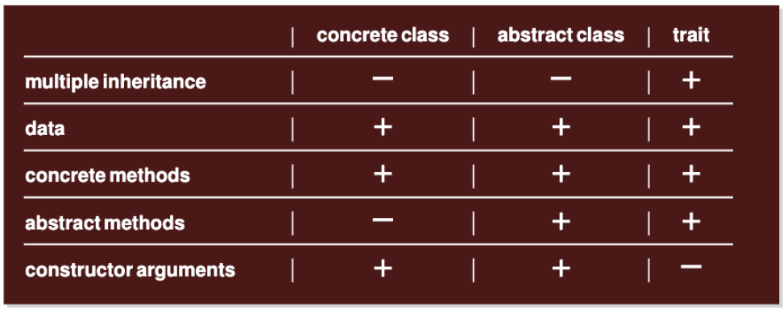
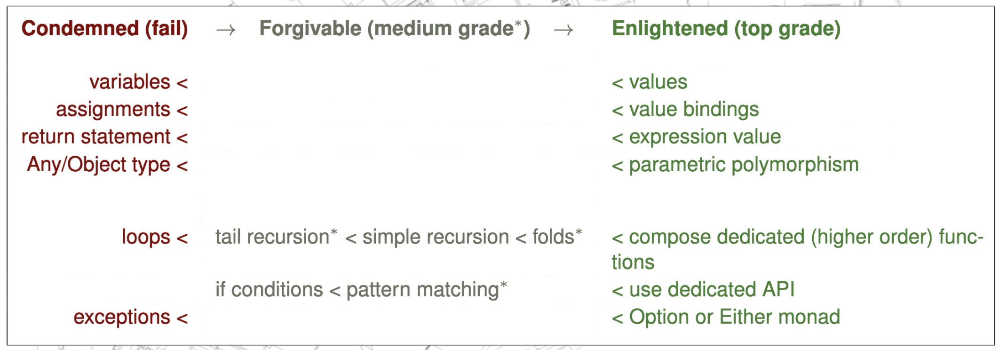

For this course, I aim to both (1) study the material in terms of understanding terminology and "Best Coding Practices" and (2) work on previous exam sets to practice the format as well as writing scala code.

# Material
## Basics of Scala
**Never** use variables (`var` declarations), always use values that are final and immutable (`val` declarations). Every value is its own object, i.e. a referencable static named value.

All statements are functional - the last statement in a function body is the return value.

### "Rich or Fat Interfaces"

- **abstract classes**: constructed using `abstract class <class_name>([val <arg>: <arg_type>, ...])`
- **concrete classes**: constructed using `class <class_name>([<arg>: <arg_type>, ...]):`
- **traits**: constructed using `trait <trait_name>:`
- *Note* that traits cannot be constructed but are descriptors of certain functionality. I.e. "Foldable" may be a trait describing functions / vals that should be part of classes which can be folded over. The abstract classes are like parent / template classes that are inherited into concrete classes which may then be constructed.
- **inheritance** is defined in the class header (i.e. before `:`) using `extends <abstract_class_name>([val <arg>: <arg_type>, ...]), <trait_name>:`
- **concrete methods** may be provided in all types and are methods for which a function body is defined (yet it may be overridden in child-classes)
- **abstract methods** may provided in only abstract classes and traits, and has a function definition (i.e. function name and arguments) without specifying the boyd of the function. If a concrete class inherits from an object with an abstract method, the method must be defined in the concrete class.

### Literals and Functions
Literals are vals / instantiated objects - i.e. an array, a number etc.
A function literal is an anonymous function that may be passed or directly applied without ever being given a name. Anonymous function are defined by `(<var>: <var_type>) => <function_body>` and has type `<var_type> => <return_type>`.

**Curried** functions are functions taking multiple arguments and allowing *partial applications*. In particular a non-curried function takes a tuple of arg values: `<func>(<arg_1>: <type_1>, <arg_2>: <type_2>) => <return_type>:` whereas a curried function takes each argument separately: `<curry_func>(<arg_1>: <type_1>)(<arg_2>: <type_2>) => <return_type>:`.
The difference is subtle but important, as curried functions allow creating partial application such as `<partial_func> = <curry_func>(<concrete_arg_1)`, producing a new function. 
The initial curried function has type `<type_1> => <type_2> => <return_type>`, whereas the partially applied function has type `<type_2> => <return_type>` (i.e. the first arg is removed as it is statically fixed to the first input val).

**Functions are values**, i.e. they are just another assigned value in a programme and may be passed as arguments. Sometimes referred to as "higher order" or *HOFs*.

### Purity
**In Practice** a function is pure if it has no side effects.
More formally described, we define that all functions / expression $f(e)$ are referentially transparent when $e$ is referentially transparent. I.e. if we operate on a referentially transparent object, we should also produce a referentially transparent object.
*Referential transparency* means we can replace a variable, i.e. 'a' with the value of 'a' (f.ex. the exact list Cons(0, Nil)) without changing the semantics / behavior of the code.

### Data Types
**Algebraic Data Type** (ADT) refers to a type that is constructed with 0 or more arguments. May be f.ex. classes or other complex data types. One may for example define the ADT for lists:
```{scala}
enum List[+A] // the initial enum ADT
    case Nil
    case Cons(head: A, tail: List[A])

object List: // companion object
    def sum(ints: List[Int]): Int = ints match // specificially for integer lists
        case Nil => 0
        case Cons(x, xs) => x + sum(xs)
    def apply[A](as: A*) => List[A] = // applied to any type A
        if as.isEmpty then Nil
        else Cons(as.head, apply(as.tail*))
```

#### Polymorphism and monomorphism
**Monomorphic** functions operate on a fixed type, f.ex. an integer. On the other hand, **polymorphic** functions may be defined using syntax `<func_name>[A, B](<arg_1>: A) => B:` allowing types `A` and `B` to take on any type (custom or library) when used and applied later on. When using, one may type the function by `<func_name>[Int, Int](<concrete_arg_1>)`

### Folds
Folds are iterators over some type of collection. The most common use is for iterating over lists to produce som value (i.e. a sum or a new list or something else).
Fold usually comes in both a "foldRight" and "foldLeft" version, indicating starting at the beginning or end of the collection.
Folders take an initial value, i.e. "accumulator", a functions that takes the current accumulator and next element of the collection to produce the new accumulator and the collection to iterate over.
If you think you need a for-loop, a fold is possibly what you actually need.

### Dynamic Dispatch
???

### Preferred Style


## ???

# Old Exams / Exercises
Contained within the separate repo [here](https://github.itu.dk/miejo/Advanced_Programming) inside github.itu.dk