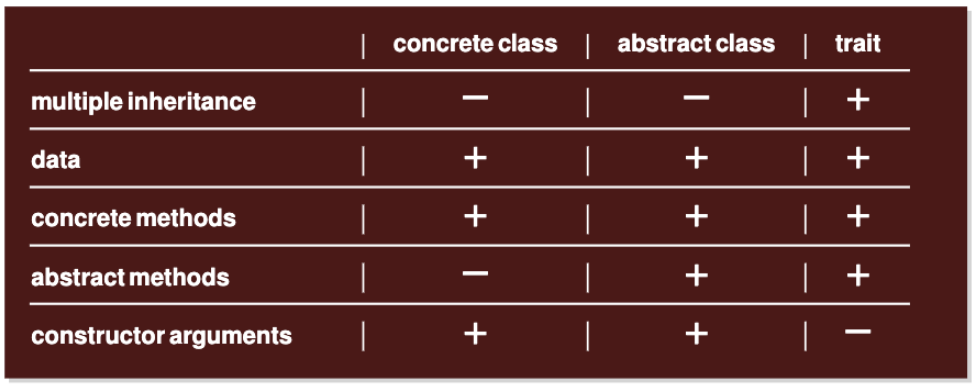
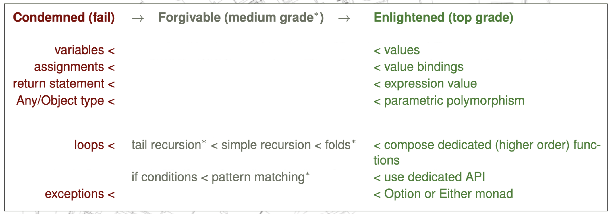
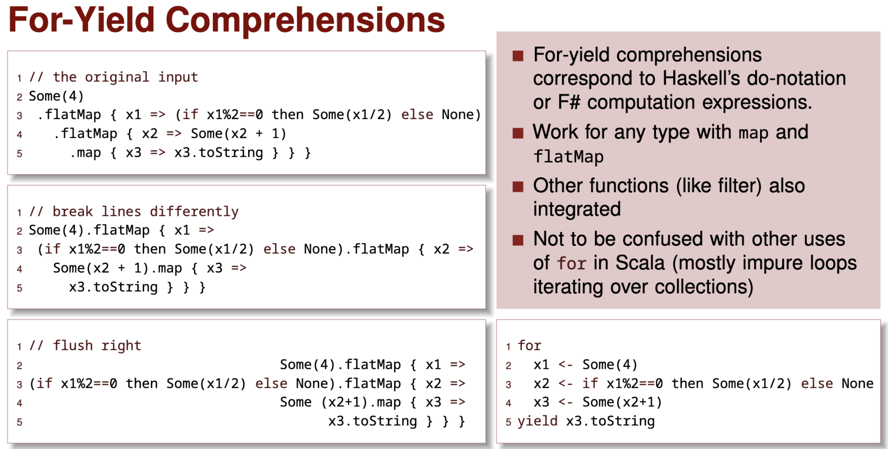

For this course, I aim to both (1) study the material in terms of understanding terminology and "Best Coding Practices" and (2) work on previous exam sets to practice the format as well as writing scala code.

# Material
## Basics of Scala
**Never** use variables (`var` declarations), always use values that are final and immutable (`val` declarations). Every value is its own object, i.e. a referencable static named value.

All statements are functional - the last statement in a function body is the return value.

### "Rich or Fat Interfaces"

- **abstract classes**: constructed using `abstract class <class_name>([val <arg>: <arg_type>, ...])`
- **concrete classes**: constructed using `class <class_name>([<arg>: <arg_type>, ...]):`
- **traits**: constructed using `trait <trait_name>:`
- *Note* that traits cannot be constructed but are descriptors of certain functionality. I.e. "Foldable" may be a trait describing functions / vals that should be part of classes which can be folded over. The abstract classes are like parent / template classes that are inherited into concrete classes which may then be constructed.
- **inheritance** is defined in the class header (i.e. before `:`) using `extends <abstract_class_name>([val <arg>: <arg_type>, ...]), <trait_name>:`
- **concrete methods** may be provided in all types and are methods for which a function body is defined (yet it may be overridden in child-classes)
- **abstract methods** may provided in only abstract classes and traits, and has a function definition (i.e. function name and arguments) without specifying the boyd of the function. If a concrete class inherits from an object with an abstract method, the method must be defined in the concrete class.

### Literals and Functions
Literals are vals / instantiated objects - i.e. an array, a number etc.
A function literal is an anonymous function that may be passed or directly applied without ever being given a name. Anonymous function are defined by `(<var>: <var_type>) => <function_body>` and has type `<var_type> => <return_type>`.

**Curried** functions are functions taking multiple arguments and allowing *partial applications*. In particular a non-curried function takes a tuple of arg values: `<func>(<arg_1>: <type_1>, <arg_2>: <type_2>) => <return_type>:` whereas a curried function takes each argument separately: `<curry_func>(<arg_1>: <type_1>)(<arg_2>: <type_2>) => <return_type>:`.
The difference is subtle but important, as curried functions allow creating partial application such as `<partial_func> = <curry_func>(<concrete_arg_1)`, producing a new function. 
The initial curried function has type `<type_1> => <type_2> => <return_type>`, whereas the partially applied function has type `<type_2> => <return_type>` (i.e. the first arg is removed as it is statically fixed to the first input val).

**Functions are values**, i.e. they are just another assigned value in a programme and may be passed as arguments. Sometimes referred to as "higher order" or *HOFs*.

### Purity
**In Practice** a function is pure if it has no side effects.
More formally described, we define that all functions / expression $f(e)$ are referentially transparent when $e$ is referentially transparent. I.e. if we operate on a referentially transparent object, we should also produce a referentially transparent object.
*Referential transparency* means we can replace a variable, i.e. 'a' with the value of 'a' (f.ex. the exact list Cons(0, Nil)) without changing the semantics / behavior of the code.

### Data Types
**Algebraic Data Type** (ADT) refers to a type that is constructed with 0 or more arguments. May be f.ex. classes or other complex data types. One may for example define the ADT for lists:
```{scala}
enum List[+A] // the initial enum ADT
    case Nil
    case Cons(head: A, tail: List[A])

object List: // companion object
    def sum(ints: List[Int]): Int = ints match // specificially for integer lists
        case Nil => 0
        case Cons(x, xs) => x + sum(xs)
    def apply[A](as: A*) => List[A] = // applied to any type A
        if as.isEmpty then Nil
        else Cons(as.head, apply(as.tail*))
```

Classes are **constructed** with 'val' input parameters as fields and execution of top-level statements in the class definition. We may define default value for input parameters to avoid overloading.

#### Polymorphism and monomorphism
**Monomorphic** functions operate on a fixed type, f.ex. an integer. On the other hand, **polymorphic** functions may be defined using syntax `<func_name>[A, B](<arg_1>: A) => B:` allowing types `A` and `B` to take on any type (custom or library) when used and applied later on. When using, one may type the function by `<func_name>[Int, Int](<concrete_arg_1>)`

### Folds
Folds are iterators over some type of collection. The most common use is for iterating over lists to produce som value (i.e. a sum or a new list or something else).
Fold usually comes in both a "foldRight" and "foldLeft" version, indicating starting at the beginning or end of the collection.
Folders take an initial value, i.e. "accumulator", a functions that takes the current accumulator and next element of the collection to produce the new accumulator and the collection to iterate over.
If you think you need a for-loop, a fold is possibly what you actually need.

### Preferred Style


## Basic Buzz-words

### Dynamic Dispatch
In scala (as well as python & java), instance methods are virtual, i.e. they are 'dynamically dispatched'.
The method implementation is chosen at **runtime** based on the **actual object type**, not the variable's declared type.
This enables polymorphism - the same method call behaves differently depending on the concrete object. Example: `val a: Animal = Dog(); a.speak()` calls `Dog.speak()`, not `Animal.speak()`, because the runtime looks at the actual object (Dog), not the variable type (Animal).
Contrast with static dispatch where the method to call is chosen at compile time.

### Co-variance and Contra-variance.
Assuming the type `Student` is a subtype of `Person` (i.e. `Student <: Person`) and assuming a function taking argument of type `IEnum[Person]`. We may pass a student `IEnum[Student]` in place of the Person-argument type, and name that:
- *Co-variance*: When `Student <: Person`, then `IEnum[Student]` is a subtype of `IEnum[Person]` - i.e. varies in the same direction of inheritance. Dangerous if we do everything but READ.
- *Contra-variance* When `Student <: Person`, then `IEnum[Person]` is a subtype of `IEnum[Student]` - i.e. varies in the opposite direction of inheritance. Dangerous if we do everything but WRITE.

For generic types, i.e. polymorphic definitions, `T[A]` given any `B <: A`, then `T[B] <: T[A]` and thus `T[B]` may be used in place of `T[A]`. 
In scala covariance is denoted by using `T[+A]` and contravariance is denoted by using `T[-A]`. Invariance is the default behavior, i.e. a function may still be polymorphic but once called will require a specific type and not allow subtypes as part of the function.

### For-Yield Expressions


## Options
Options come up when referring to error-handling. I.e. we want to return the result if it may be processed and a default error-value when there is no possible result. One may think of the related concepts:
- **Total functions**: a function $f: A -> B$ where for every $a \in A$ there exists a $b \in B$ such that $f(a) = b$
- **Partial functions**: a function where there is not necessarily a solution $b \in B$.

Partial functions call for for Options or other types that allow working in the world of errors/faults.
Option may be defined as a simple two-case class:
```[scala]
enum Option[+A]:
    case Some(get: A)
    case None

    // anonymous functions
    def map[B](f: A => B): Option[B]
    def flatMap[B](f: A => Option[B]): Option[B]
    def filter(f: A => Boolean): Option[A]
    def getOrElse[B >: A](default: => B): B // Note that this function may be typed to a supertype of the type of the Option
```
The `Some(a)` encapsulates any result-value whilst `None` encapsulates not being able to retrieve a value for the computation. This means we can define behavior without worrying about when or where the code might fail - and simply end with processing the failure by supplying a given default value or similar (depending on desired behavior).

### Either: Option but with error information
Instead of just returning None, allows keeping track of the error that occurred and to return it for handling. The data type is therefore also slightly more complex as it encapsulates more information in the failing case:
```[scala]
enum Either[+E, +A]:
    case Left(value: E) // Error, likely a string. May also be a list of strings if capturing entire stack.
    case Right(value: A) // Success
```

## Lazy Lists (and evaluation)
We want to separate all of it "hows" (i.e. how to compute lengths, how to summarize, ...) from the "whats" (i.e. the concrete objects such as a specific list). 

### Strictness
**strict evaluations** evaluate all function arguments before evaluating the function body. This is the default in most languages, and means that if the input is valid (non-failing) it will be put through the function body without issues. On the other hand, **non-strict evaluation** may be super useful to define behavior that is not immediately executed.
All languages need a strict construct, otherwise nothing is ever actually computed.

### Forcing it and Call-by-name
Strict computations are also referred to as **call-by-value** evaluation.
We can simulate *non-strict* behavior (**call-by-name** evaluation) in a strict functional language by using the type `() => A` in place of `A`, a nullary function returning the value over the distinct value itself. Such a *delayed computation* is called a **thunk**, and executing a thunk is called **forcing it**. In Scala:
- type `<arg_name>: () => A` is used in function body as `<arg_name>()`.
- type `<arg_name>: => A` is used in function body as `<arg_name>`. This is useful and preferred over the previous implementation as it is referenced like a regular variable (automatically forced) and also requires no caching.

The call-by-name argument is evaluated every time it is accessed in the function body. One may store it in a `lazy val cache<arg_name> = <arg_name>` to evaluate it only once and cache the result. *Lazy vals are not forced immediately*, but forced on first access and then fetched going forward. **Lazy Evaluations** is the combination of *call-by-name* evaluation and caching (*memoization*) after the first access.

Laziness interacts badly with side effects (such as printing and similar). We can simplify and optimize pure programs when using lazy evaluation to reduce memory usage and compute power needed.

### Lazy Lists
Lazy lists are an elegant way of creating both finite and infinite streams of data, for which we do not need to evaluate the entire structure at once. Lazy lists are also referred to as **Pull-streams** as you ask for data from the stream when needed and it is generated on-demand (i.e. does not exist in memory until generated).

Lazy lists are **isomorphic** with lists - they provide the same API, but under the hood we evaluate lazily. Because enums cannot have *call-by-name* arguments we create a convenience constructor:
```[scala]
enum LazyList[+A]:
    case Empty
    case Cons(h: () => A, t: () => LazyList[A])

    def headOption[A] = this match
        case Empty => None
        case Cons(h, t) => Some(h()) // note, that here we force the lazy head!

// convenience constructor outside the enum
def cons[A](hd: => A, tl: => LazyList[A]): LazyList[A] =
    lazy val head = hd // creating a lazy vals to ensure caching after first compute
    lazy val tail = tl
    Cons(() => head, () => tail)
```

Note that infinite lazy lists often have recursive definitions. For example:
```[scala]
// an infinite stream of 1's:
val ones: LazyList[Int] = cons(1, ones)

// an infinite stream of random numbers:
val randoms: LazyList[Double] = cons (Math.random, randoms)
```
In particular also note that assigning  the head and tail as `lazy val` in the convenience constructor is important to ensure referential transparency when f.ex. having the list of random numbers, as no caching would mean it would be different each time we evaluate it.

Lazy lists are functional iterators - as you may also see them in python or other imperative languages - as the computation is only done once and even if needed. Reduces unnecessary computation and memory usage.
Lazy lists are also the basis for *reactive programming* (but need to add real time, pushing and more).

## State
We want to keep track of the state explicitly to have referential transparency in what is actually going on with f.ex. random number generators. A referentially transparent (and therefor pure) version of a random number generator may for example be:
```[scala]
trait RNG:
    def nextInt: (Int, RNG)

object RNG:
    def nextInt(rng: RNG): (Int, RNG) = // takes a state object and returns the result and the new state object
        rng.nextInt
```
Other common names for state are: *stateful*, *automaton*, *transition* - a single iteration of calling and updating the state may be called a *run* or *step*.
States and lazy lists have a lot in common - we can unfold a state in a lazy list as a generator of the contents from an initial state $s$.

We may want to compute a random instance of some type `A`, that we do not yet know. We can define this Random generator as `type Rand[A] = State[RNG, A]`. This is all good and well, and with a concrete implementation of an RNG, we may now start defining how to generate an Int (... or a Double or a list or a tuple) from a specific initialization of an RNG.
```[scala]
val r: Rand[Int] = ... // Defining basic Int-generation
val (i, r1) = r.run(SimpleRNG(42)) // Running 'r' with a concrete State implementation and instance

def map[S, A, B](s:State[S, A])(f:A =>B):State[S, B] // defining how to map from the initial output to another type.
def flatMap[S, A, B](s:State[S, A])(f:A =>State[S, B]):State[S, B] // to compose generators linearly
map2[S, A, B, C](sa:State[S, A])(sb:State[S, B])(f:(A, B) =>C):State[S, C] // using two generators over the same state instance
```

This concept of state is super confusing at times, but most importantly: we always want to use the state to get some value, update the new state and pass on the new state for the next computation. Never reuse the state for multiple computations, always string it along to the next.
See own exercise solution [here](https://github.itu.dk/miejo/Advanced_Programming/blob/main/05-state/Exercises.scala) for better intuition if it seems confusing how one would do it for any of the coding examples in this section. In particular (note that here, for map2, rng is not stringed along - tests were failing if this was the case. On the other hand, other tasks intended to use map2 were requiring the state to be stringed along - see sequence):
```[scala]
def map[A,B](s: Rand[A])(f: A => B): Rand[B] =
    rng => {
        val (a, rng2) = s(rng)
        (f(a), rng2)
    }

def flatMap[A,B](f: Rand[A])(g: A => Rand[B]): Rand[B] =
    rng => {
        val (a, rng2) = f(rng)
        g(a)(rng2)
    }

def map2[A, B, C](ra: Rand[A], rb: Rand[B])(f: (A, B) => C): Rand[C] = 
    rng => {
        val (a, rng2) = ra(rng)
        val (b, rng3) = rb(rng)
        (f(a, b), rng2)
    }

def sequence[A](ras: List[Rand[A]]): Rand[List[A]] =
    ras.foldRight
        (unit(List.empty[A]))
        ((x1: Rand[A], acc: Rand[List[A]]) => // using map2 causes errors because it is not threading the rng
        // threading the rng in map2 will (on the other hand) cause other tests to fail...
            rng => {
                val (a, rng2) = x1(rng)
                val (list, rng3) = acc(rng2)
                (a :: list, rng3)
            }
        )
```

# Old Exams / Exercises
Contained within the separate repo [here](https://github.itu.dk/miejo/Advanced_Programming) inside github.itu.dk