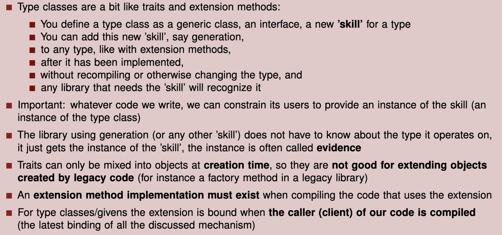
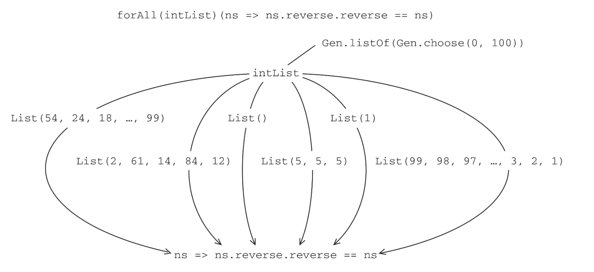
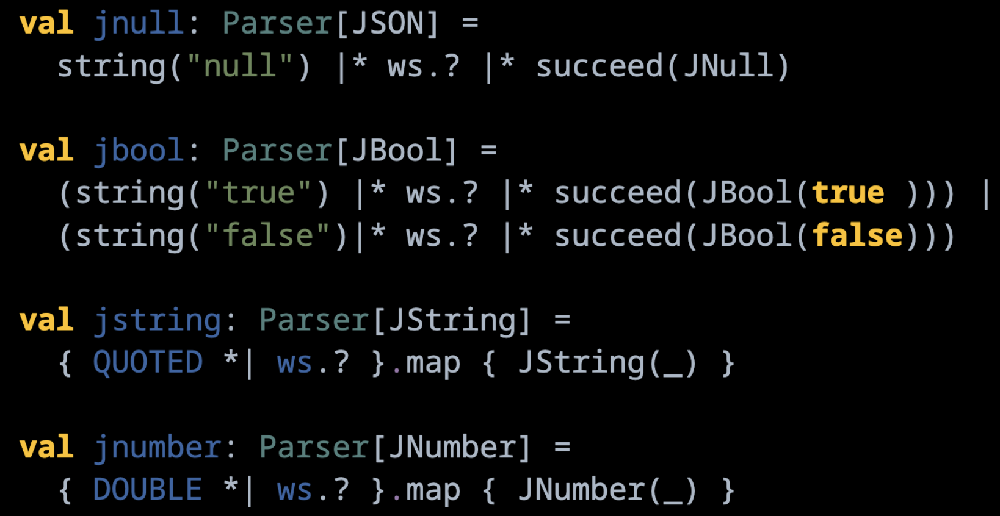
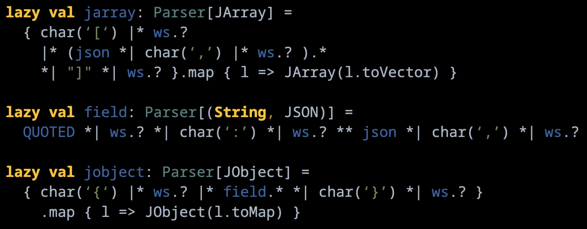
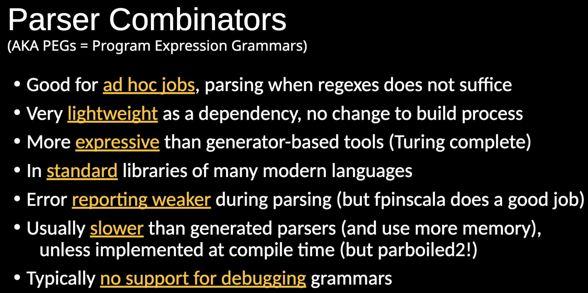
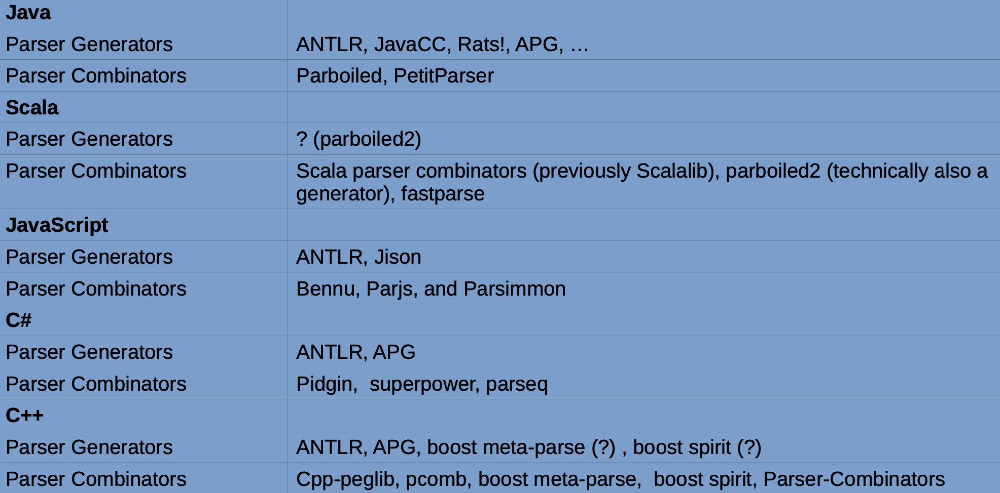

For this course, I aim to both (1) study the material in terms of understanding terminology and "Best Coding Practices" and (2) work on previous exam sets to practice the format as well as writing scala code.

# Material
## Basics of Scala
**Never** use variables (`var` declarations), always use values that are final and immutable (`val` declarations). Every value is its own object, i.e. a referencable static named value.

All statements are functional - the last statement in a function body is the return value.

### "Rich or Fat Interfaces"

- **abstract classes**: constructed using `abstract class <class_name>([val <arg>: <arg_type>, ...])`
- **concrete classes**: constructed using `class <class_name>([<arg>: <arg_type>, ...]):`
- **traits**: constructed using `trait <trait_name>:`
- *Note* that traits cannot be constructed but are descriptors of certain functionality. I.e. "Foldable" may be a trait describing functions / vals that should be part of classes which can be folded over. The abstract classes are like parent / template classes that are inherited into concrete classes which may then be constructed.
- **inheritance** is defined in the class header (i.e. before `:`) using `extends <abstract_class_name>([val <arg>: <arg_type>, ...]), <trait_name>:`
- **concrete methods** may be provided in all types and are methods for which a function body is defined (yet it may be overridden in child-classes)
- **abstract methods** may provided in only abstract classes and traits, and has a function definition (i.e. function name and arguments) without specifying the boyd of the function. If a concrete class inherits from an object with an abstract method, the method must be defined in the concrete class.

### Literals and Functions
Literals are vals / instantiated objects - i.e. an array, a number etc.
A function literal is an anonymous function that may be passed or directly applied without ever being given a name. Anonymous function are defined by `(<var>: <var_type>) => <function_body>` and has type `<var_type> => <return_type>`.

**Curried** functions are functions taking multiple arguments and allowing *partial applications*. In particular a non-curried function takes a tuple of arg values: `<func>(<arg_1>: <type_1>, <arg_2>: <type_2>) => <return_type>:` whereas a curried function takes each argument separately: `<curry_func>(<arg_1>: <type_1>)(<arg_2>: <type_2>) => <return_type>:`.
The difference is subtle but important, as curried functions allow creating partial application such as `<partial_func> = <curry_func>(<concrete_arg_1)`, producing a new function. 
The initial curried function has type `<type_1> => <type_2> => <return_type>`, whereas the partially applied function has type `<type_2> => <return_type>` (i.e. the first arg is removed as it is statically fixed to the first input val).

**Functions are values**, i.e. they are just another assigned value in a programme and may be passed as arguments. Sometimes referred to as "higher order" or *HOFs*.

### Purity
**In Practice** a function is pure if it has no side effects.
More formally described, we define that all functions / expression $f(e)$ are referentially transparent when $e$ is referentially transparent. I.e. if we operate on a referentially transparent object, we should also produce a referentially transparent object.
*Referential transparency* means we can replace a variable, i.e. 'a' with the value of 'a' (f.ex. the exact list Cons(0, Nil)) without changing the semantics / behavior of the code.

### Data Types
**Algebraic Data Type** (ADT) refers to a type that is constructed with 0 or more arguments. May be f.ex. classes or other complex data types. One may for example define the ADT for lists:
```{scala}
enum List[+A] // the initial enum ADT
    case Nil
    case Cons(head: A, tail: List[A])

object List: // companion object
    def sum(ints: List[Int]): Int = ints match // specificially for integer lists
        case Nil => 0
        case Cons(x, xs) => x + sum(xs)
    def apply[A](as: A*) => List[A] = // applied to any type A
        if as.isEmpty then Nil
        else Cons(as.head, apply(as.tail*))
```

Classes are **constructed** with 'val' input parameters as fields and execution of top-level statements in the class definition. We may define default value for input parameters to avoid overloading.

Declaring **opaque** types, means the user cannot exploit the underlying representation: `opaque type MaxSize = Int`. This may also be useful when defining extensions to limit to this exact type (an not a similar type with the same footprint). Similar benefits as to defining it as a class, but avoiding the more complex structure.

#### Polymorphism and monomorphism
**Monomorphic** functions operate on a fixed type, f.ex. an integer. On the other hand, **polymorphic** functions may be defined using syntax `<func_name>[A, B](<arg_1>: A) => B:` allowing types `A` and `B` to take on any type (custom or library) when used and applied later on. When using, one may type the function by `<func_name>[Int, Int](<concrete_arg_1>)`

### Folds
Folds are iterators over some type of collection. The most common use is for iterating over lists to produce som value (i.e. a sum or a new list or something else).
Fold usually comes in both a "foldRight" and "foldLeft" version, indicating starting at the beginning or end of the collection.
Folders take an initial value, i.e. "accumulator", a functions that takes the current accumulator and next element of the collection to produce the new accumulator and the collection to iterate over.
If you think you need a for-loop, a fold is possibly what you actually need.

### Preferred Style


### Extension Methods
An extension method is a static function that may be call on an instance as if it was an instance type - i.e. we *extend the existing API* for a class with additional methods/functions. In scala:
```[scala]
// definition
extension (val str: String)
    def <method_name> =
        str.<functionality>

// usage
import <method_name>
"TEST STRING".<method_name>
```
This is useful when we want to add functionality to classes and where we cannot reasonably modify and recompile the source code.

### Type Classes in a nutshell


## Basic Buzz-words

### Dynamic Dispatch
In scala (as well as python & java), instance methods are virtual, i.e. they are 'dynamically dispatched'.
The method implementation is chosen at **runtime** based on the **actual object type**, not the variable's declared type.
This enables polymorphism - the same method call behaves differently depending on the concrete object. Example: `val a: Animal = Dog(); a.speak()` calls `Dog.speak()`, not `Animal.speak()`, because the runtime looks at the actual object (Dog), not the variable type (Animal).
Contrast with static dispatch where the method to call is chosen at compile time.

### Co-variance and Contra-variance.
Assuming the type `Student` is a subtype of `Person` (i.e. `Student <: Person`) and assuming a function taking argument of type `IEnum[Person]`. We may pass a student `IEnum[Student]` in place of the Person-argument type, and name that:
- *Co-variance*: When `Student <: Person`, then `IEnum[Student]` is a subtype of `IEnum[Person]` - i.e. varies in the same direction of inheritance. Dangerous if we do everything but READ.
- *Contra-variance* When `Student <: Person`, then `IEnum[Person]` is a subtype of `IEnum[Student]` - i.e. varies in the opposite direction of inheritance. Dangerous if we do everything but WRITE.

For generic types, i.e. polymorphic definitions, `T[A]` given any `B <: A`, then `T[B] <: T[A]` and thus `T[B]` may be used in place of `T[A]`. 
In scala covariance is denoted by using `T[+A]` and contravariance is denoted by using `T[-A]`. Invariance is the default behavior, i.e. a function may still be polymorphic but once called will require a specific type and not allow subtypes as part of the function.

### For-Yield Expressions


## Options
Options come up when referring to error-handling. I.e. we want to return the result if it may be processed and a default error-value when there is no possible result. One may think of the related concepts:
- **Total functions**: a function $f: A -> B$ where for every $a \in A$ there exists a $b \in B$ such that $f(a) = b$
- **Partial functions**: a function where there is not necessarily a solution $b \in B$.

Partial functions call for for Options or other types that allow working in the world of errors/faults.
Option may be defined as a simple two-case class:
```[scala]
enum Option[+A]:
    case Some(get: A)
    case None

    // anonymous functions
    def map[B](f: A => B): Option[B]
    def flatMap[B](f: A => Option[B]): Option[B]
    def filter(f: A => Boolean): Option[A]
    def getOrElse[B >: A](default: => B): B // Note that this function may be typed to a supertype of the type of the Option
```
The `Some(a)` encapsulates any result-value whilst `None` encapsulates not being able to retrieve a value for the computation. This means we can define behavior without worrying about when or where the code might fail - and simply end with processing the failure by supplying a given default value or similar (depending on desired behavior).

### Either: Option but with error information
Instead of just returning None, allows keeping track of the error that occurred and to return it for handling. The data type is therefore also slightly more complex as it encapsulates more information in the failing case:
```[scala]
enum Either[+E, +A]:
    case Left(value: E) // Error, likely a string. May also be a list of strings if capturing entire stack.
    case Right(value: A) // Success
```

## Lazy Lists (and evaluation)
We want to separate all of it "hows" (i.e. how to compute lengths, how to summarize, ...) from the "whats" (i.e. the concrete objects such as a specific list). 

### Strictness
**strict evaluations** evaluate all function arguments before evaluating the function body. This is the default in most languages, and means that if the input is valid (non-failing) it will be put through the function body without issues. On the other hand, **non-strict evaluation** may be super useful to define behavior that is not immediately executed.
All languages need a strict construct, otherwise nothing is ever actually computed.

### Forcing it and Call-by-name
Strict computations are also referred to as **call-by-value** evaluation.
We can simulate *non-strict* behavior (**call-by-name** evaluation) in a strict functional language by using the type `() => A` in place of `A`, a nullary function returning the value over the distinct value itself. Such a *delayed computation* is called a **thunk**, and executing a thunk is called **forcing it**. In Scala:
- type `<arg_name>: () => A` is used in function body as `<arg_name>()`.
- type `<arg_name>: => A` is used in function body as `<arg_name>`. This is useful and preferred over the previous implementation as it is referenced like a regular variable (automatically forced) and also requires no caching.

The call-by-name argument is evaluated every time it is accessed in the function body. One may store it in a `lazy val cache<arg_name> = <arg_name>` to evaluate it only once and cache the result. *Lazy vals are not forced immediately*, but forced on first access and then fetched going forward. **Lazy Evaluations** is the combination of *call-by-name* evaluation and caching (*memoization*) after the first access.

Laziness interacts badly with side effects (such as printing and similar). We can simplify and optimize pure programs when using lazy evaluation to reduce memory usage and compute power needed.

### Lazy Lists
Lazy lists are an elegant way of creating both finite and infinite streams of data, for which we do not need to evaluate the entire structure at once. Lazy lists are also referred to as **Pull-streams** as you ask for data from the stream when needed and it is generated on-demand (i.e. does not exist in memory until generated).

Lazy lists are **isomorphic** with lists - they provide the same API, but under the hood we evaluate lazily. Because enums cannot have *call-by-name* arguments we create a convenience constructor:
```[scala]
enum LazyList[+A]:
    case Empty
    case Cons(h: () => A, t: () => LazyList[A])

    def headOption[A] = this match
        case Empty => None
        case Cons(h, t) => Some(h()) // note, that here we force the lazy head!

// convenience constructor outside the enum
def cons[A](hd: => A, tl: => LazyList[A]): LazyList[A] =
    lazy val head = hd // creating a lazy vals to ensure caching after first compute
    lazy val tail = tl
    Cons(() => head, () => tail)
```

Note that infinite lazy lists often have recursive definitions. For example:
```[scala]
// an infinite stream of 1's:
val ones: LazyList[Int] = cons(1, ones)

// an infinite stream of random numbers:
val randoms: LazyList[Double] = cons (Math.random, randoms)
```
In particular also note that assigning  the head and tail as `lazy val` in the convenience constructor is important to ensure referential transparency when f.ex. having the list of random numbers, as no caching would mean it would be different each time we evaluate it.

Lazy lists are functional iterators - as you may also see them in python or other imperative languages - as the computation is only done once and even if needed. Reduces unnecessary computation and memory usage.
Lazy lists are also the basis for *reactive programming* (but need to add real time, pushing and more).

## State
We want to keep track of the state explicitly to have referential transparency in what is actually going on with f.ex. random number generators. A referentially transparent (and therefor pure) version of a random number generator may for example be:
```[scala]
trait RNG:
    def nextInt: (Int, RNG)

object RNG:
    def nextInt(rng: RNG): (Int, RNG) = // takes a state object and returns the result and the new state object
        rng.nextInt
```
Other common names for state are: *stateful*, *automaton*, *transition* - a single iteration of calling and updating the state may be called a *run* or *step*.
States and lazy lists have a lot in common - we can unfold a state in a lazy list as a generator of the contents from an initial state $s$.

We may want to compute a random instance of some type `A`, that we do not yet know. We can define this Random generator as `type Rand[A] = State[RNG, A]`. This is all good and well, and with a concrete implementation of an RNG, we may now start defining how to generate an Int (... or a Double or a list or a tuple) from a specific initialization of an RNG.
```[scala]
val r: Rand[Int] = ... // Defining basic Int-generation
val (i, r1) = r.run(SimpleRNG(42)) // Running 'r' with a concrete State implementation and instance

def map[S, A, B](s:State[S, A])(f:A =>B):State[S, B] // defining how to map from the initial output to another type.
def flatMap[S, A, B](s:State[S, A])(f:A =>State[S, B]):State[S, B] // to compose generators linearly
map2[S, A, B, C](sa:State[S, A])(sb:State[S, B])(f:(A, B) =>C):State[S, C] // using two generators over the same state instance
```

This concept of state is super confusing at times, but most importantly: we always want to use the state to get some value, update the new state and pass on the new state for the next computation. Never reuse the state for multiple computations, always string it along to the next.
See own exercise solution [here](https://github.itu.dk/miejo/Advanced_Programming/blob/main/05-state/Exercises.scala) for better intuition if it seems confusing how one would do it for any of the coding examples in this section. In particular (note that here, for map2, rng is not stringed along - tests were failing if this was the case. On the other hand, other tasks intended to use map2 were requiring the state to be stringed along - see sequence):
```[scala]
def map[A,B](s: Rand[A])(f: A => B): Rand[B] =
    rng => {
        val (a, rng2) = s(rng)
        (f(a), rng2)
    }

def flatMap[A,B](f: Rand[A])(g: A => Rand[B]): Rand[B] =
    rng => {
        val (a, rng2) = f(rng)
        g(a)(rng2)
    }

def map2[A, B, C](ra: Rand[A], rb: Rand[B])(f: (A, B) => C): Rand[C] = 
    rng => {
        val (a, rng2) = ra(rng)
        val (b, rng3) = rb(rng)
        (f(a, b), rng2)
    }

def sequence[A](ras: List[Rand[A]]): Rand[List[A]] =
    ras.foldRight
        (unit(List.empty[A]))
        ((x1: Rand[A], acc: Rand[List[A]]) => // using map2 causes errors because it is not threading the rng
        // threading the rng in map2 will (on the other hand) cause other tests to fail...
            rng => {
                val (a, rng2) = x1(rng)
                val (list, rng3) = acc(rng2)
                (a :: list, rng3)
            }
        )
```

## Monads
### Monoid / Addable
A monoid is a type $A$, for which associativity and identity laws hold. In more detail, a monoid type should have:
- A `combine` method, which takes 2 elements $a1, a2 \in A$ and combining them produces an element $c \in A$
- A `zero` element, which given an element $a \in A$ will produce the element $a$ when combining with itself.
This is a mathematical definition, and in particular the laws that should follow are:
- **associativity**: the order of calculations does not matter, i.e. $(x \bigoplus y) \bigoplus z == x \bigoplus (y \bigoplus z)$ - in particular the order of expressions is the same, but which combination we do first is free-of-choice.
- **identity**: combining with the zero-element produces the element itself, i.e. $x \bigoplus 0 == x == 0 \bigoplus x$

In scala it may be defined as the trait:
```[scala]
trait Monoid[A]:
  self =>
  def combine(a1: A, a2: A): A
  def empty: A

  object laws:
    def associative (using Arbitrary[A], Equality[A]) =
      forAll { (a1: A, a2: A, a3: A) =>
        self.combine(self.combine(a1, a2), a3) ===
          self.combine(a1, self.combine(a2, a3)) }

    def unit (using Arbitrary[A], Equality[A]) =
      forAll { (a: A) =>
        (self.combine(a, self.empty) === a) &&
        (self.combine(self.empty, a) === a) }

    def monoid (using Arbitrary[A], using Equality[A]) = // combination of all other laws
      associative && unit

// a type class example instance
val stringMonoid: Monoid[String] = new:
  def combine(a1: String, a2: String): String =
    a1 + a2
  val empty: String = ""

// and we may test that our example instance follows the laws
property("stringMonoid is a monoid") =
    stringMonoid.laws.monoid
```

#### Homomorphism
We may talk about **Homomorphism** between Monoids. In particular, given the two distinct monoids: $(M, \bigoplus, 0)$ and $(N, \bigotimes, 1)$ and a function $f: M \to N$, then the following should hold for homomorphic monoids:
- **distributive**: combining in the source entity or target entity provides the same result: $f(x \bigoplus y) == f(x) \bigotimes f(y)$ for any $x, y \in M$
- **preserves identity**: the zero element of M should map to the zero element of N: $f(0) = 1$

**Isomorphism** is when there is homomorphism in both directions.
An example of homomorphism is concat of strings and addition of numbers with "size" / length as the mapping function.
An example of Isomorphism is strings and lists of chars.

### Foldable
Objects that may be folded over, f.ex. Lists, Sequences or any other iterable type!
```[scala]
trait Foldable[F[_]]:
    extension [A](as: F[A])

    // map into a monoid and reduce using ’combine’
    def foldMap[B: Mondoid](f: A => B): B
    def foldRight[B](z: B)(f: (A, B) => B): B
    def foldLeft[B] (z: B)(f: (B, A) => B): B

    //If A is a monoid then
    def concatenate[A](as: F[A])(using m: Monoid[A]): A =
        as.foldLeft(m.empty)(m.combine)
```

### Functor / Mappable
A mappable/functor is an object that may be mapped. In particular, we see that the map functions we have implemented for options, generators and so on all have a similar type: `def map[A, B] (a: <type>[A]) (f: A -> B) : <type>[B]`. 
In scala:
```[scala]
trait Functor[F[_]]: // Functor is higher kind

  extension [A](fa: F[A])
    def map[B](f: A => B): F[B] // require map

  extension [A, B](fab: F[(A, B)])
    def distribute: (F[A], F[B])= // derived from map
      (fab.map { _._1 }, fab.map { _._2 })

  object functorLaws:
    def map[A](using Arbitrary[F[A]], Equality[F[A]]): Prop = // preservation of structure law
      forAll { (fa: F[A]) => fa.map[A](identity[A]) === fa }
```

### Monad / Flatmappable
Encapsulates all of the types we ahve developed in the class, i.e. flatmappables. Note that map and other functions may be derived from the flatmap function:
```[scala]
trait Monad[F[_]]
  extends Functor[F]:
  
  def unit[A](a: => A): F[A]

  extension [A](fa: F[A])
    def flatMap[B](f: A => F[B]): F[B]
    def map[B](f: A => B): F[B] =
      fa.flatMap[B] { a => unit(f(a)) }

  object monadLaws:
    def associative[A, B, C]
      (using Arbitrary[F[A]], Arbitrary[A => F[B]], Arbitrary[B => F[C]], Equality[F[C]]) =
        forAll { (x: F[A], f: A => F[B], g: B => F[C]) =>
          (x.flatMap(f).flatMap(g)) === (x.flatMap { a => f(a).flatMap(g) })
        }

    def identityRight[A]
      (using Arbitrary[F[A]], Equality[F[A]]) =
        forAll { (x: F[A]) =>
          x.flatMap(unit) === x
        }

    def identityLeft[A]
      (using Arbitrary[A], Arbitrary[A => F[A]], Equality[F[A]]) =
        forAll{(y: A,f: A=>F[A]) =>
          unit(y).flatMap(f) === f(y)
        }
```
Is any type of object that may be sequenced or transformed. It is both a functor (mappable) and an applicative functor (map2-able)

## Testing - General concepts
**Assertions** are boolean evaluations (*boolean predicates*) over the program state and variables, asserting whether they have the expected value. It helps us establish norms and expectations and to test that these expectations/assumptions hold in practice - i.e. *fail-fast programming*. 
Writing small assertions is more useful (unit tests), as the error is more distinct and isolated to a particular focus point / behavior.
Scala has different types of assertions. All of them fail at runtime but vary in the error produced and how it should be corrected:
- **require**: before any actions are executed, blame the *caller* when failing, i.e. faulty input, a **pre-condition**. 
- **ensuring**: after an action, check if result is valid, blame the *callee* when failing, i.e. body of code itself is failing, a **post-condition**
- **assert**: must hold, is basically a test (usually equality or greater-than)
- **assume**: verifier assumes this behavior, an axiom.

**Pre-conditions** detailed look:
"If this pre-condition holds, then the code should behave correctly"; Usually used to constrain arguments of a function. We want to specify the *weakest* pre-condition, i.e. the pre-condition allowing the largest set of inputs while still satisfying the desired behavior. We do this to achieve *complete specifications* of the input space, and may in testing use stronger pre-conditions to test on limited subsets of the input space.

**Post-conditions** detailed look:
"Given this intermediary result, is it correctly computed?"; Usually used to verify correctness of steps or function outputs before continuing, constrains the return value. We want to specify the *strongest* post-condition, i.e. the post-condition that is particularly limited to the actual desired behavior. Used to define *complete behavior* of the code. Usually decomposed into smaller weaker post-conditions that are easier to test and verify.

**Contracts** are defined as a pair of a *pre-condition* and a *post-condition*, for which the caller shall make sure the pre-condition is held and the callee shall make sure the post-condition is held as long as the pre-condition was in fact held. The ideal contract is *minimized assumptions* (weak pre-condition) and *maximized guarantees* (strong post-condition).

A related concept is **invariants** which are properties that should always hold at runtime (i.e. strong assumptions about the structure / behavior of objects).

In practice, we use `forAll` to test over a number of randomly generated objects of a certain type and specification. Most types will have a generator `Arbitrary[A]` / `Gen[A]` - but if you create your own data type you also need to define the generator for it.
Types may have multiple generators, and we may specify which generator to use with the `given` keyword. We can name our givens, just like we name values, and use them in combination or separately in tests.

## Property based testing
Property-based testing differs from unit-testing and other scenario-based testing methods, as it is not rooted in particular examples but rather in generalized laws and behavior of the API. PBT therefore seeks to define the laws and test these rigorously on random inputs, possibly catching flukes that might have been missed.

### Generators
Generators are the objects that generates a random object of a specific type under specific constraints (f.ex. lists of integers of length 0-100). Generators are useful in PBT frameworks, as they produce a random object with certain properties, to test whether it might be a failing case. See for example this property test:


Generators are random generators just like RNG, we define `opaque type Gen[+A] = State[RNG, A]`. Now, we may use the State API to create generators of all sorts:
```[scala]
def anyInteger: Gen[Int] = State.next_int

def intPair: Gen[(Int, Int)] = anyInteger.map2(anyInteger)(x => x) // compose two integers as the tuple they are

def listOfN[A] (n: int) (using genA: Gen[A]) : Gen[List[A]] = ... // using makes the compiler auto-fetch library generators
// but there must be a given generator or it will fail.
given val anyInteger : Gen[Int] = anyInteger
```
See more generators in the exercises [here](https://github.itu.dk/miejo/Advanced_Programming/blob/main/07-prop/Exercises.scala). NOTE: the using argument may be overwritten and used as regular argument by passing an object of the given type in its place. 

One may also use **summon** instead of **using**. I.e. `summon[Gen[A]]` in the code body instead of `using genA: Gen[A]` in the argument header.

## Parsing
Parsing is about coding how to read a file / string into a sensible data structure or executable. The main concepts are as follows:
- **concrete syntax** vs **abstract syntax**: The concrete syntax is the format of the input, which may for example be a JSON file. The JSON file is structured with certain delimiters between arguments, possibly with extra spaces/newlines/tabs. The abstract syntax is, on the other hand, the structure we use to represent the concrete object as an object in our code. The abstract syntax is of course highly dependant on the concrete syntax and how we wish to represent and use the object. We might use the following abstract syntax for JSON files:
```[scala]
enum JSON
    // simpler types of args
    case JNull
    case JNumber(get: Double)
    case JString(get: String)
    case JBool(get: Boolean)

    // Lists are read as sequences of other JSON objects, f.ex. JNumber. This allows multi-type arrays to be read.
    case JArray(get: IndexedSeq[JSON])

    // The overall JSON encapsulator, mapping a string "field-name" to some JSON object. Allows nesting objects.
    case JObject(get: Map[String, JSON])
```
- **Algebraic Design**: design your interface first, along with associated laws. THEN use the types and laws to evolve the interface. This is a form of *test-driven-development*, where we define the intended behavior first and then seek to define the objects that should follow the laws only later. We focus on separating the design and definition of the interface from the implementation details.
- **Full Abstraction**: we define types, functions & behavior without defining the implementation details. I.e. we never run anything, just type checking and compilation. This is the pure design of the API, and we will later focus on the implementation. We also define the *laws/tests* which we may also compile before ever having a specific implementation.
- **Higher Kind**: A type that is polymorphic in **type constructors** (`Parsers[ParseError, Parser[+_]]`) not directly in the type (as `Parser[+A]`) - Difference here is that the higher kind type is *requiring a `Parser` of some type*, specifying the type constructor directly, but does not mind WHAT the Parser is parsing. The normal polymorphic type constructor just does not mind what type the type is at all.
- Map is **Structure Preserving**: When map is used on a parser `p` with the identity function, it should always produce the parser `p` itself. In particular, map does not change the structure but only the value contained in the parser.

we use regex to define the patterns of each type, f.ex. a quoted string, a decimal number or white spaces. We also define the following combinators for parser objects:
- `|` - OR, choice of parsers (only choice when it is singular without any `*`). Will try parsers from leftmost to rightmost until something is matched.
- `?` - OPT, optionally parsed. Mostly used for whitespaces as there may be 0 or may be many. We want them parsed so we get to the input we are interested in.
- `**` - parse both (sequencing) and return a tuple with `(left_out, right_out)`
- `*|` - parse both (sequencing) and only return the left element
- `|*` - parse both (sequencing) and only return the right element

Parsers:



- **Internal Domain-Specific Languages (DSL)**: Parser combinators are a language, and one example of an internal DSL. Internal DSL is basically syntactic sugar of the host language.
Parser Combinators in-a-nutshell:

- **Concrete Parser**: implemented with a `run` function that parses the string from a certain position to see if the parser will find a match. Flatmapping will recursively call parsers and return the final success / error of the parsing.

Parser Libraries:


## Basics of Evaluators
Programming languages in general may be defined on 3 different levels:
- **syntax**: whether a programme file is valid, i.e. correct way of writing up a programme.
- **semantics**: how is a valid programme executed, i.e. what happens for each type of statement.
- **implementation**: how is the programme compiled to machine code, i.e. what is actually executed on the hardware.

When defining programming languages we often talk about **operational semantics**, which are a set of *semantic rules* that define behavior. These are often represented as **inference rules**, contained in two parts: *premises* and *conclusions*. The premise are the assumptions we have, and if they hold then we can produce the conclusion!

We may define **context-free grammar** in a mathematical sense, that may be used across multiple languages, effectively separating the language specifics from the design of the grammar. What we specify is the **abstract syntax** which is a recursive tree definition.
F.ex. a numerical abstract syntax:
$$
e ::=num(n) \quad n \in Z
\newline |\space e \space\%\space e
$$
In scala:
```[scala]
enum numExpr
    case Num(n: int)
    case Div(Left: numExpr, Right: numExpr) // note the recursive definition here.
```
In premise / conclusion format (no premise => always holds, premise otherwise is a requirement / specification for the rule):
$$
\frac{}{num(n) \to n}NUM
\newline\newline
\frac{e \to n_1 \quad e' \to n_2}{e \% e´ \to n_1 /n_2}DIV
$$
Evaluator in scala:
```[scala]
def eval (expr: numExpr): Int = expr match
    case Num(n) => n
    case Div(Left, Right) => eval(Left) / eval(Right) // recursive definition here again
```
This is also called **Big-Step Semantics**, as we make the entire reduction from some expression to the value in one go.
Precedence of calculations is decided by the parser, and the evaluator simply seeks to determine the proper total value of the expression that has been parsed

We may extend with exceptions on f.ex. 0-division (but quickly becomes much more tedious with error handling and passing):
$$
\frac{}{num(n) \to n}NUM
\newline\newline
\frac{e \to n_1 \quad e' \to n_2 \quad n_2\neq0}{e \% e´ \to n_1 /n_2}DIV
$$
```[scala]
def eval (expr: numExpr): M[Int] = expr match
    case Num(n) => Return(n)
    case Div(Left, Right) => eval(Left) match
        case Raise(msg) => Raise(msg)
        case Return(lv) => eval(Right) match
            case Raise(msg) => Raise(msg)
            case Return(rv) =>
                if rv == 0 then Raise("Division by 0")
                else Return(lv / rv)
```
We note though, that this exception is in fact a monad and is indeed super similar to our Option / Either types from earlier. If we use a monad, we may replace all the pattern matching (which is only there for error handling) with a simple forward-going flatmap!

## Lenses
???

## Basic Probabilistic Programming (i.e. probability in code)
Roots in basic probability theory and statistical modelling. An alternative to standard machine learning methods, and adds the layer of uncertainty to the model outputs directly.
Basic probability theory:
- A *probability function* $p$ over the *finite sample space* $S$, assigns to each $E \subseteq S$ a probability between 0 and 1.
- When two subsets $E, F \subseteq S$ are **disjoint**, we may say that their **joint probability** is: $P(E \cup F) = P(E) + P(F)$ - this property also implies that: $P(E) = \sum_{s \in E} P(\{s\})$
- The conditional probability (i.e. probability of E, knowing that F happened) is $P(E|F)=\frac{P(E \cap F)}{P(F)}$. I.e. the intersection of E and F divided by the totality of F.
- E and F are **independent** iff $P(E \cap F) = P(E) * P(F)$. Also, derived from this, $P(E | F) = P(E)$ - knowing that F has happened, gives us no new information about the likelihood of E having happened.
- **Bayes Theorem** states: $P(F|E) = \frac{P(E|F)*P(F)}{P(E)}$
- A **Random Variable** assigns a real number to each outcome $s \in S$, such that modelling the probability as a function becomes easier.
- The **expectation** for a random variable X is the mean value of X which exists in the realm of real numbers. It is defined as $E(X)= \sum_{s \in S} P({s}) * X(s)$

There exists a number of standard distributions which are the ones used most often:
- A **Bernoulli Trial** is like a coin toss with a probability of success. It is parameterised by a single parameter $\theta \in [0, 1]$

See code example using Pigaro in exercises [here](https://github.itu.dk/miejo/Advanced_Programming/blob/main/10-prob/Exercises.scala).

## Basic Reinforcement Learning
???

# Old Exams / Exercises
Contained within the separate repo [here](https://github.itu.dk/miejo/Advanced_Programming) inside github.itu.dk