# What is the exam like?
Message from Pinar:
```
The students from the same group are scheduled back-to-back.
Omar and I both will be at the exam in addition to an external censor.

The exam is mainly based on your projects, but the topics we covered in class are also included.
You can consider the exam having four parts:
(1) questions on your first project assignment (~6mins)
(2) questions on your second project assignment (~6mins)
(3) one-two general questions on the class topics (~5mins)
(4) grading & feedback

You don't need to prepare a presentation.

You can have your project reports with you and point to some results/figures if it helps your explanation.

The topics we covered in class are also relevant for your projects as they will be helpful when it comes to explaining some of the performance behavior, so you could be asked some general questions as we discuss your projects as well.
For example, if you are running experiments on two different kinds of processors, a relevant question could be: why are the results on one faster than the other? Is it just the clock speed or is there a difference between the cache hierarchy / storage?
Or what is the impact of OS to your results (especially with respect to experiments with thread pinning)?
Or if there is a behavior that you cannot explain, a question could be what type of experiment you would design to help explaining this if you had the time?

For the general course topics, I recommend reminding yourselves what we covered by going over the course slides and exercises.

Don't hesitate to ask if you have any questions.
```

# To-Dos

- [ ] Print Project Reports
- [ ] Read-through and highlight relevant parts of the project reports (f.ex. all figures and conclusions)
- [ ] Write down main points and takeaways from projects
- [ ] Get handwritten notes from the Ipad and copy them into this repo
- [ ] Go through slides and write down takeaways, terminology etc. in an easy overview
- [ ] Go through exercises and write down outcomes and discussions
- [ ] Write up a terminology overview used in projects, exercises and curriculum
- [ ] Rehearse talking out loud about the projects
- [ ] Rehearse talking out loud about course curriculum
- [ ] Unexplained / Weak results; what would we do different?

# Project Walk-through

## Project 1

### Analysis of paper

- **goal**: investigating how existing data partitioning mechanisms behave on multicore hardware. do old findings still hold?
- **system**:
    - *application-level*: 4 partitioning mechanisms
    - *OS-level*: general purpose OS
    - *hardware-level*: multicore hardware
- **metrics**: tuples per second (throughput), data TLB misses, data cache misses, metadata overhead
- **parameters (k)**: page size, hash bits (or #partitions), #threads,
- **levels (l)**:
    - *page size*: 8KB, 64KB, 4MB, 256MB
    - *hash bits*: 1 … 18, #threads: 1, 2, 4, 8, 16, 32
- **type of experiment**: measurements (main), analytical approach to cache/tlb misses
- **workloads**: with uniform data (8byte keys – 8byte payloads), 2 tuples
- **experimental runs**: 8 trials

# Curriculum Walk-through

## Lecture 1 - Performance Analysis & Experimental Design

The *systems stack* defines the system we are running things on and has multiple layers. Namely, it has the **aplication** which is software programs etc. that are running on top of the **operating system** (linux / windows / MacOS etc.) which is running on the **hardware** (servers, disks etc.). Each of these **highlighted** items are a layer for themselves that may or may not be interchanged as part of an experiment design, if the goal is to compare multiple *systems*.

When we are investigating systems, we are interested in defining **metrics** that we can measure, **workloads** that we can run and **systems** we want to test. The system also encompasses *parameters* (often denoted k) which have a defined set of *levels* (often deonted l) to run the experiment on.
We also need tools that help us run and investigate the performance - i.e. we are reasoning among the *system layers* about why certain experiments perform in a certain way.

**Experiment** is defined as something that does either of below:
- *Makes a Discovery* - what is the throughput of A? How long does it take to fine-tune ML model B?
- *Tests a Hypothesis* - Hypothesis: fine-tuning model A is faster than fine-tuning model B
- *Demonstrates a Known Fact* - Reproduce the proof that fine-tuning model A is faster than fine-tuning model B, to confirm

We also **NEVER** run an experiment just once - we need to run many times and make sure the standard deviation between runs is low - i.e., we need to ensure that our results are reproducible and not an outlier!

### Workloads
If the system is the hardware itself, the workload may be anything in the system stack from the OS and up.
If the system is some software or tooling, the workload may be a specific task performed by the software, such as model training and inference.
The workloads

There are three main workload options:
- *synthetic*, i.e. benchmarking data, selected and created for a specific purpose
- *trace-base*, i.e. historical workloads from logs or similar, imitating the expected real-life application
- *actual*, i.e. we run it directly in real time

### Metrics
Metrics are what we measure and compare between different configurations in order to gain some kind of insight into how well a particular system is solving whatever task we put it up to.
Metrics should therefore also be tightly linked with the research question / goal, such that we can infer something about our point-of-interest using the metrics.

There are as many types of metrics as you can possibly think of, but some common ones are:
- *throughput* - how many requests are processed in unit time?
- *latency* - how much time passes from stimulation to response?
- *energy* - how much power is spent on a request?
- *memory footprint* - how much memory space is used?
- *CPU utilization* - how much are the cores being used?
- *ease of use*, *cache misses*, *security*, etc.

### Parameters and Levels
When running experiments it can be difficult to decide exactly what to test and which combinations. Doing a full search on the entire space of parameters may be infeasible, when either the number of parameters (k) of levels (l) grow large!
I.e. because we are have 3 parameters with each 8 levels, testing all possible combinations will give us 8^3 experiments :o

A better option is to decide on a *default level* for each parameter such that only a single parameter is varied at a time away from this default level! In the example above, this would instead be 8 + (8-1) + (8-1) :D
It is also common to try multiple default values to give a broader picture.

### 2^k factorial experiment
Is a particular type of experiment aiming to measure which effect each parameter has on the output. It works as follows:
- Decide for a low and high level for each parameter (2 values)
- Run experiments for all combinations (2^k total experiments) - with repetitions!
- Using the non-linear regression where each parameter defines a variable x_i, which has the value -1 for the low level and 1 for the high level. See example here:

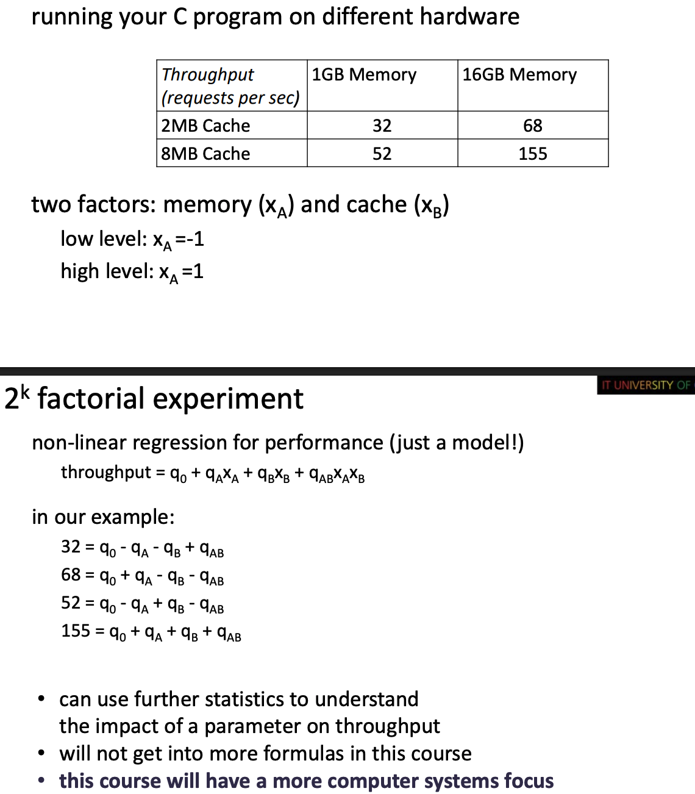

### Overview

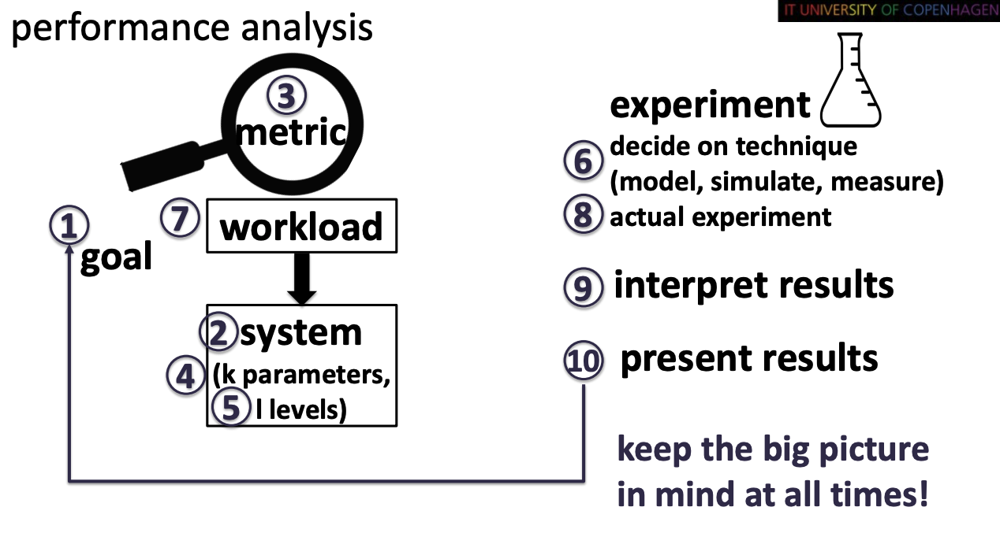

## Lecture 2 - Memory Hierarchy & Parallelism

Typical storage hierarchy has *registers* and *caches* closest to the core, *main memory* (som type of RAM) at the edge of the caches & *persistent memory* past the main memory. When moving from the caches closest to the core and outward toward persistent & archival storage, the following holds:
- Less data locality - data is much further away from the source of processing
- More access latency - retrieving or placing data takes a longer time as it is further away from the source of processing
- Less bandwidth
- More Storage Capacity per cost - the hardware is a cheaper storage option

Note the following interesting considerations:
- The persistent memory may have a further internal hierarchy, f.ex. by having an SSD next to the main memory and a hard disk at the next level of the hierarchy.
- Not all memory needs to be local - it can be remotely located and accessed with the extra latency for communication.
- Data transfer between registers, caches and main memory is managed by hardware whilst moving data to persistent storage is managed with software.
- When moving data we cannot move single bytes and oddly sized pieces, we always move a certain "page size" or "cache line" which gets smaller on smaller storage devices, meaning if we want a single piece of information from disk to the registers we move a big chunk of data to begin with and then take smaller and smaller pieces as we go towards the smaller more expensive storage.

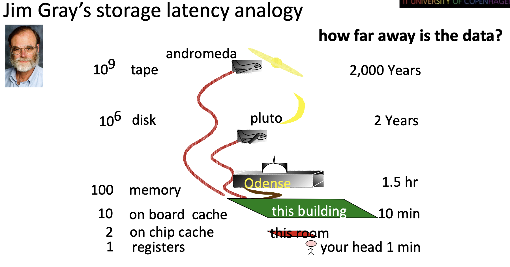

| Level | Access latency | Capacity |
| --- | --- | --- |
| Registers (inside the core) | 1 cycle / ~0.2 ns | 16×8 B |
| L1-I / L1-D | 1–2 ns | 32 KB each |
| L2 | 3–7 ns | 256 KB |
| L3 / LLC (last-level cache) | 10–40 ns | 8–10 MB |
| Main memory (DRAM) | 80–140 ns | 16–64 GB |
| NVMe SSD | 10–40 μs | 1–2 TB |
| Hard disk | 3–10 ms | 1–2 TB |
| Archival storage (tape) | ~100 s | 8 TB |

### Locality
Locality refers to how programs often tend to access the same or similar item close together in time or space. We generally refer to **temporal locality** as locality where recently referenced items are likely to be referenced again and **spatial locality** as locality where nearby addresses of a referenced item are likely to be referenced.

This locality is important and can be exploited on both hardware and software level to create more efficient programmes.
The goal is to optimise for locality in the cores, such that latency of fetching data from lower levels is reduced! But there are a lot of small details that are important to be aware of, such as what happens when there is *no space left in the cache* - how is data replaced, to still ensure f.ex. temporal localities are sustained. Also, how to handle *replacement of data* is relevant - is it an immediate effect or on replacement it is written back to the lower level cache?

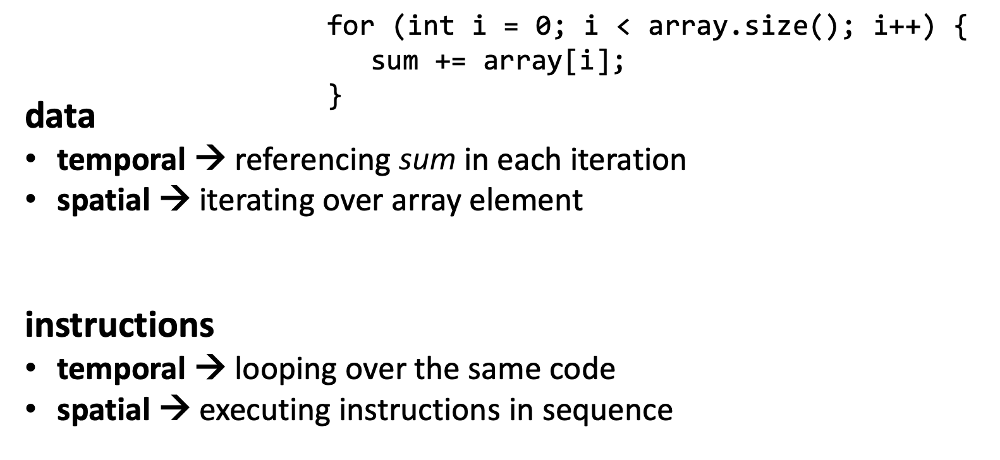

### RAM (Main Memory & Caches)
Random-Access Memory (RAM) is memory that provides *almost constant random-access latency* wherever data is. This is fast memory, but it is *volatile* and will not sustain between power down and power up.

A fun quirk is the **sequential access is slightly faster** than random access in RAM, because the hardware often **prefetches adjacent blocks**, such that the next-coming data items are quickly obtained from prefetched data in the case that they were adjacent in memory.
There are two main sub-divisions of RAM, namely:
- *DRAM* (Dynamic RAM) - common for Main Memory - requires refresh even when the power is on!
- *SRAM* (Static RAM) - common for caches / registers - more energy-efficient AND expensive!

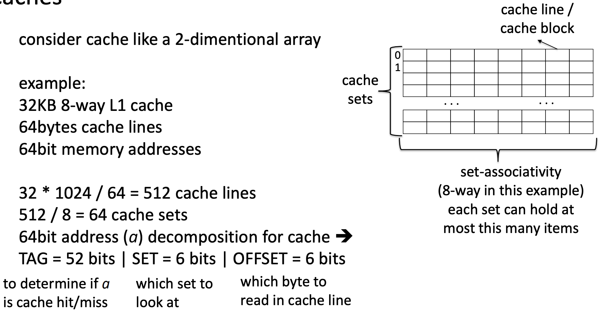

### CPUs
CPU stands for Central Processing Unit and is the part of the computer that is performing instructions using data.
We used to have single-core CPUs, but nowadays almost all systems are **multi-core** (i.e. multiple CPU cores in a single processor) or even **multi-socket** (i.e. multiple processor units with each multiple cores).
This does not mean that CPUs have gotten any faster or complex - they are actually pretty similar - but just gives extra power for processing in parallel.


#### Parallelism
Parallelism is the way we are gaining more efficient computing at this point. One such type is **implicit parallelism** which utilizes "downtime" when there is access latency to perform other tasks in the meantime (just like someone with ADHD who is utilizing it as a skill). Note that implicit parallelism happens within a single core CPU.

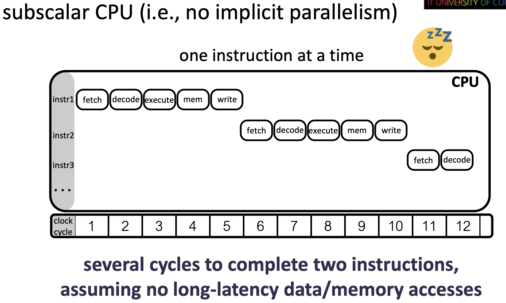

**RISC** Instruction stages:
- **fetch** - get the instruction from the cache
- **decode** - understand instruction and required input data
- **execute** - perform teh operation
- **memory** - access memory if needed
- **write** - write-back results into registers

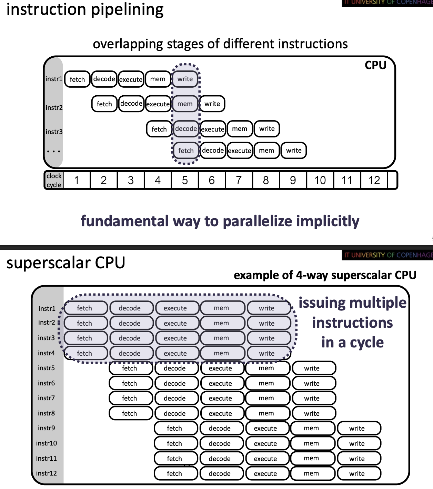

The other main type is **explicit parallelism**, where we run threads on different cores. This only utilizes the system when specified to do so, meaning it requires hard work to leverage it well. This is where we introduce *multi-core*, *multi-socket* and *distributed systems* (i.e. multiple different machines even).
The main challenge in explicit parallelism is **synchronization** of threads when accessing the *system state* and *data*, because we want the threads to produce a desired sequentially consistent result even as they are working in parallel.

Here is an overview of the memory hierarchy of some of the mentioned types of processor systems; note particularly where the shared data is located compared to the core in terms of data locality:

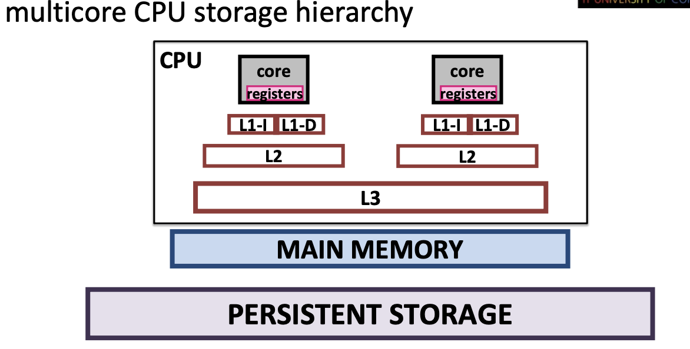

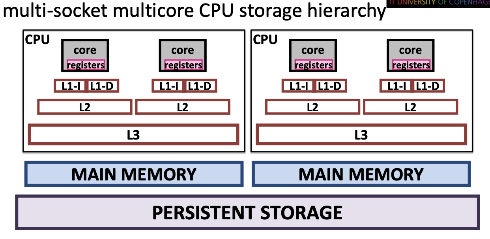

When working with *multi-socket* systems we may utilize **NUMA** (Non-Uniform Memory Access) to access the Main Memory of the other socket (which corresponds to a remote Main Memory, and therefore has a longer access latency).
NUMA impacts the multi-socket situation such that there are the following latencies between threads:
- Within-core: 10 cycles
- Within-socket: 50 cycles
- Other-socket: 500 cycles

### Terminology
- **OoO Execution** - Out-of-Order Execution - refers to how instructions may be executed in an alternate order than specified given that the instructions are unrelated (i.e. they are not dependent on each other)
- **SIMD** - single-instruction multiple-data - an implicit data parallelism where the same instruction is a applied to multiple data points at a time, achieving vector operations easily. This kind of parallelism needs to be specified in software though.
- **SMT** / **Hyperthreading** - Simultaneous Multithreading - Has more register space and divides it between threads that then have each their own context window, and the threads are swapped in each CPU cycle. This may struggle if done wrong, as it puts extra pressure on caches and other shared resources.
- **TLB** - TODO
- **Pagesize** - TODO

### Useful Commands:
- Memory hierarchy topology: `lstopo --output-format svg -v --no-io > cpu.svg`
- CPU topology: `lscpu`
- Checking Pagesize: `cat /proc/meminfo`
- Core-by-Core Info: `cat /proc/cpuinfo`
- Core-by-Core Info + TLB: `cpuid`

## Lecture 3 - Profiling
When programmes run poorly, how do we fix it? We could give up or try things blindly?
Or! we can make measurements to find the actual problem and tracing it to the source. Profiling is about finding **bottlenecks** in code to explain why a programme runs with the speed it does.
A bottleneck is the *limiting factor/component for the capacity/throughput* of a software system. Fixing bottlenecks is a continuous journey - when you fix one bottleneck, the next bottleneck will reveal itself.
Here are some common examples:
- Coarse- vs. fine-grained locking for synchronization
- I/O data latency on access - can be improved by optimizing caching and data locality
- unnecessary duplicate work, were multiple threads perform the same procedure

We usually care about bottlenecks for one of the following reasons:
- Our system cannot satisfy the current workload. Can be solved by throwing more hardware at it or fixing the bottlenecks to run more efficiently long-term.
- Want to cut down costs by running the existing workload on less hardware.

We can find bottleneck by either using existing tooling (Intel VTune, gprof dtrace, perf) or by making our own custom measurements of what we are interested in investigating.

### Examples
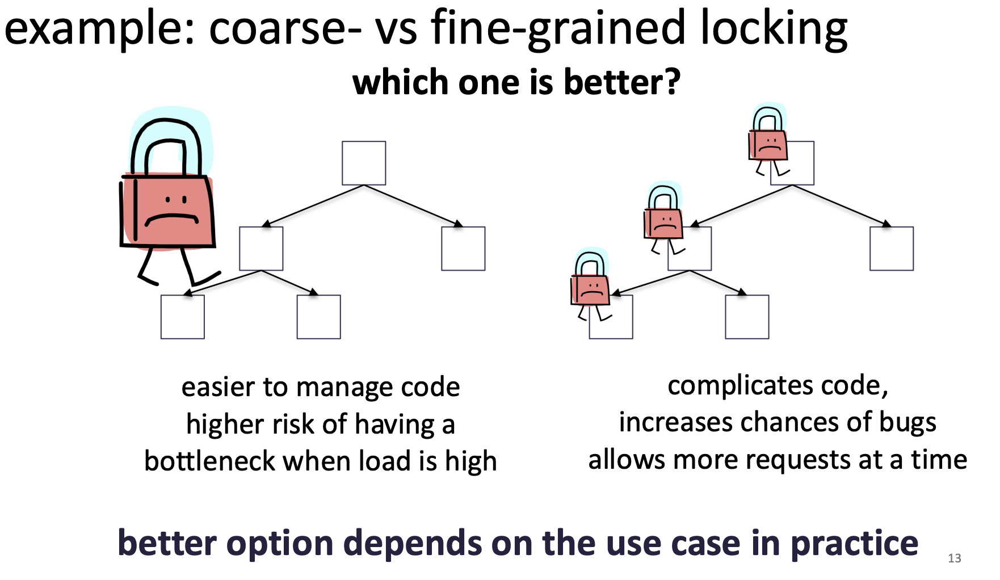
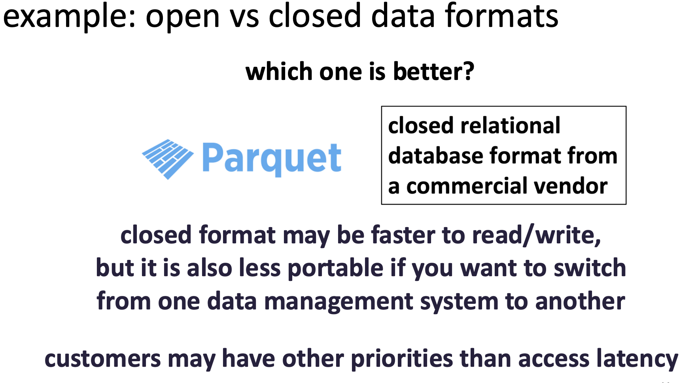

Often business priorities, ease of use, speed and other factors impact real-life production cycles, and thus a lot of obvious bottle necks exist in real life systems.

### perf
Perf is a commandline performance measurement tool. Here are some useful commands:
- `perf list` - list all measureable events that can be monitored
- `perf stat ls` - get a stat over running the command 'ls' 
    - flag `-d`
    - flag `-e event_1,event_2` measure specific types of events instead of defaults
- `perf record <command>`- makes a performance recording over running the command
    - flag `-g` adds a call graph
- `perf report` - produces the report over the recording

Visualizing with FlameGraph:
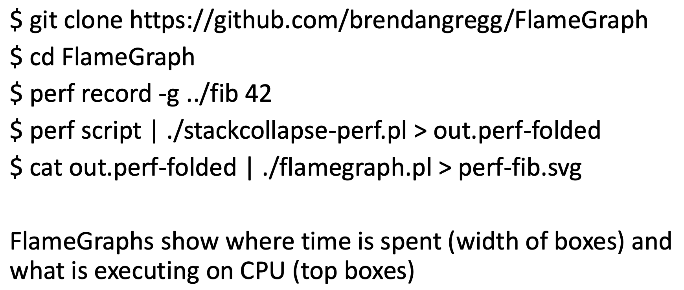

## Lecture 4 - Queueing Theory, Common Mistakes, Plotting Graphs

### Common Mistakes
- common mistakes when defining **goals**
    - *unclear / under-specified* problem or goal
    - *biased goals*, in danger of confirmation biases i.e. only finding proofs confirming the desired state.
    - *analysis without understanding* the problem underlying what is investigated
- common mistakes when defining **methodology**
    - *unsystematic approach*, i.e. arbitrary choice of parameters and not thinking through the experiments
    - *incorrect metrics*, i.e. something that is not comparable or does not measure what we are interested in analyzing
    - *unrepresentative workloads*, i.e. a workload that does not represent the real-life use case or intended application
    - *wrong evaluation technique*, i.e. often pick most comfortable setup
- common mistakes in terms of **completeness**
    - *overlook important parameters*, i.e. being careful with your setup such that it does not have any unintended behavior making it unsuitable for what is being tested
    - *ignore significant factors*, i.e. making sure to experiment with all relevant parameters
    - *inappropriate level of detail*, i.e. running too many or too few experiments to say anything concrete about the goal.
- common mistakes in the **analysis**
    - *no analysis*, i.e. simply presenting results without reasoning about them and finding trends
    - *errorneous analysis*, i.e. looking at the wrong things, averaging wrong things, false numbers, representativeness of reported numbers
    - *no sensitivity analysis*, i.e. not experimenting with the right granularity of levels to see the details
    - *too complex analysis*, i.e. working with a too complex scenario instead of starting simple
    - *ignoring errors in input*, i.e. wrong interpretation of parameters, equaling things that are not actually equal
    - *improper treatment of outliers*, i.e. distinguishing between errors and natural phenomenons in the measurements; what is because of noise and other things that could have been avoided
    - *ignoring variability*, i.e. ignoring the variance seen in the outputs across runs when writing the analysis
- common mistakes with **presentation**
    - *assuming no change*, i.e. assuming results hold on other non-comparable or future systems
    - *improper presentation of results*, i.e. use the right tools and honest communication when presenting results, such that they are conveyed to the receiver
    - *ignoring social aspects*, i.e. communication skills
    - *omitting assumptions and limitations*, i.e. not communicating them clearly, leading to misleading results and analysis
- common mistakes with **graphs**
    - missing *units* and *axis titles* on your axes
    - let 1 graph tell a *single story* to not mix unrelated signals! Also make sure to *avoid crowded* graphs with too many items at the same time.
    - *Starting the axis at non-zero* in a misleading way without stating it clearly
    - *Not having a shared y-axis* when comparing graphs
    - Make sure the *graph type* fits what is being measured and be consistent
    - Make sure text is sized properly
    - Make sure to use the space available optimally to show best detail
    - Black-and-white printing friendliness

### Queueing Theory

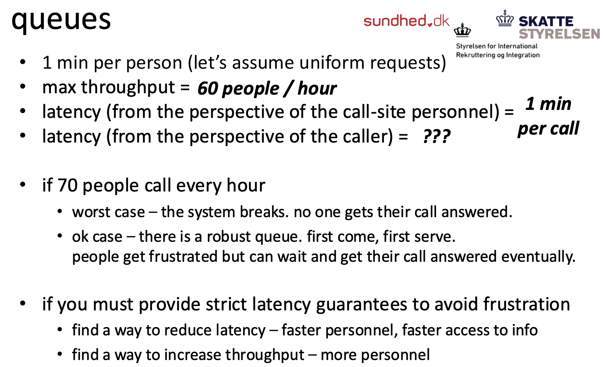

### Scalability

Scalability is an interesting metric that may take different shapes. It all depends on which scalability we are interested in measuring - in terms of cores, dataset size, servers .... ?

## Lecture 5 - Operating Systems

Running things on hardware can be tough - the OS acts as the middle layer, ensuring resources are shared between all running processes. Resources to be shared are CPU, Memory and i/o devices.

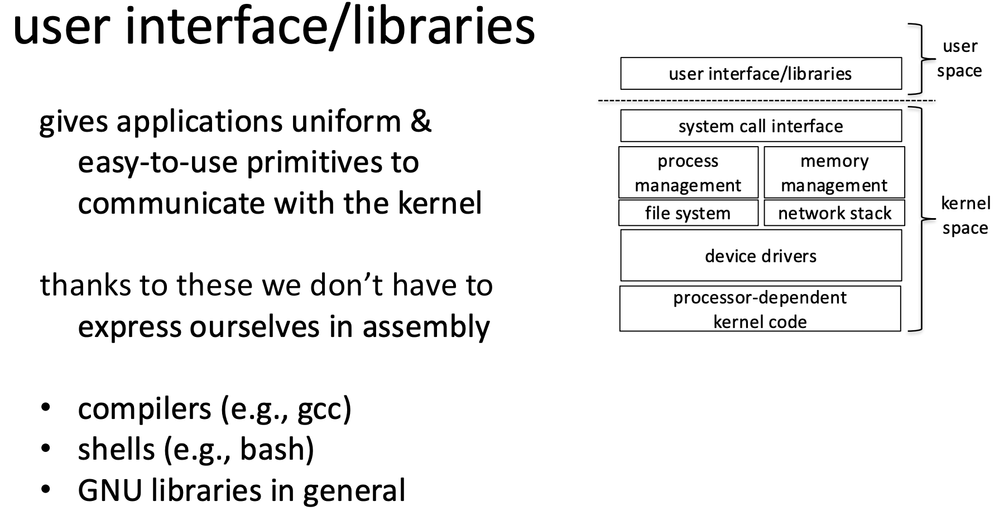

Users are not interacting directly with the hardware, but simply make requests to for example read/write a file, allocating memory, sending network packets etc. This is the **system call interface** which separates the user from the kernel space.

The **process management** gives the illusion of an infinite number of cores. Per default the processor will allocate threads on cores to a process when the process is not asking for a specific core. The OS handles the job of assigning processes on cores.
There is only a certain number of threads that can be active at a time, namely the number of logical cores / hardware contexts - for hyper-threading cores this is usually 2 per CPU core. If we have more threads than this, they will share a context window in the caches and possibly interrupt each other.

The **memory management** gives the illusion of infinite memory. I.e. each process running from the user space through the OS has its own virtual memory set with its own memory address space. The OS will switch your process memory back and forth as needed using more memory than physically available by swapping it to the disk. If things are swapped back and forth too much, it is not good and is called *thrashing*.

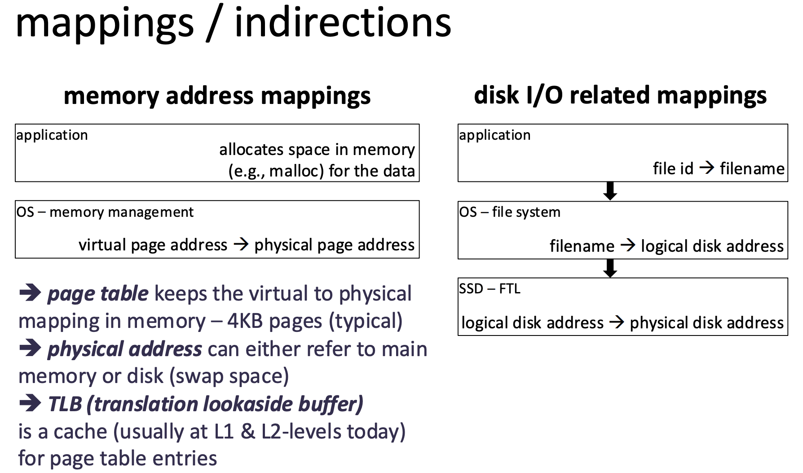

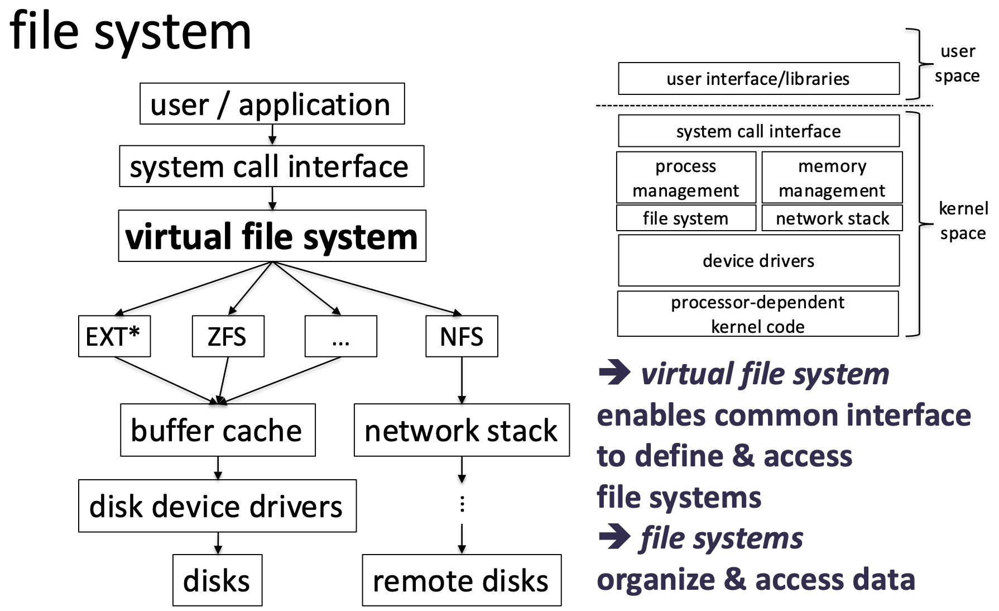

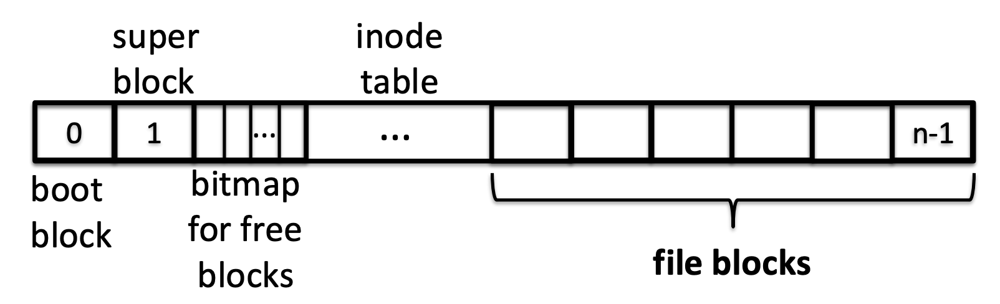

- *file blocks* - has data stored in files. If block size is too large, it will cause small files to waste space. If block size is too small, it will cause too many block addresses to keep track of. Most common is 4KB.
- *inode* - has metadata about files and where to find them.
- *inode table* - maps the inode number to the inode in storage.
- *bitmap* - an overview of which blocks are free - 0 / 1 for each file block.
- *super block* - has metadata about the entire file system (size of bitmap, number of each component, offsets etc.)
- *boot block* - starts / boots the OS

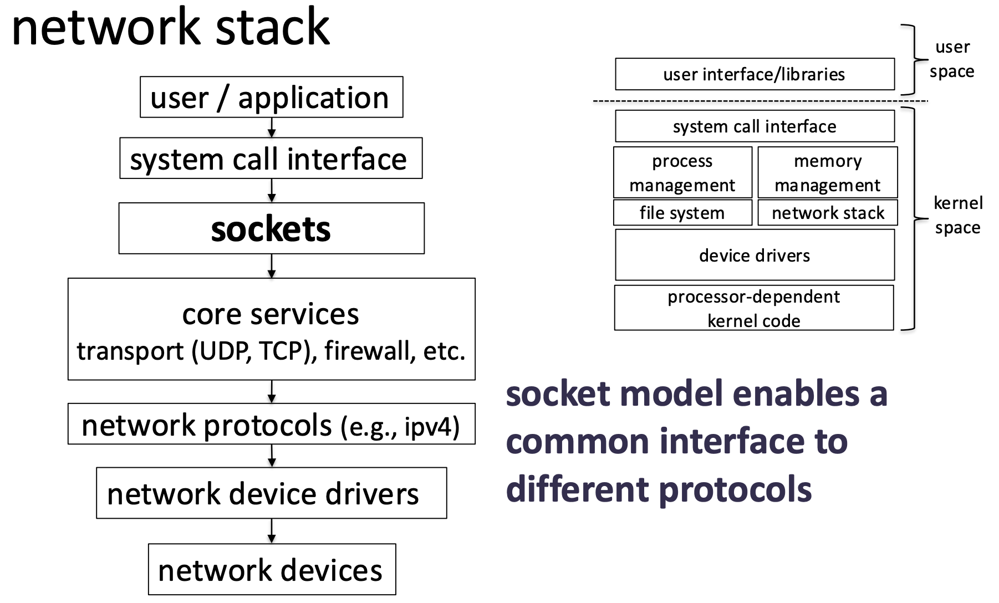

The **device drivers** are drivers to control hardware components - it is OS-dependent and device-hardware-dependent. Allows controlling other hardware such as a mouse, printer, keyboard etc.

The **processor-dependent code** is the translator between low-level machine code and the specific processor instruction set. Some processors support some hardware speed-ups while others do not.

### Microkernel

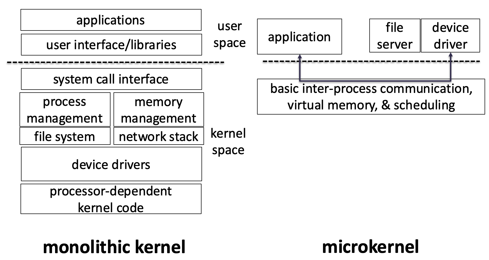
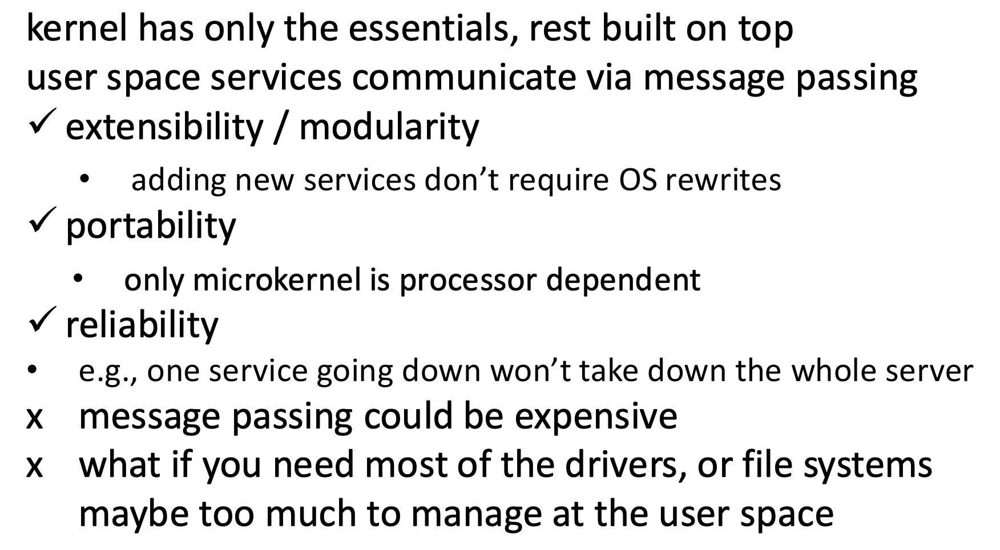

### Traditional Database Systems

OS and DB have many things in common and solve many similar problems - but they differ in DB being very application specific while OS is more general and cannot be as controlled.

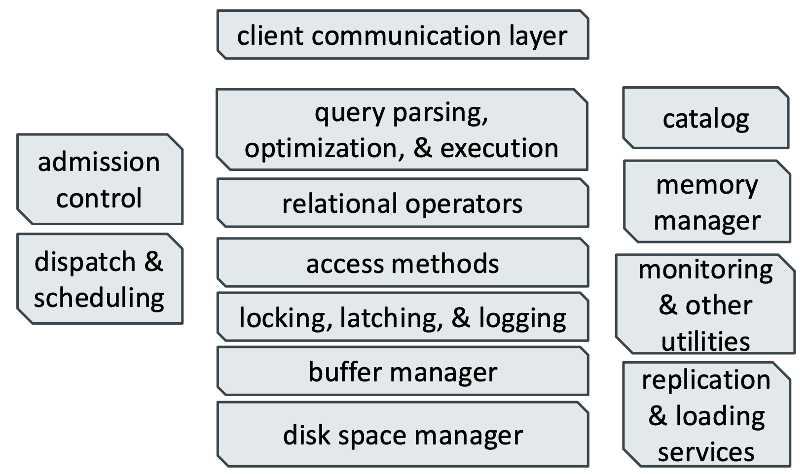

- **admission control** - prevents receiving too many requests at the same time
- **dispatch and scheduling** - after receiving a client request, decides how to execute on which threads etc.
- **catalog** - management of metadata
- **memory manager** - keeps track of all available memory
- **monitoring and other utilities**
- **replication and loading services**
- **client communication layer**
- **query parsing, optimization, & execution**
- **relational operators**
- **access methods**
- **locking, latching and logging**
- **buffer manager** - keeps track of data read from disk into main memory
- **disk space manager** - keeps track of data in disk storage

## Lecture 6 - Benchmarking

A **workload** is a set of operations or requests executed on a system.
A **benchmark** is one or more workloads used to assess a system's performance against other systems.

### Synthetic vs Real workloads

| Aspect | Synthetic | Real |
| --- | --- | --- |
| Representativeness | Mimics real behavior; may be uniform or skewed, not fully representative | Actual production behavior; you know exactly what ran |
| Ease of use | Easy to develop/use; independent of customer; can simplify features | Harder to obtain/deploy; privacy scrubbing; may need a lot of storage |
| Controllability | Easy to tune parameters and stress specific behaviors | Harder sensitivity analysis; only covers paths the workload hits |
| Bottom line | Both have value | Both have value |

### Types of benchmarks
Whenever we create a system, we tend to desire to evaluate the performance against other systems. If we do not have these other systems, that may be difficult!

**Micro-Benchmarks** are used to evaluate specific lower-level system operations, e.g., memory latency, reading from disk, syscall cost …
- *pros*
    - focused on a specific system component
    - controllable workload
    - helpful for detecting bottlenecks
    - easy to run
- *cons*
    - ignores interactions with teh rest of the system
    - may not be representative / realistic

**Macro-Benchmarks** are used to evaluate higher-level system behavior. 
- *pros*
    - realistic evaluation of behavior
    - reflect real workloads and use cases
- *cons*
    - performance issue causes not imminent
    - may have confidential information
    - harder to scale & control

When finding a benchmark, find commonly used benchmarking workloads in related works such that results are comparable. If the use case is novel or different, using a benchmark and modifying it slightly is also an option.

### Standard benchmarks
- *processors* - SPEC (Standard Performance Evaluation Corporation)
- *data management systems* - TPC (Transaction Processing Performance Council), YCSB (Yahoo! Cloud Serving Benchmark)
- *machine learning systems* - MLCommons, TPCx-AI
- *storage* - fio

SPEC and TPC are non-profit standardization organizations, and are therefore good defaults for fair comparisons between companies when talking about hardware and database systems respectively.
Developing benchmarks for common use cases is a huge contribution to the community!

BUT! **Benchmarks can be gamed** by configuration - hardwired things, systems design to fit the benchmark, unfair configuration. We also need to make sure what we report; bugs may make code run super fast which we may be oblivious to if we do not check the validity of the results.

## Lecture 7 - Persistent Storage Devices
**Tape** is *cheap* way of storing data, but only allows *sequential* access the data. Today, this is only used for archival storage.

**Hard disk** have many disks with a number of *tracks* on each disks. Disks are placed on top of each other, and tracks at the same diameter make a *cylinder*. A track is composed of adjacent *blocks* that are the unit of read/write operations. Blocks are composed of *sectors* which are fixed size.
When accessing data on a hard disk, the data locality is crucial to the access latency. The *I/O latency* for hard disks is = seek_time + rotational_delay + transfer time = ~1-20 ms + ~0-10 ms + ~<1ms for 4KB. I.e. the seek time (move disk arm to track) and rotational delay (find block on track) are the main contributors to the latency. This is also the reason that *sequential access is much faster than random access* on hard disks. But we can have sequential in many ways on hard disks:
- Adjacent block on the same track
- Block on the same cylinder (short rotational delay)
- Block on adjacent cylinder (short seek time to switch track)

**RAID** (Redundant Array of Independent Disks) - several disks gives the illusion of a single large disk. Increases performance and reliability because the disks may work independently.
Performance and reliability rely on *data striping* (data is partitioned and distributed on the disks) and *redundancy* (duplicating data on multiple disks to avoid accidental data loss)

**Persistent Memory** - *NVM* (Non-Volatile Memory), *SCM* (Storage Class Memory), *NVRAM* (Non-Volatile RAM) - faster than hard disks / SSDs and slower then Main memory. It is persistent and *byte-addressable* and has *no significant difference between random and sequential access*. Was commercialized by Intel but discontinued for economical reasons few years later.

**SSD** (Solid State Disk) has evolved a lot while other types of storage remained similar in performance over the years, hereunder better pricing and capacity. Data management is therefore shifting from in-memory optimized to SSD optimized.

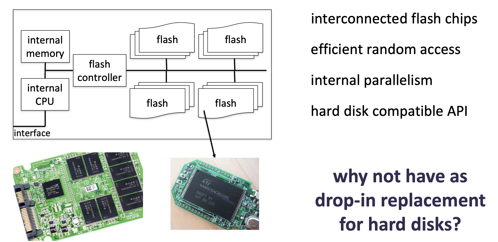

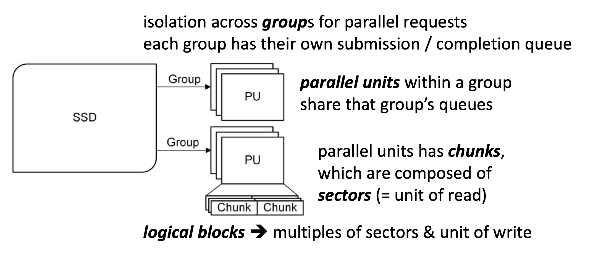

- cannot *override* a unit before it is erased
- unused blocks are handled by *garbage collection* such that they can be reused
- *write amplification* = data is physically written
- Writing data may trigger garbage collection
- *wear leveling* - some cells / blocks die over time
- read/write *latencies* are unpredictable if a request gets stuck in garbage collection

disks have *computational units* inside them handling communication and logical mapping of addresses to their physical location, as well as handling wear leveling and caching. SSDs are more complex than Hard Disks in the part of the unit due to the *flash translation layer*
the benefits of fast storage wasted by
- data movement overheads (from device to host & across network)
- black-box generic flash-translation layers
- multitude of software layers

**Computational Storage** is when computation is done on the IO path, i.e. the storage device itself (disk) has ram and compute to perform computations right at the data source.

## Lecture 8 - Oracle Guest Lecture

## Lecture 9 - Hardware Acceleration & GPUs

## Lecture 10 - AI Performance

## Lecture 11 - Cloud

## Lecture 12 - Snowflake Guest Lecture

# Exercise Walkthrough

## Week 1 - getting started

## Week 2 - Core Affinity

## Week 3 - Using Perf to measure Fibonacci & core affinity