# Q3 — Electronics (all_electronics)

Look at each image **before** reading the questions. For every item, work through the **core sequence**, then the **extra questions**.

**Core sequence (adapt to what the image shows):**

1. **Identify** — name every component (or state the exam task)
2. **Schematic** — draw the correct circuit with standard symbols
3. **Breadboard** — describe or sketch the physical wiring
4. **Code** — write the Arduino sketch to read or control the component
5. **Why** — explain key design choices (resistors, supplies, protection, pin types)

Also practise:

- [ ] Correct schematic symbols for every component used in the course
- [ ] Bench power supply use (voltage/current limit) vs Arduino USB / 5 V pin
- [ ] Wire each circuit from memory on a breadboard or simulator

---

### Part 01 — Component set: power supply, board, resistor, push button

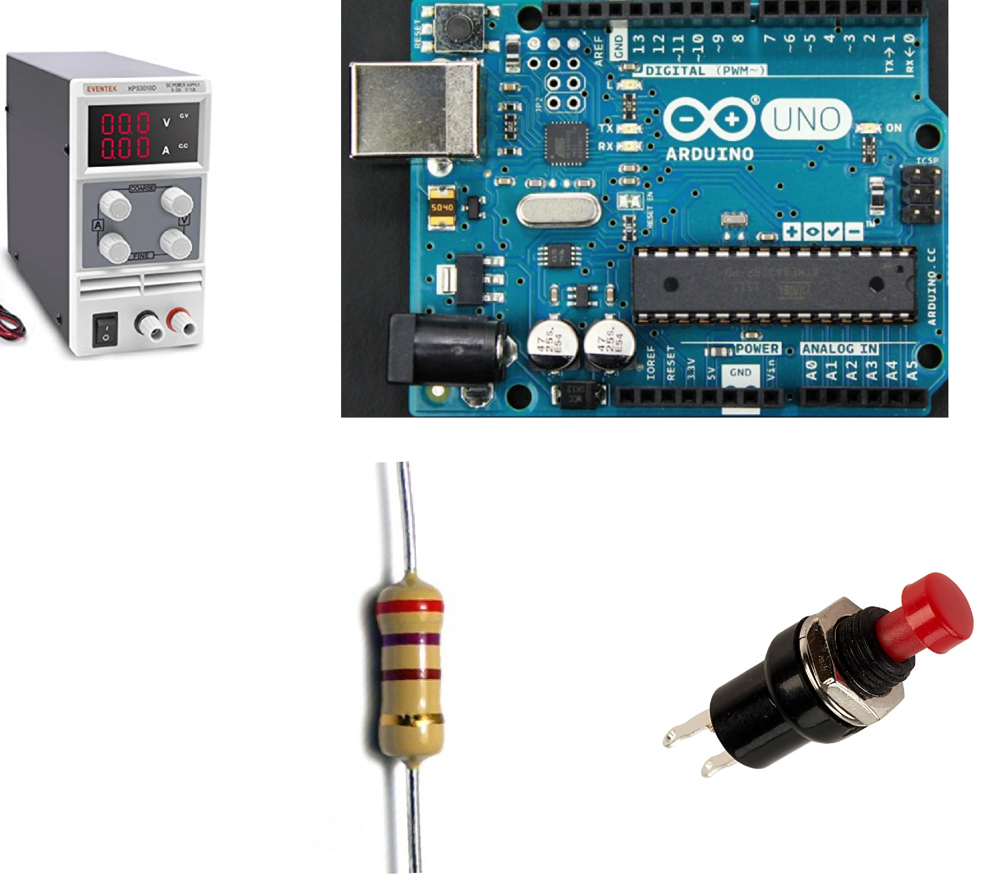

**What is it?** Four items: variable bench power supply with V/A displays and knobs; blue microcontroller board with USB and pin headers; through-hole resistor with colour bands; red panel-mount push button with two terminals.

**Core sequence:** *(apply the five steps — task: read the button with the microcontroller)*

**Extra questions:**

- Read the resistor colour bands — what value and tolerance?
- Which Arduino pins are power, ground, and digital input?
- Pull-up vs pull-down: draw both variants.
- Why not connect the button directly without a resistor?
- When would you use the bench supply vs USB power?

---

### Part 02 — Component set: power supply, board, potentiometer

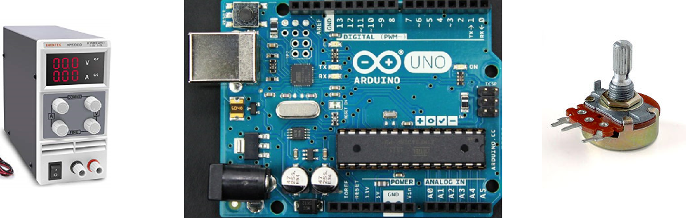

**What is it?** Bench power supply, Arduino-class board, and a rotary three-pin potentiometer with knurled shaft and solder lugs.

**Core sequence:** *(apply the five steps — task: read the potentiometer)*

**Extra questions:**

- Which pin is the wiper and which two are the fixed ends?
- Why connect the ends to 5 V and GND and the wiper to an analog pin?
- What voltage appears at the wiper at 0 %, 50 %, and 100 % rotation?
- Write `analogRead()` code and map the result to a useful output range.
- What happens if you only use two pins?

---

### Part 03 — Component set: power supply, board, resistor, LED

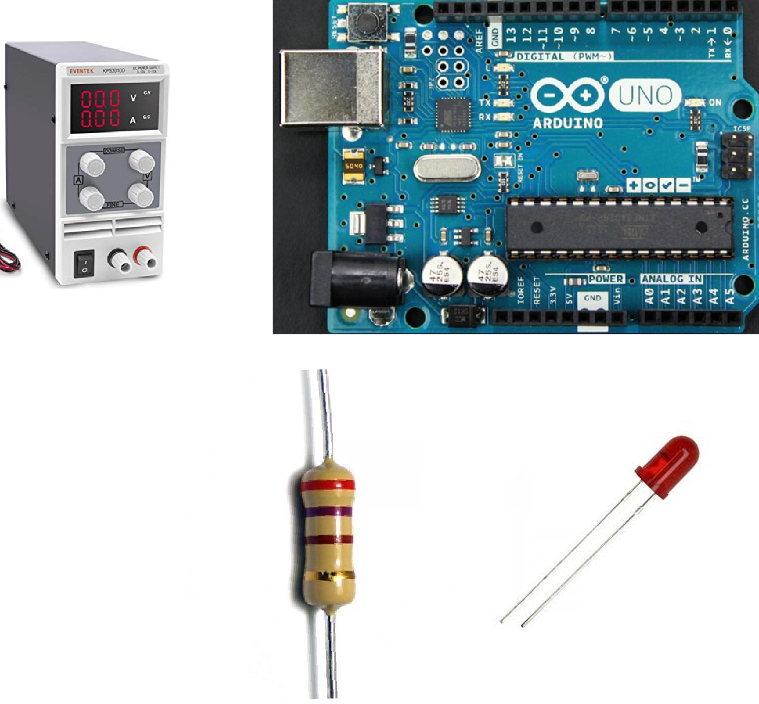

**What is it?** Bench power supply, Arduino board, four-band resistor, 5 mm red LED with two legs of different length.

**Core sequence:** *(apply the five steps — task: control the LED from a digital pin)*

**Extra questions:**

- Read the resistor value from the colour bands.
- Which LED leg is anode and which is cathode?
- Calculate series resistor for ~10–20 mA from 5 V (show working).
- Draw correct series vs incorrect parallel connection to the same supply.
- How do you dim the LED in software?

---

### Part 04 — Component set: power supply, board, resistor, transistor symbol, geared motor

**What is it?** Bench supply, Arduino, 1 kΩ resistor (brown-black-red-gold), hand-drawn NPN transistor symbol (b, c, e), small yellow geared motor with red/black wires.

**Core sequence:** *(apply the five steps — task: switch the motor on/off in one direction)*

**Extra questions:**

- Why cannot the motor connect directly to an Arduino pin?
- Draw the low-side switch: base resistor, collector to motor, emitter to ground.
- Where does the motor power supply connect?
- What is missing for a inductive load (motor)?
- Write code to turn the motor on/off from a digital pin.

---

### Part 05 — Component set: power supply, board, capacitor, driver module, motor

**What is it?** Bench supply, Arduino, 25 V 100 µF electrolytic capacitor, small black stepper driver board (ENABLE, MS1–MS3, STEP, DIR, VMOT, 1A/1B/2A/2B pins), small geared motor with 5-wire connector.

**Core sequence:** *(apply the five steps — task: drive the motor from the Arduino)*

**Extra questions:**

- Why is a driver module required between the Arduino and the motor?
- Which pins connect to STEP and DIR? Which to VMOT and GND?
- Where does the capacitor go and why?
- Explain the difference between a stepper and a DC motor.
- Write minimal code to step the motor in one direction.

---

### Part 06 — Schematic: four transistors around a motor

**What is it?** Circuit diagram: motor in the centre; four transistors in an H layout (PNP top, NPN bottom); base resistors R1–R4; four diodes; VCC and ground; four control inputs.

**Core sequence:** *(apply the five steps — task: bidirectional DC motor control)*

**Extra questions:**

- Which two transistors turn on for forward vs reverse rotation?
- What happens if Q1 and Q2 are on simultaneously?
- Purpose of the four diodes?
- How is speed controlled in addition to direction?
- Draw how this connects to a microcontroller and motor supply.

---

### Part 07 — Small blue actuator with three-wire cable

**What is it?** Small translucent blue rectangular actuator with white horn on top, mounting tabs, label "Tower Pro Micro Servo 9g SG90", three-wire cable (orange, red, brown) ending in a 3-pin connector.

**Core sequence:** *(apply the five steps — task: position the horn to a commanded angle)*

**Extra questions:**

- How is this controlled differently from a DC motor or stepper?
- What does the internal feedback loop consist of?
- Which wire is signal, power, and ground?
- Write code using `Servo.h` or `writeMicroseconds()`.
- Advantages and disadvantages vs a stepper for a pen-lift mechanism?

---

### Part 08 — Infrared sensor module (two views)

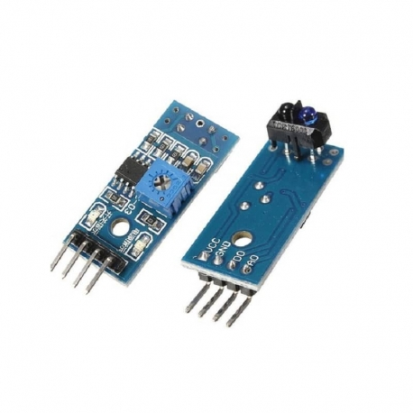

**What is it?** Two small blue PCBs: reflective IR emitter/receiver under a black housing labelled TCRT5000; blue adjustment screw; small IC; indicator LEDs; four pins labelled VCC, GND, D0, A0.

**Core sequence:** *(apply the five steps — task: detect a line or nearby surface)*

**Extra questions:**

- How does the sensor detect a line vs background?
- Difference between reading D0 and A0?
- What does the blue screw adjust?
- Draw the wiring to the Arduino.
- Write code for both digital threshold and analog distance-style reading.

---

### Part 09 — Completed schematic: GPIO, transistor, diode, motor, 12 V

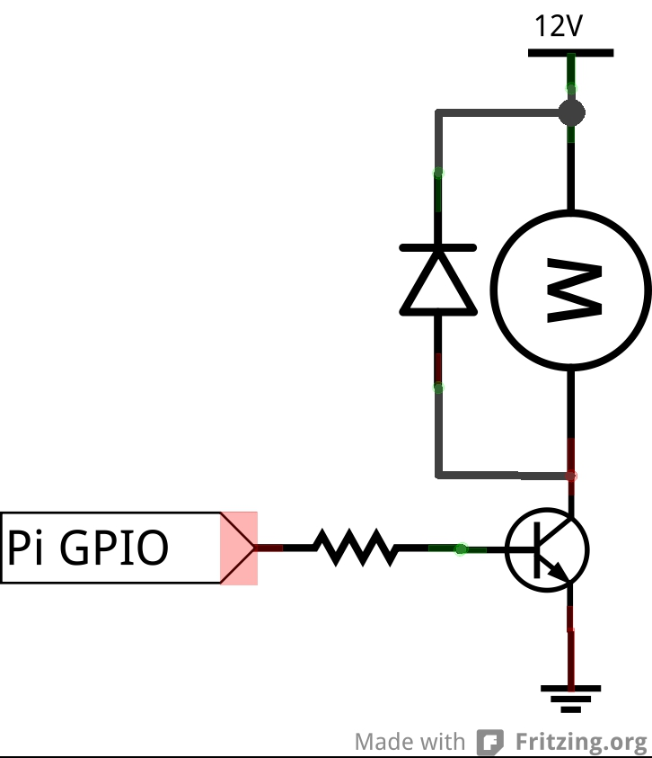

**What is it?** Fritzing-style schematic: GPIO pin → resistor → NPN base; collector to motor and diode; emitter to ground; motor other side to 12 V rail; flyback diode across motor.

**Core sequence:** *(apply the five steps — explain and reproduce this circuit)*

**Extra questions:**

- Why is the GPIO labelled "Pi GPIO" but the same idea applies to Arduino?
- Why 12 V for the motor and not 5 V from the board?
- Diode orientation — which way and why?
- Calculate base resistor if GPIO is 3.3 V or 5 V (order of magnitude).
- What changes for bidirectional control?

---

### Part 10 — Square motor with four wires and mounting holes

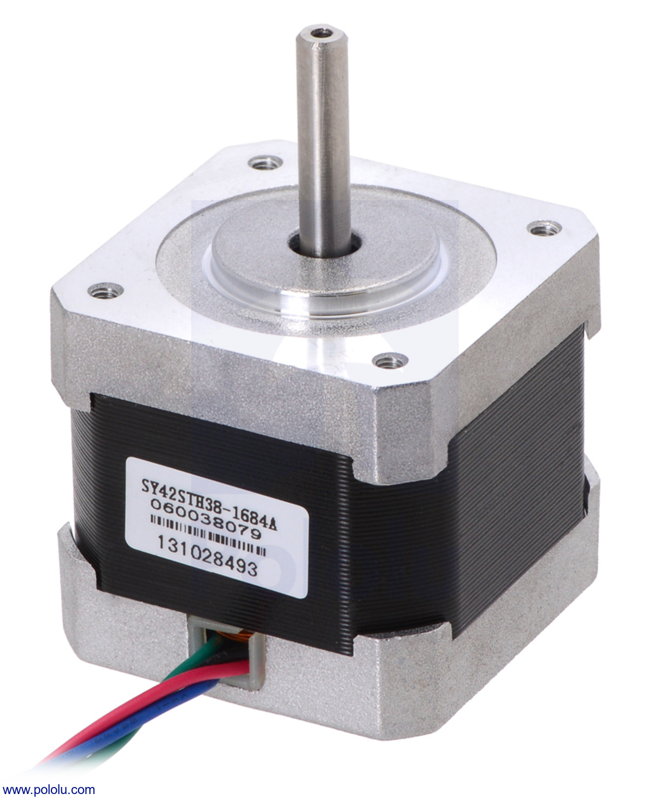

**What is it?** Square-profile black-and-silver motor, shaft on top, four corner mounting holes, four coloured wires (red, blue, green, + one) from bottom grommet; label "SY42STH38-1684A".

**Core sequence:** *(apply the five steps — task: identify and drive this motor type)*

**Extra questions:**

- Motor type? How many phases/wires and why?
- What driver is needed and why not direct Arduino connection?
- Typical applications in the mechanism images?
- Open-loop vs closed-loop — does this motor know its position?
- Compare to the yellow geared motor in Part 04.

---

### Part 11 — Exam prompt: read a switch

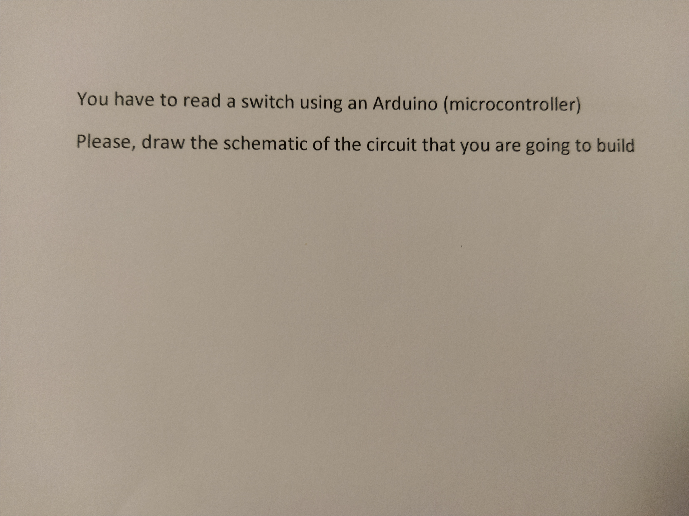

**What is it?** Printed text: "You have to read a switch using an Arduino (microcontroller). Please, draw the schematic of the circuit that you are going to build."

**Core sequence:** *(apply the five steps)*

**Extra questions:**

- Draw both pull-up and pull-down versions — which is more common on Arduino?
- Write `setup()` and `loop()` with debouncing.
- What voltage does the pin read when the button is open vs pressed?
- Common mistakes in exam schematics (missing resistor, short to wrong rail).

---

### Part 12 — Exam prompt: read a potentiometer

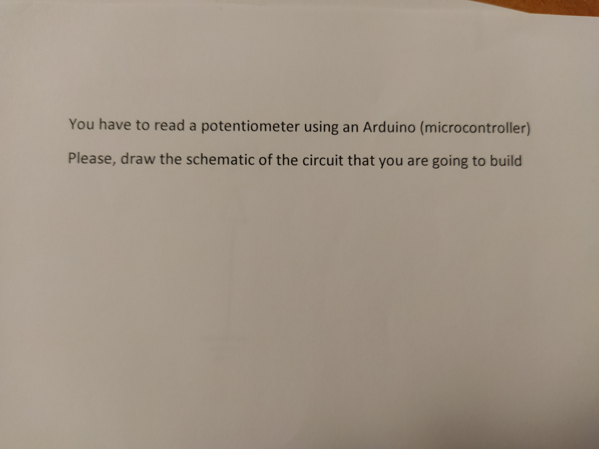

**What is it?** Printed text: "You have to read a potentiometer using an Arduino (microcontroller). Please, draw the schematic of the circuit that you are going to build."

**Core sequence:** *(apply the five steps)*

**Extra questions:**

- Label all three potentiometer terminals on your schematic.
- Why is this a voltage divider?
- Convert 10-bit ADC reading to voltage and to a percentage.
- Could you use a digital pin instead? Why or why not?

---

### Part 13 — Exam prompt: control an LED

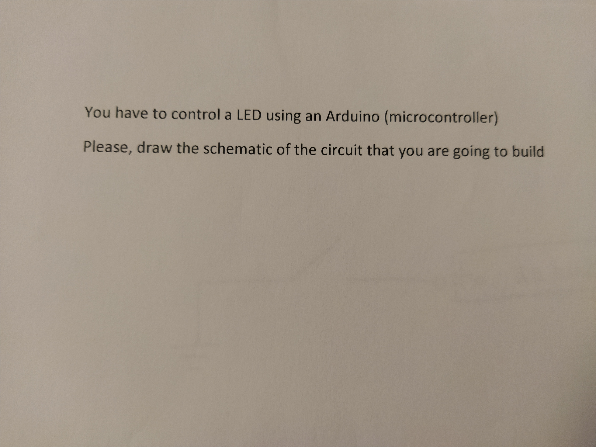

**What is it?** Printed text: "You have to control a LED using an Arduino (microcontroller). Please, draw the schematic of the circuit that you are going to build."

**Core sequence:** *(apply the five steps)*

**Extra questions:**

- Minimum parts list for a working circuit.
- Show correct current direction through the LED.
- Pick a resistor value and justify with Ohm's law.
- Blink vs PWM brightness — code for both.

---

### Part 14 — Exam prompt: drive a DC motor (6 V, 500 mA)

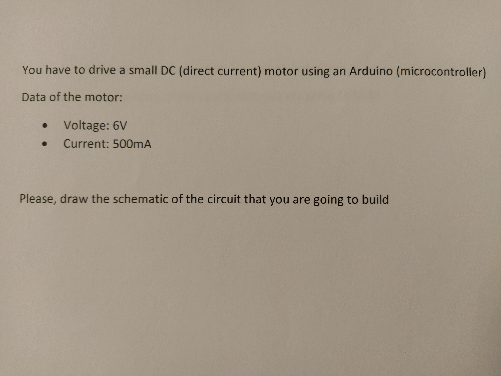

**What is it?** Printed text: drive a small DC motor with Arduino; motor data **6 V, 500 mA**; draw the schematic.

**Core sequence:** *(apply the five steps)*

**Extra questions:**

- Why must the Arduino not power the motor directly from a pin?
- Draw with transistor **or** H-bridge — when is each enough?
- Separate motor supply: how do you tie grounds?
- Flyback diode — where and why?
- Add direction control — what extra parts?

---

### Part 15 — Exam prompt: drive a stepper motor

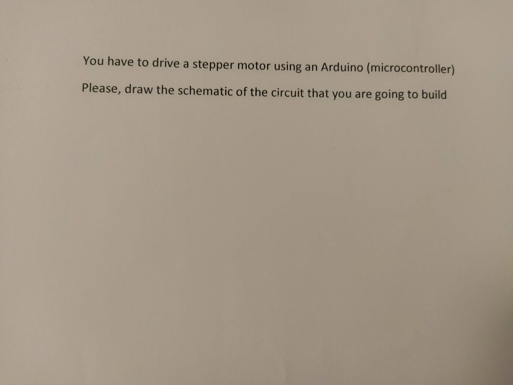

**What is it?** Printed text: "You have to drive a stepper motor using an Arduino (microcontroller). Please, draw the schematic of the circuit that you are going to build."

**Core sequence:** *(apply the five steps)*

**Extra questions:**

- Why almost never wire a stepper directly to Arduino pins?
- Draw Arduino → driver → motor → power supply (include cap if needed).
- STEP/DIR wiring and minimal code.
- Compare to Part 05 component photo — same solution?

---

### Part 16 — Hand-drawn symbol: three-terminal variable resistor

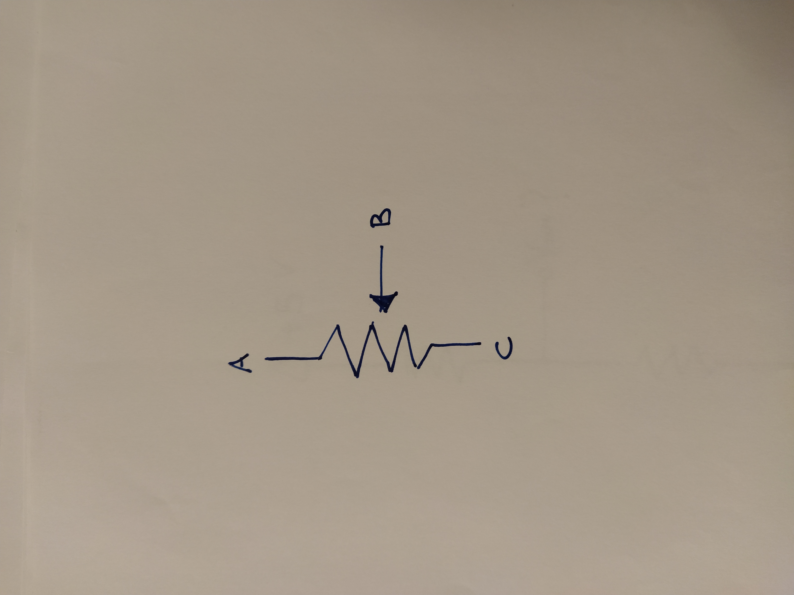

**What is it?** Blue ink on paper: vertical zigzag resistor symbol; terminals labelled A (top), B (middle, arrow wiper from right), C (bottom).

**Core sequence:** *(apply the five steps — identify symbol, then draw full circuit)*

**Extra questions:**

- Standard name for this component and symbol?
- Which terminal is the wiper?
- Draw it connected for analog input to a microcontroller.
- Fixed resistor symbol vs this symbol — difference?

---

### Part 17 — Hand-drawn circuit: two resistors and Vout

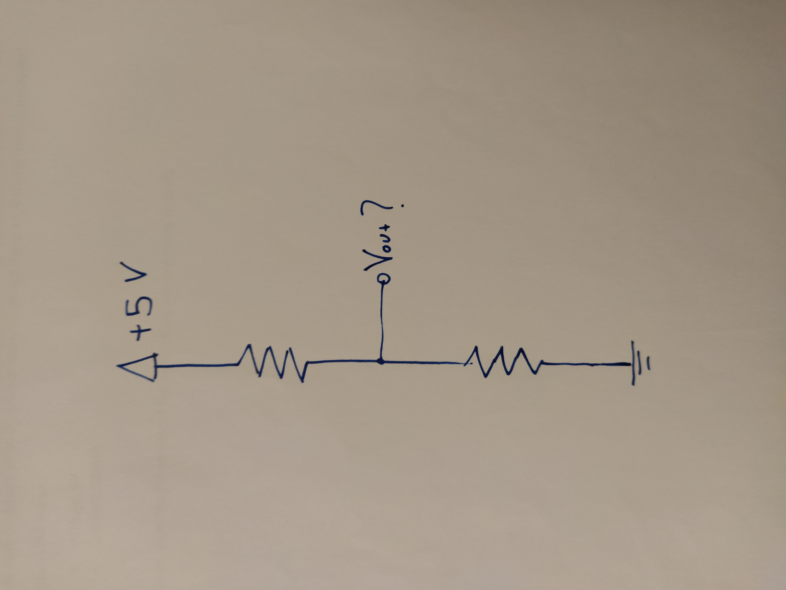

**What is it?** Hand-drawn: +5 V at top; two resistors in series; node labelled "$V_{out}$ ?" between them; ground at bottom.

**Core sequence:** *(apply the five steps — explain and use this circuit)*

**Extra questions:**

- What is this configuration called?
- If both resistors are equal, what is $V_{out}$?
- General formula for $V_{out}$ in terms of R1, R2, and supply.
- Link to the potentiometer — how is a pot the same idea?
- Why not connect $V_{out}$ directly to 5 V or GND with no resistors?

---

### Part 18 — Hand-drawn circuit: switch to ground, to Arduino

**What is it?** Hand-drawn: ground symbol; wire to open switch; other switch side to a point labelled "to ARDUINO". **No resistor shown.**

**Core sequence:** *(apply the five steps — critique and fix)*

**Extra questions:**

- What is missing for reliable operation?
- What undefined voltage does the pin read when the switch is open?
- Draw the corrected version.
- Active-low vs active-high in code.

---

### Part 19 — Hand-drawn block diagram: board to four-wire motor

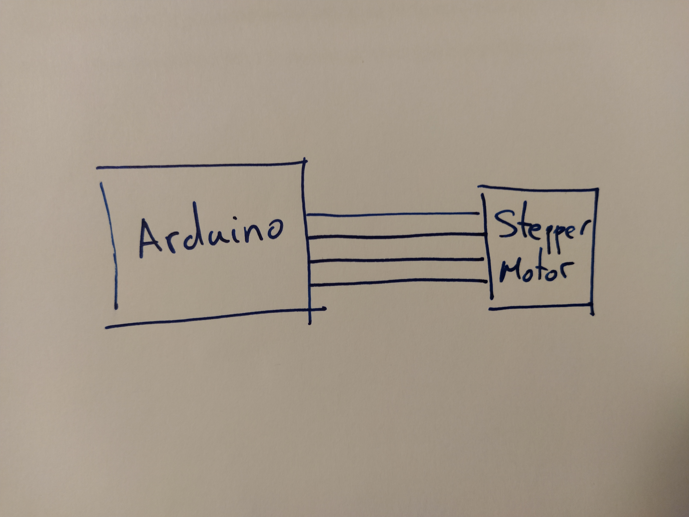

**What is it?** Two boxes labelled "Arduino" and "Stepper Motor" connected by four parallel lines. **No driver or power supply shown.**

**Core sequence:** *(apply the five steps — critique and fix)*

**Extra questions:**

- What is wrong or incomplete about this diagram?
- Draw the full schematic a examiner would expect.
- Why four wires on the motor?
- Current and voltage limits of Arduino pins vs motor needs.

---

### Part 20 — Hand-drawn circuit: +5 V directly to ground

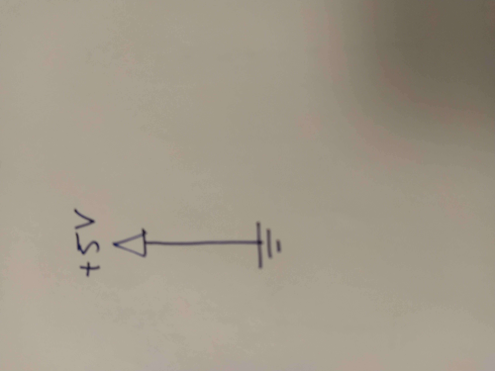

**What is it?** Hand-drawn: +5 V triangle symbol connected by a single vertical wire directly to ground symbol. **No components in between.**

**Core sequence:** *(apply the five steps — identify the problem)*

**Extra questions:**

- What is wrong with this circuit?
- What happens to current if you build this?
- How does a loaded circuit (LED, resistor, etc.) differ?
- Role of current-limiting in every practical circuit.

---

### Part 21 — Hand-drawn circuits: LED wiring comparison

**What is it?** Two hand-drawn circuits separated by a dashed line. **Left:** +5 V → resistor → LED → ground (series). **Right:** +5 V splits to resistor on one branch and LED on another branch, then rejoins to ground (parallel).

**Core sequence:** *(apply the five steps — which is correct?)*

**Extra questions:**

- Which side is the correct way to drive an LED from a microcontroller pin?
- What happens on the right side when you turn it on?
- Draw the correct version connected to an Arduino digital pin.
- Add resistor value and calculate current for the correct circuit.
