# Q2 — How a machine works (all_mechanisms)

Look at each image **before** reading the questions. Work through the **core sequence** on every machine, then the **extra questions**.

**Core sequence (every machine):**

1. Identify components: linear guides, bearings, motors, belts/gears/screws, structural elements
2. Trace power: motor → reduction (if any) → end effector
3. Count DOFs
4. Name sensors and actuators — which type, and **why**?
5. Identify driver and microcontroller

---

### Part 01 — Pen plotter on smooth rods (white frame)

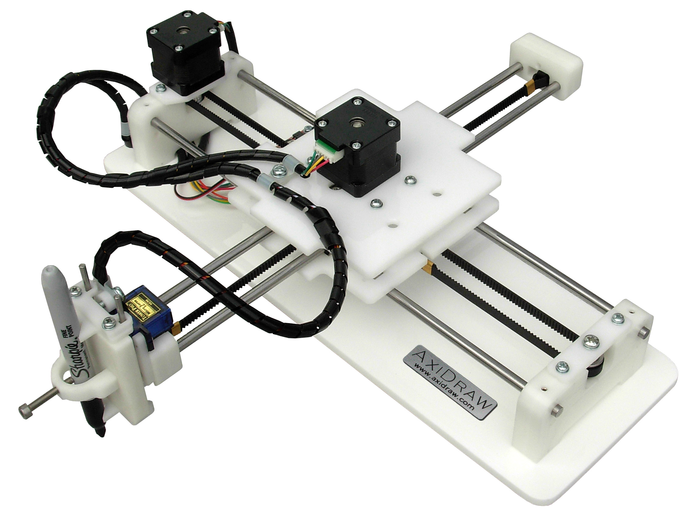

**What is it?** The machine is a drawing machine, intended to draw with any pen or pencil on the 2D plane that it is placed on top of.

**Core sequence:** *(apply the five steps above)*
1. Components
    - Main Structure with rods, plastic parts and a pen (and cable management)
    - Likely linear bearings on each of the rods.
    - 2 stepper motors & 1 servo motor
    - belts and pulleys
2. Power
    - Each stepper motor controls one axis of movement in the XY-plane. The leftmost motor spins a pulley which moves the belt (rotating -> linear translation), that moves the platform with the second stepper motor.
    - The second stepper motor also spins a pulley which moves a belt to move the pen closer or further away from the motor location.
    - The servo motor controls the Z-direction of the movement and therefore whether the pen touches the underlying surface or not.
3. DOFs
    - 3: XYZ drawing machine.
4. Sensors & Actuators
    - I do not see any sensors in the setup, but there may be some somewhere to reset the stepper motors and detect when the pen is touching the underlying surface.
    - The actuators are 2 steppers and 1 servo.
5. Driver / Microcontroller
    - Not visible on the picture. Most likely contains 2 stepper drivers. The controller need to be able to take some kind of program / 2D drawing and use the machine's 3-axis movement to make that drawing.

**Extra questions:**

- How many controlled axes? Which axis only needs up/down, not precise positioning?
    - we control 3 axes. The Z-direction only needs up/down as we are only controlling whether the pen is on the paper or not.
- Why might one axis use a different actuator type than the other two?
    - Because of the movement types - the up/down movement of the pen is in a very limited range while the movement around the plane should be precise relatively speaking and on a broader range.
- Where are the linear guides and what slides along them?
    - The rods are used as linear guides for the movement on the XY-plane, i.e. the movement of the platform with a stepper motor and the movement of the pen-holder.
- What is the end effector and how is it angled relative to the paper?
    - The end effector is the pen drawing on the paper.

---

### Part 02 — Pen plotter (silver rail, ribbon cables)

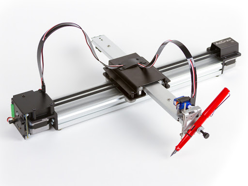

**What is it?** Silver aluminium main rail with a perpendicular arm, black motor housings at the rail ends, flat ribbon cables in a loop, small blue motor on a red pen holder, control connectors at one end.

**Core sequence:** *(apply the five steps above)*

**Extra questions:**

- Compare the cable routing to Part 01 — how is movement accommodated?
- Where is power/control connected?
- Cantilever arm: what are the trade-offs vs a fully supported gantry?
- Same machine family as Part 01 — what is different in the mechanical layout?

---

### Part 03 — T-slot frame plotter over a notebook

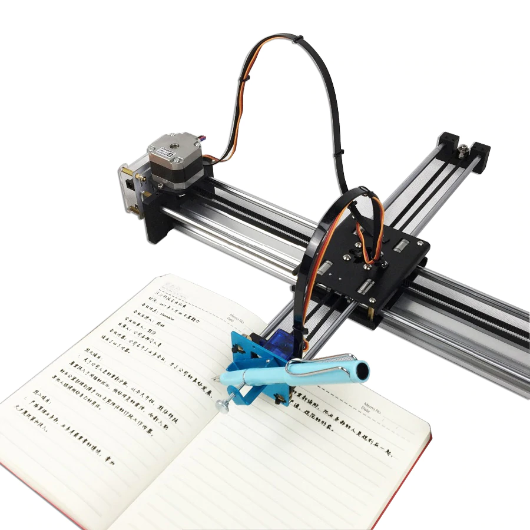

**What is it?** Silver T-slot aluminium T-frame over an open notebook with handwriting. Black toothed belts on the extrusions, black carriage plates with rollers, one large motor at the rail end, blue pen clamp with thumb-screw, small blue motor on the carriage, green PCB with USB at the far end.

**Core sequence:** *(apply the five steps above)*

**Extra questions:**

- How is the pen raised and lowered?
- Trace the belt path for each horizontal axis.
- What does the green board at the end likely contain?
- How many motors total, and what does each one move?

---

### Part 04 — Rectangular acrylic-frame drawing machine

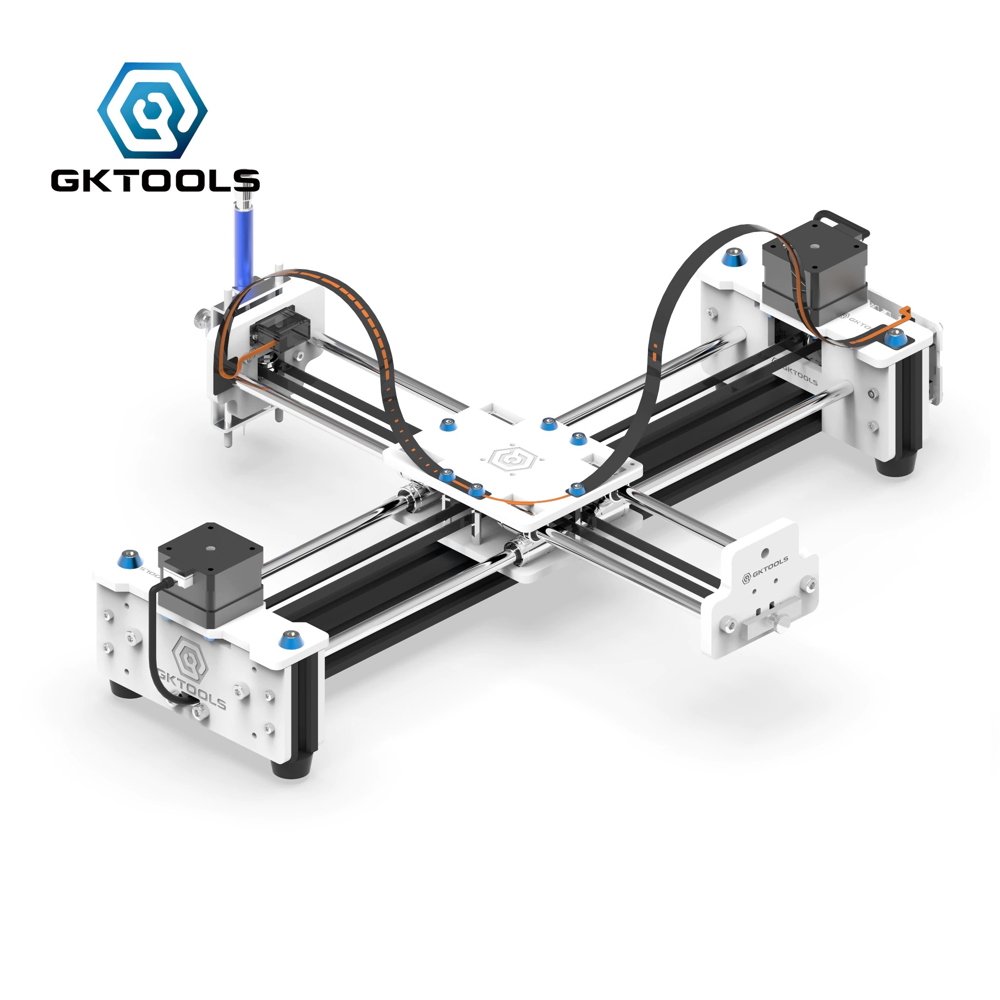

**What is it?** Flat rectangular kit machine: clear/acrylic structural plates on an aluminium extrusion frame, belts running in multiple directions on the perimeter, central pen carriage, motors mounted on the frame (not on the moving carriage).

**Core sequence:** *(apply the five steps above)*

**Extra questions:**

- Both motors appear fixed to the frame while the carriage moves — what is this kinematic layout called?
- How do the two motors combine to move the pen in X and Y?
- Advantages of keeping motor mass off the carriage?
- What firmware is typically used for machines like this?

---

### Part 05 — Spirograph drawing machine on plywood base

**What is it?** Two-tier plywood platform on standoffs; clear acrylic gears on top; wooden arms holding a purple pen over circular paper with a dense geometric pattern; small motor with three-wire cable at the corner; green PCB with USB cable to a wall adapter.

**Core sequence:** *(apply the five steps above)*

**Extra questions:**

- Trace power from the motor through the gear train to the pen motion.
- How many DOFs does the pen have relative to the paper?
- Which parts are laser-cut vs off-the-shelf?
- Is this open-loop or closed-loop control?

---

### Part 06 — Open-frame desktop fabricator with LCD

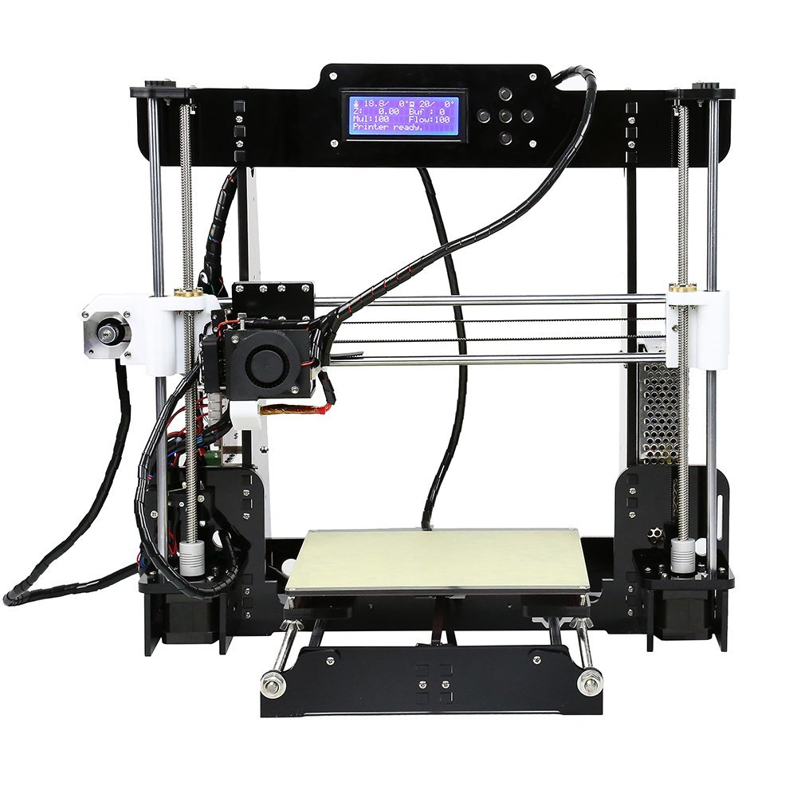

**What is it?** Black open gantry frame; square build plate on rods at the base; horizontal carriage with fan and wire bundle on upper rods; two vertical threaded rods at the sides; blue LCD with temperature and position readouts; silver power supply on the right.

**Core sequence:** *(apply the five steps above)*

**Extra questions:**

- Name each axis and its drive method (belt vs threaded rod).
- What is the end effector and what does it deposit?
- What sensors are needed for homing and temperature control?
- Why are different drive types used for horizontal vs vertical axes?

---

### Part 07 — Triangular-frame fabricator (threaded-rod frame)

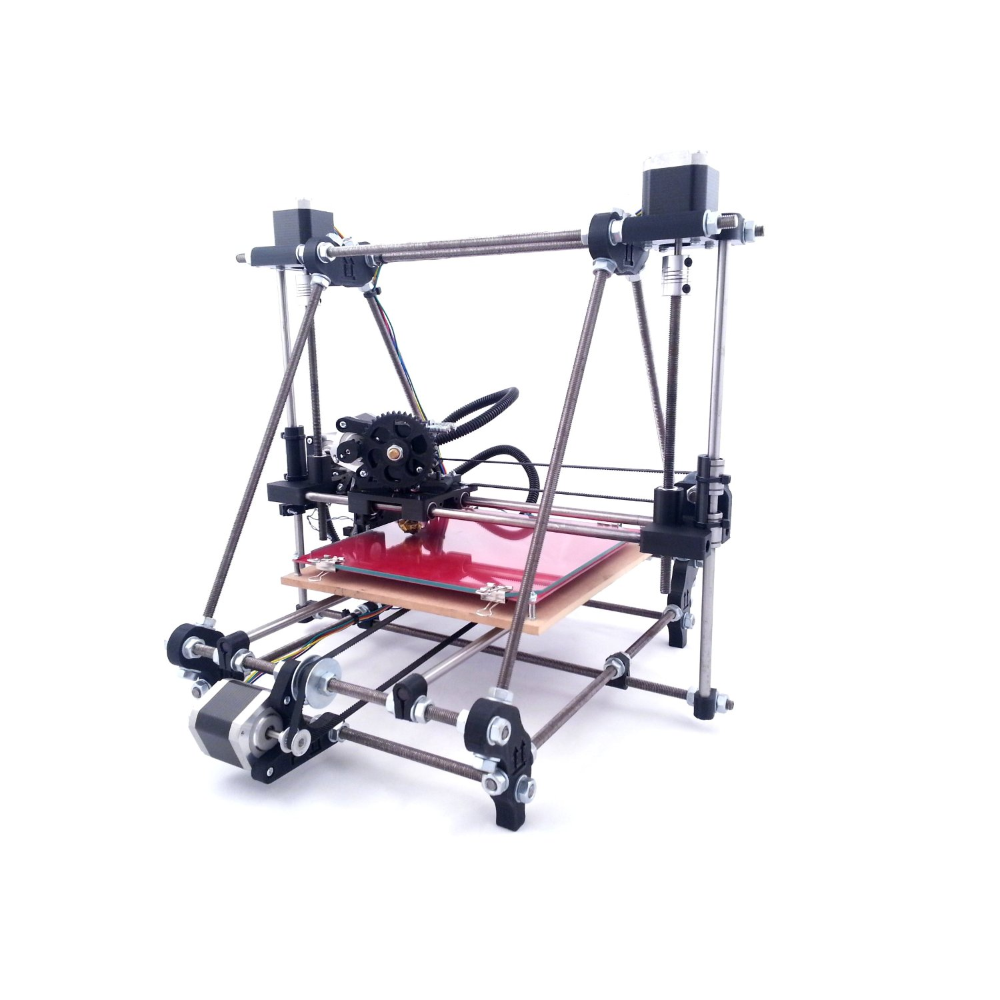

**What is it?** Triangular prism frame built from threaded rods and black plastic corner joints; moving bed on lower rods; X-carriage on upper rods with geared filament feeder; two vertical threaded rods with couplers to top motors; red heated bed on MDF with binder clips.

**Core sequence:** *(apply the five steps above)*

**Extra questions:**

- Count the motors and assign each to an axis or function.
- What are the smooth rods and what slides on them?
- Why a triangular frame instead of a simple box?
- What is the extruder gear reduction for?

---

### Part 08 — Three-pillar tall fabricator (orange carriages)

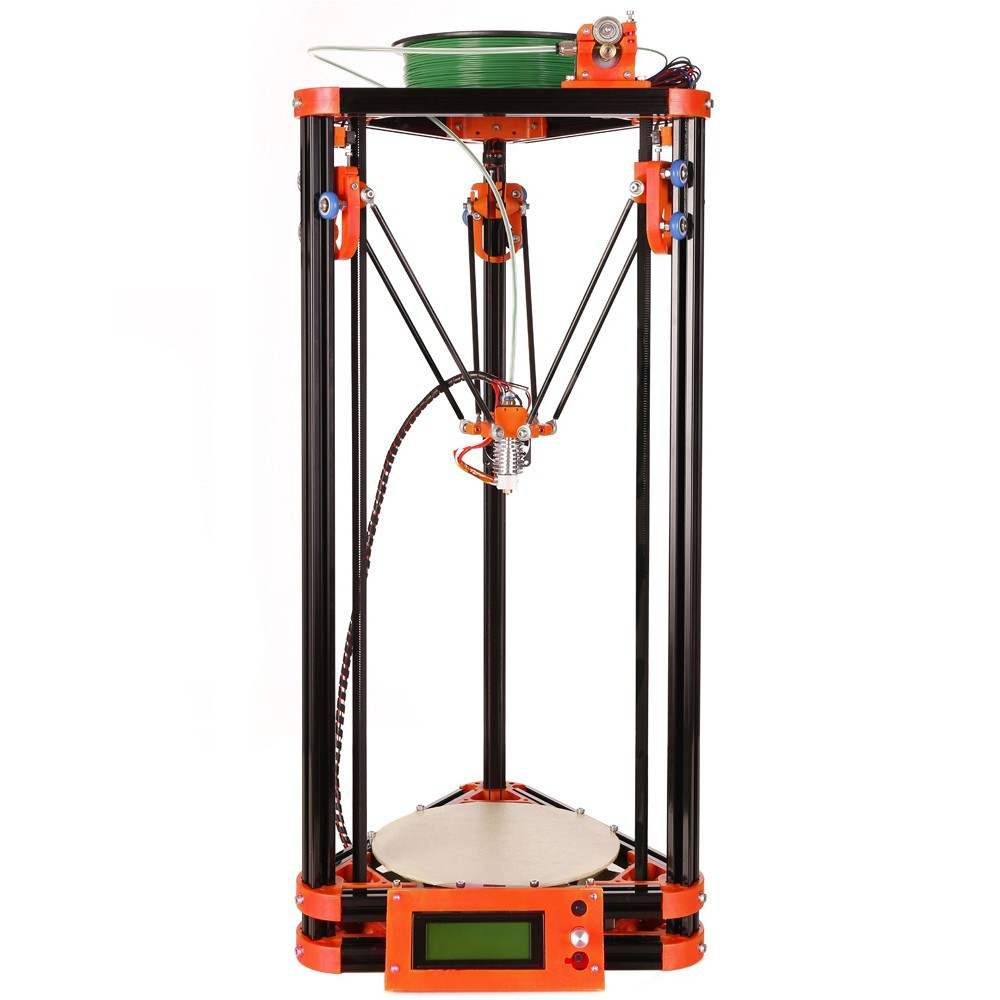

**What is it?** Three tall black pillars with orange sliding carriages; six thin rods connect carriages to a central bottom assembly; circular build plate at the base; orange extruder housing on top with green filament and white tube; green LCD and knob on front panel.

**Core sequence:** *(apply the five steps above)*

**Extra questions:**

- This is not a Cartesian XYZ machine — how does the toolhead position in 3D?
- How many carriages move independently on the pillars?
- What is the white tube for (Bowden vs direct drive)?
- Count DOFs of the effector in workspace.

---

### Part 09 — Three-pillar fabricator (four detail views)

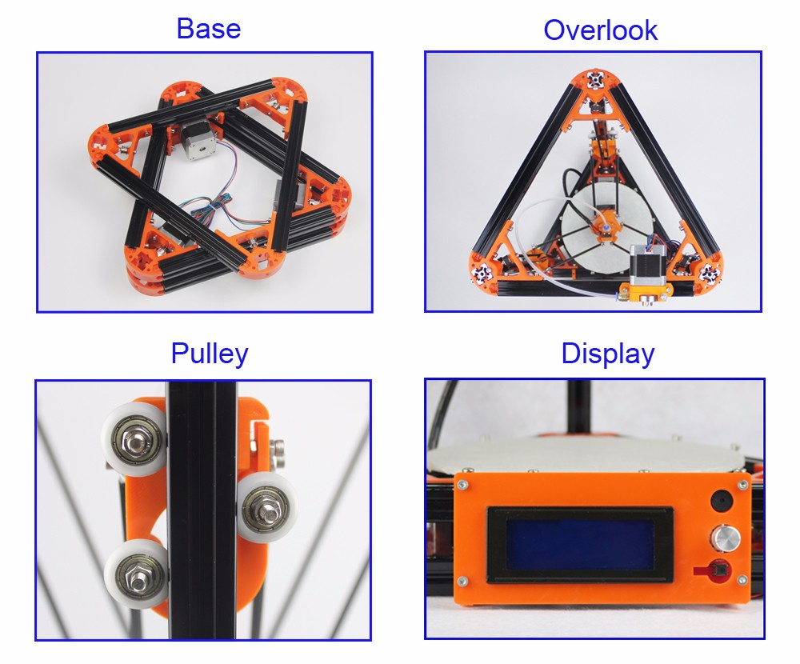

**What is it?** Composite of four photos: (top-left) hexagonal base with three internal motors and wiring; (top-right) overhead view of triangular frame, circular bed, central rods; (bottom-left) close-up of orange carriage on extrusion with three white wheels; (bottom-right) orange front panel with blue LCD, silver knob, and red button.

**Core sequence:** *(apply the five steps above — treat as one machine)*

**Extra questions:**

- In the wheel close-up: how do the rollers guide the carriage on the extrusion?
- What is the role of the three base motors?
- What electronics are on the front panel?
- Link the four views into one kinematic explanation.

---

### Part 10 — Close-up of machine safety switch and rails

**What is it?** Red mushroom button on yellow backing labelled emergency stop; metal enclosure with cables; parallel threaded rod and smooth guide rod with bearing block; aluminium extrusion frame; drag chain partially visible.

**Core sequence:** *(apply the five steps above)*

**Extra questions:**

- What is the purpose of the emergency stop in the system?
- Why is a smooth rod paired with a threaded rod on the same axis?
- Subtractive vs additive: what does this machine do differently from Parts 06–08?
- What actuator rotates the threaded rod?

---

### Part 11 — Gantry router on aluminium extrusion base

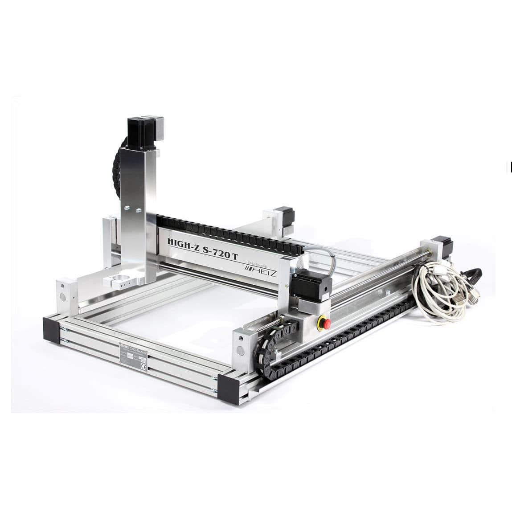

**What is it?** Open aluminium extrusion base; moving bridge/gantry; round steel guide rods; threaded drive rods; three black motors; red emergency-stop button on the carriage; drag chains along X and Y; coiled white cables with D-sub connectors; label "HIGH-Z S-720 T".

**Core sequence:** *(apply the five steps above)*

**Extra questions:**

- Assign each motor to X, Y, or Z.
- What mounts at the bottom of the Z assembly (spindle not shown)?
- What is the drag chain for?
- Compare drive system to the pen plotters in Parts 01–04.

---

### Part 12 — Compact desktop three-axis mill

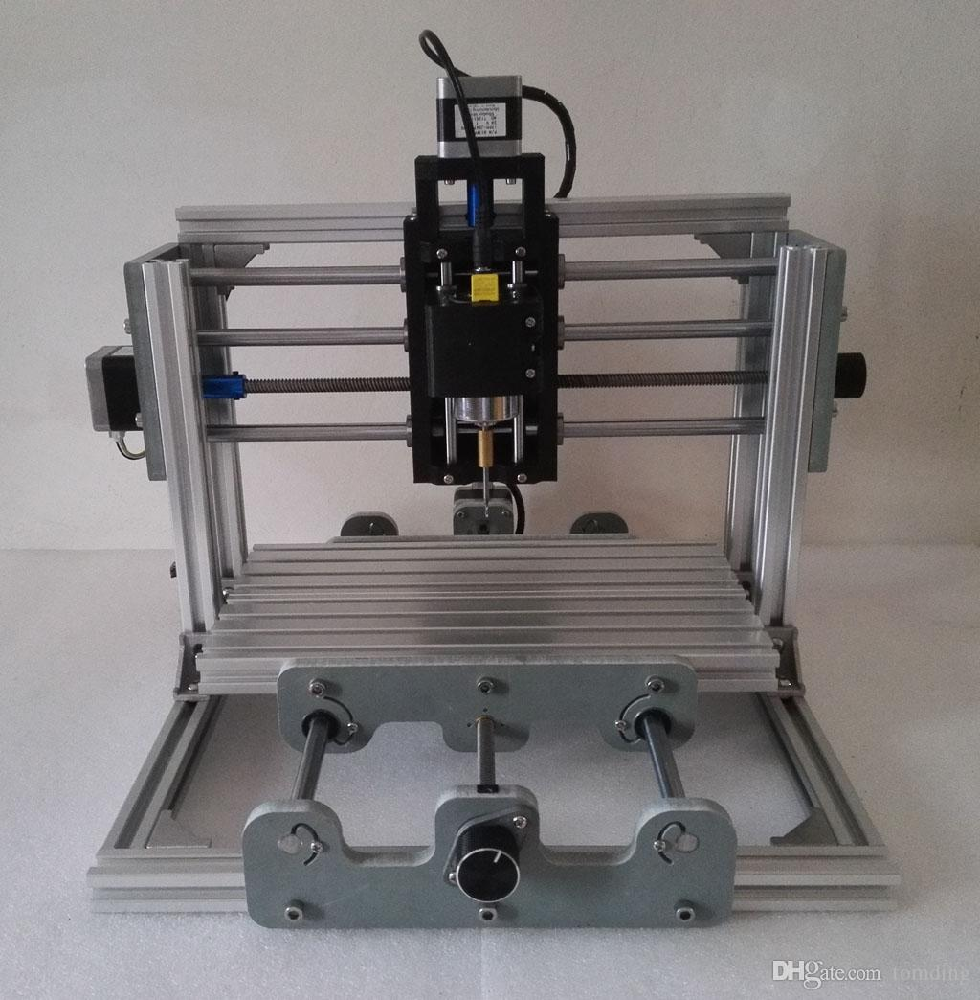

**What is it?** Aluminium extrusion frame; slotted bed plate moves on rods at the base; gantry carriage moves on rods above; vertical slide with small cylindrical tool motor and bit at the bottom; three black motors; manual knob on front plate.

**Core sequence:** *(apply the five steps above)*

**Extra questions:**

- All three axes appear to use threaded rods — why not belts on any axis?
- What is the slotted bed for (workholding)?
- What type of motor spins the cutting tool vs the axis motors?
- How many setups would you need to machine a part on all six faces?

---

### Part 13 — Open-frame gantry with finned tool module

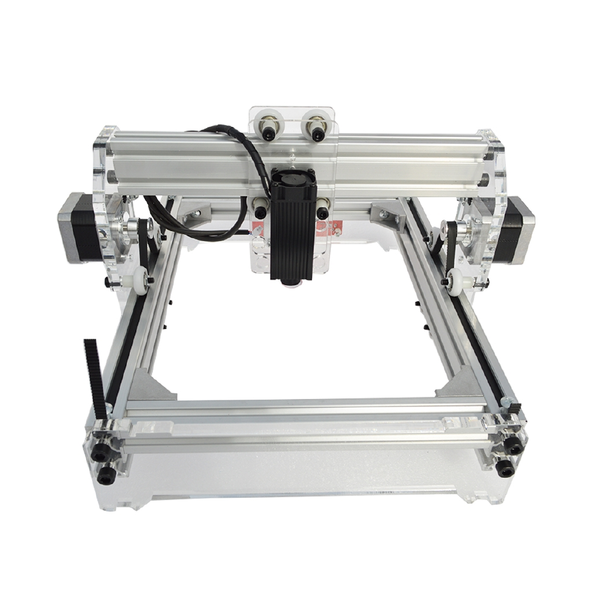

**What is it?** Aluminium extrusion rectangle; clear acrylic end plates; V-groove wheels on extrusions; timing belts on two sides; three motors; central carriage holds a black finned module with a small fan on top; spiral cable wrap on wires.

**Core sequence:** *(apply the five steps above)*

**Extra questions:**

- Is the end effector a pen, a cutter, or something else? What clues suggest which?
- How many axes of positioning vs tool action?
- Role of the fan and fins?
- Compare frame to Part 03 (same extrusion type, different end effector).

---

### Part 14 — Gantry kit with separate control board on floor

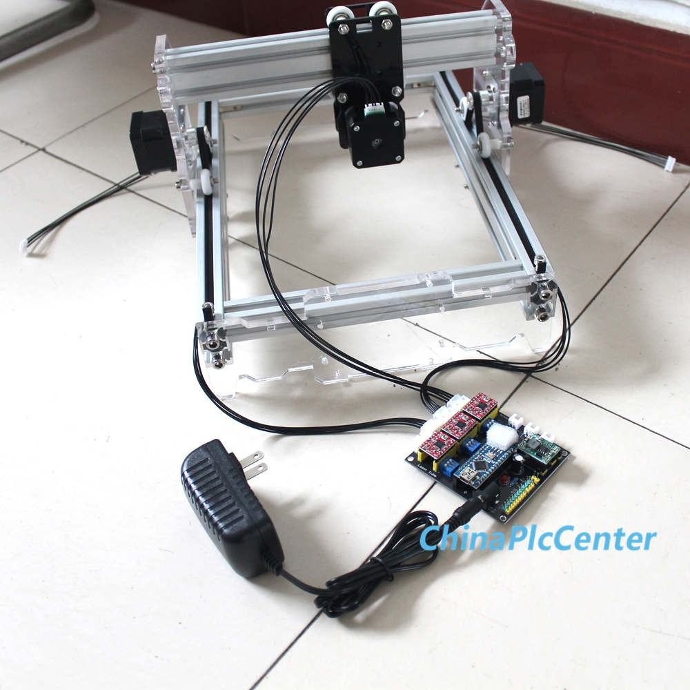

**What is it?** Silver extrusion gantry with acrylic plates and V-wheels; three motors; empty tool mount on the carriage; separate green PCB on the floor with a small blue plug-in board, red driver modules, white motor connectors, barrel jack, and wall-plug adapter.

**Core sequence:** *(apply the five steps above)*

**Extra questions:**

- Identify the microcontroller and motor driver boards.
- Why is the control board separate from the frame?
- How many axes does this machine have as shown?
- What could be mounted on the empty carriage?

---

### Part 15 — Orange plastic arm base with gears

**What is it?** Orange layered-plastic base assembly; black motors inside and on the sides; orange gear meshing with a larger gear on a rotating vertical section; three-wire cables with header connectors; horizontal pivot at the top of the rotating section.

**Core sequence:** *(apply the five steps above)*

**Extra questions:**

- Trace power from the base motor through the gear pair — what motion results?
- How many motors are visible and what joints might they drive?
- What material are the structural parts and how were they likely made?
- Count DOFs of the full arm (infer from Parts 16–17).

---

### Part 16 — Orange desktop arm with parallel links

.png)

**What is it?** Complete orange arm on a round base with mounting ears; parallel thin links alongside main beams; two-prong gripper at the tip; three black motors visible; three-wire cables routed along links. Labelled "EEZYbotARM MK2".

**Core sequence:** *(apply the five steps above)*

**Extra questions:**

- What is the purpose of the parallel linkage bars?
- Assign each motor to base rotation, shoulder, elbow, or gripper.
- Total DOFs?
- Why are rotary actuators with built-in feedback used instead of open-loop motors?

---

### Part 17 — Close-up of arm wrist and gripper

.png)

**What is it?** Angled close-up of orange arm links, pivot bolts, small black motor at the gripper, two-prong claw, cable routed through a printed hole.

**Core sequence:** *(apply the five steps above)*

**Extra questions:**

- How many DOFs at the wrist and gripper alone?
- What actuator type is at the gripper and why?
- Identify revolute joints vs the actuator itself.

---

### Part 18 — Black metal bracket arm with gear gripper

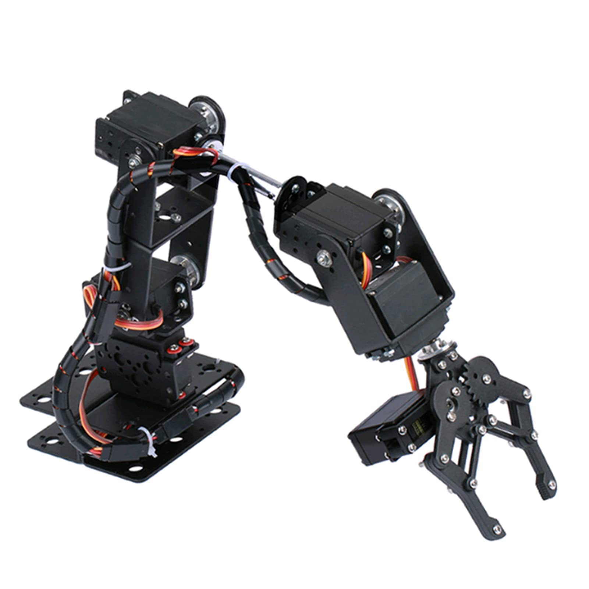

**What is it?** Black anodised aluminium U-brackets and flat plates; six or more black rectangular motors; spiral cable wrap bundling many three-wire cables; two-finger gripper with visible gear mesh at the wrist; slotted base plate.

**Core sequence:** *(apply the five steps above)*

**Extra questions:**

- Count motors and estimate total arm DOFs.
- How does the gear pair at the gripper synchronize the fingers?
- Why metal brackets instead of printed plastic?
- What driver and power supply does this system need?

---

### Part 19 — Small humanoid on aluminium brackets

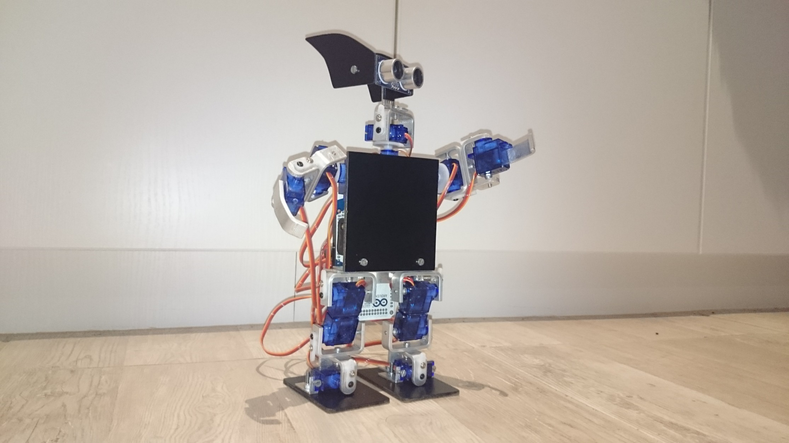

**What is it?** Biped robot: silver aluminium channel torso/limbs, black chest plate, blue translucent motors at neck, shoulders, elbows, hips, knees, ankles; two cylindrical sensors on the head; rectangular black feet; Arduino-class board visible at torso base; many three-wire cables.

**Core sequence:** *(apply the five steps above)*

**Extra questions:**

- Count total actuators and DOFs.
- What sensor is on the head and what would you use it for?
- Identify the microcontroller.
- Why so many identical small actuators instead of one motor per limb with linkages?

---

### Part 20 — Quadruped on stand (red and white legs)

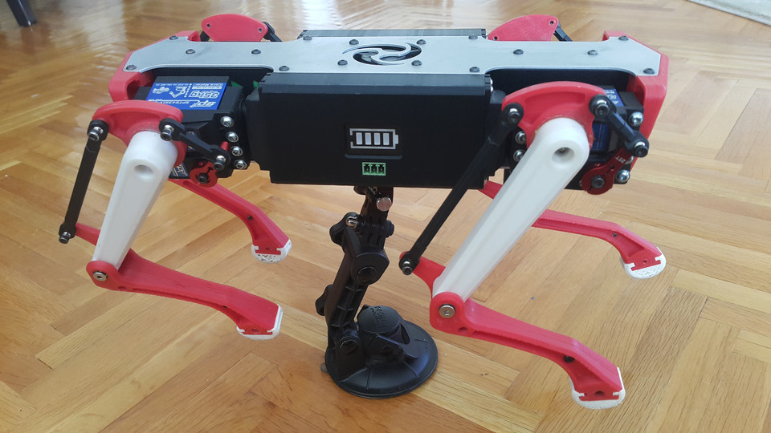

**What is it?** Black body with silver top plate and central fan vent; four legs of red and white printed segments; two blue-labelled motors per shoulder; white foot pads; battery icon and green terminal on the side; mounted on a suction-cup stand.

**Core sequence:** *(apply the five steps above)*

**Extra questions:**

- DOFs per leg and total for the body?
- Why mount heavy motors at the hip close to the body?
- What is the fan on top likely cooling?
- Open-chain vs parallel leg linkage — which is this?

---

### Part 21 — Quadruped with wooden linkages and gear train

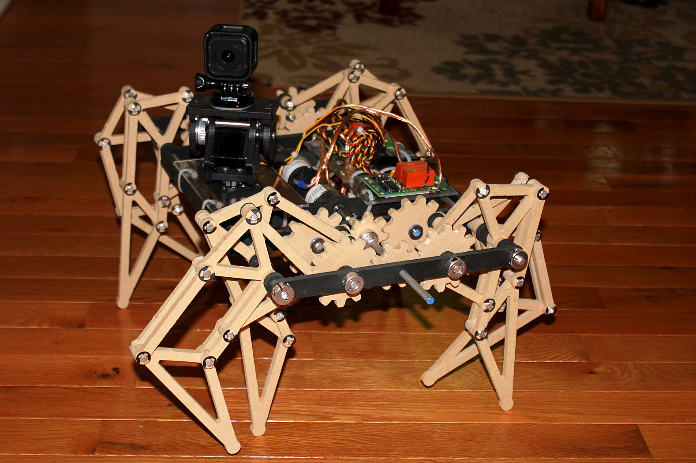

**What is it?** Black flat chassis; four legs of light wood links on bolt pivots; four interlocking wood gears on one side; two silver cylindrical motors at the centre; green PCB at the rear with orange component and wire bundle; GoPro mounted at front.

**Core sequence:** *(apply the five steps above)*

**Extra questions:**

- How many motors and how are left/right legs synchronized?
- Trace power from motor to one front leg.
- What is on the green PCB (motor driver? relay?)?
- Plain bearing vs rolling bearing at the wooden pivots?

---

### Part 22 — Wooden spider robot with central PCB

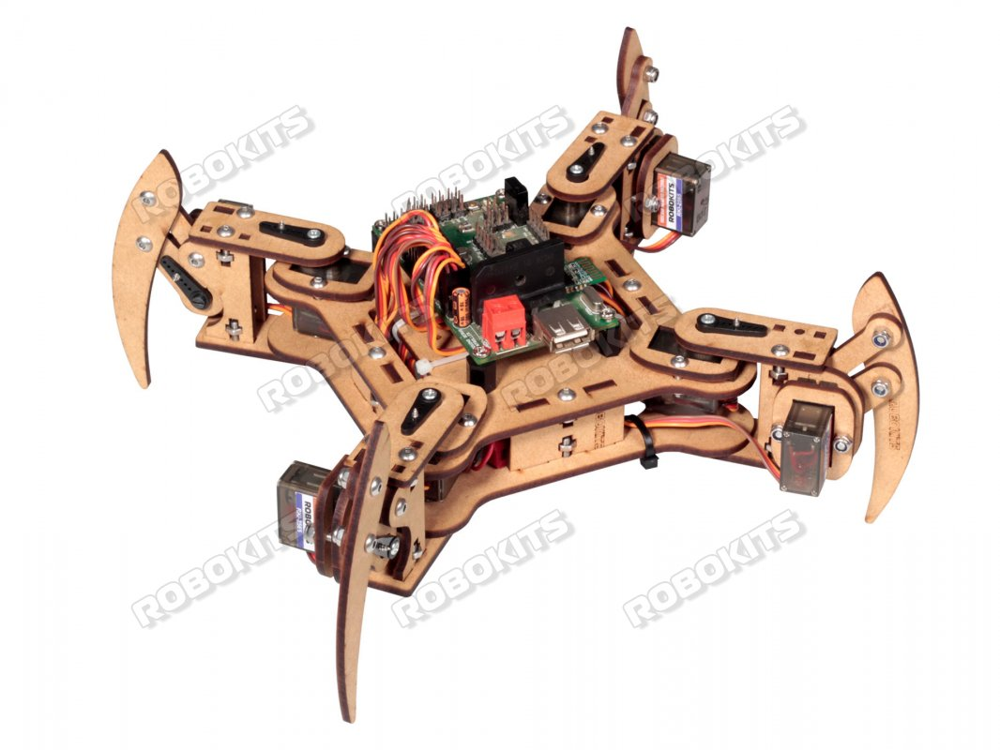

**What is it?** Light wood laser-cut body; four legs each with two black labelled motors; pointed wooden feet; green PCB on top with many three-pin headers, USB port, screw terminals, capacitors; battery pack between plates; "ROBOKITS" watermark.

**Core sequence:** *(apply the five steps above)*

**Extra questions:**

- 8 motors — assign hip vs knee for each leg.
- How does the central board distribute power and signals?
- DOFs and gait: what motions are possible?
- Laser-cut wood gears vs metal — trade-offs?

---

### Part 23 — Hexapod with labelled servo harness

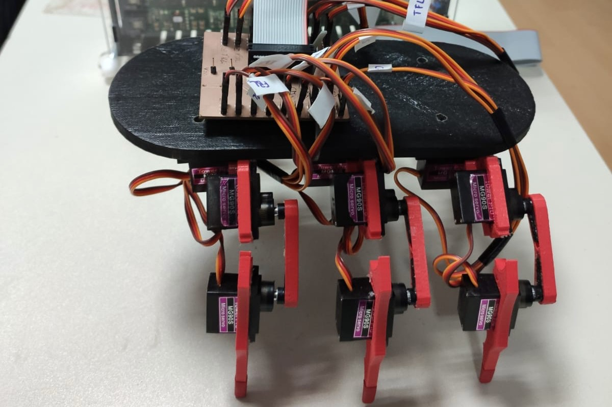

**What is it?** Black oval chassis; red leg linkages; black labelled micro motors underneath; copper PCB on top with rows of header pins and handwritten wire labels; grey ribbon cable to rear; two motors per visible leg.

**Core sequence:** *(apply the five steps above)*

**Extra questions:**

- How many legs total (infer from wiring labels)?
- DOFs per leg?
- Purpose of the custom PCB — why not wire straight to the microcontroller?
- Serial vs parallel leg control timing?

---

### Part 24 — Wooden chassis with worm drive (top view)

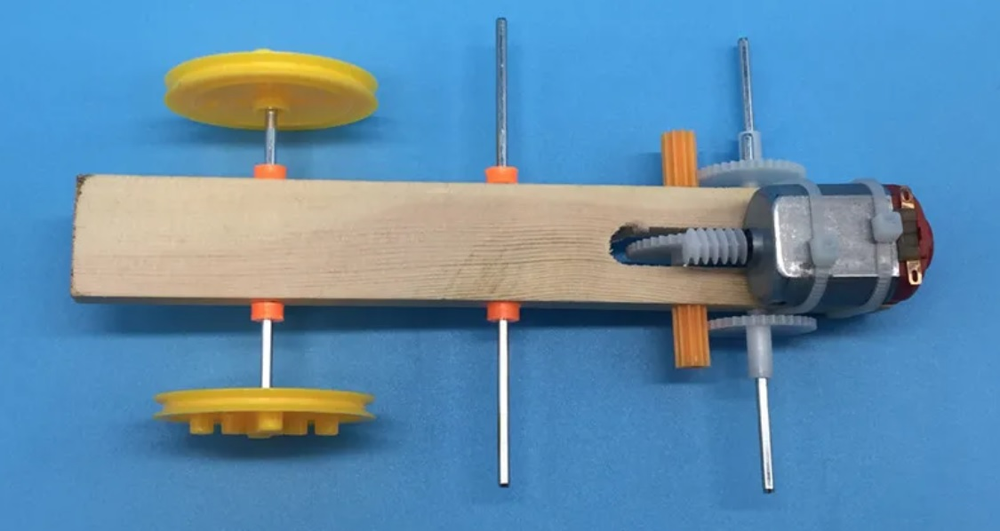

**What is it?** Rectangular wood block; three metal axles through the body; silver motor with red cap zip-tied on top; white worm meshing white spur gear on rear axle; orange bushings; two large yellow wheels on front axle.

**Core sequence:** *(apply the five steps above)*

**Extra questions:**

- Trace power: motor → worm → gear → axle → wheel.
- Why a worm gear pair?
- How many driven wheels vs idle axles?
- What driver does a simple two-wire motor need for direction control?

---

### Part 25 — Walking robot with legs and gear wheels (top view)

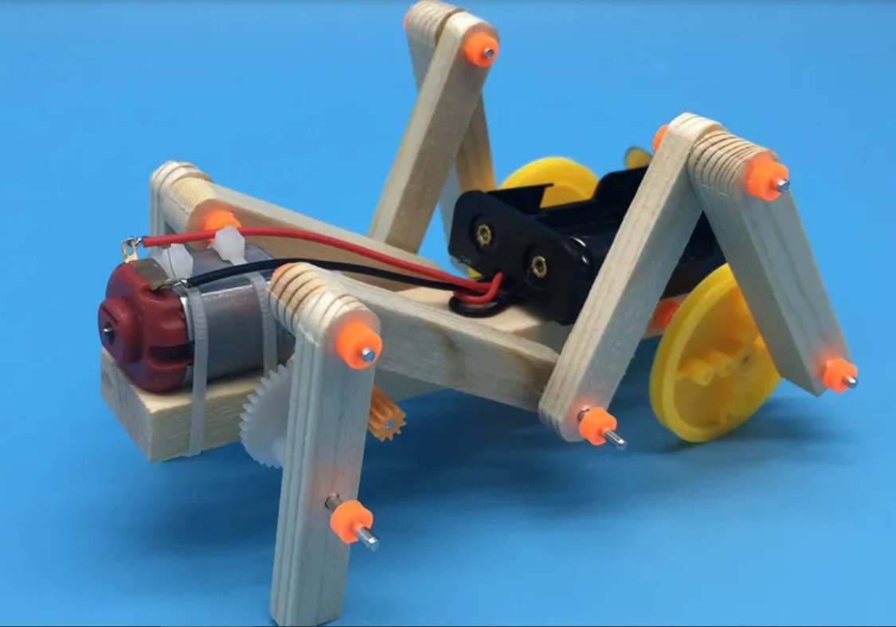

**What is it?** Wood chassis; motor at front; orange and white gears; two large yellow wheels/cams at rear; four wooden legs on metal pins with orange caps; battery holder with red/black wires direct to motor.

**Core sequence:** *(apply the five steps above)*

**Extra questions:**

- How does rotary motion become a walking gait?
- Is there a microcontroller visible? Implications for control?
- Compare the drive train to Part 24.
- Count effective DOFs of the locomotion system.

---

### Part 26 — Clear base four-wheel kit (partially assembled)

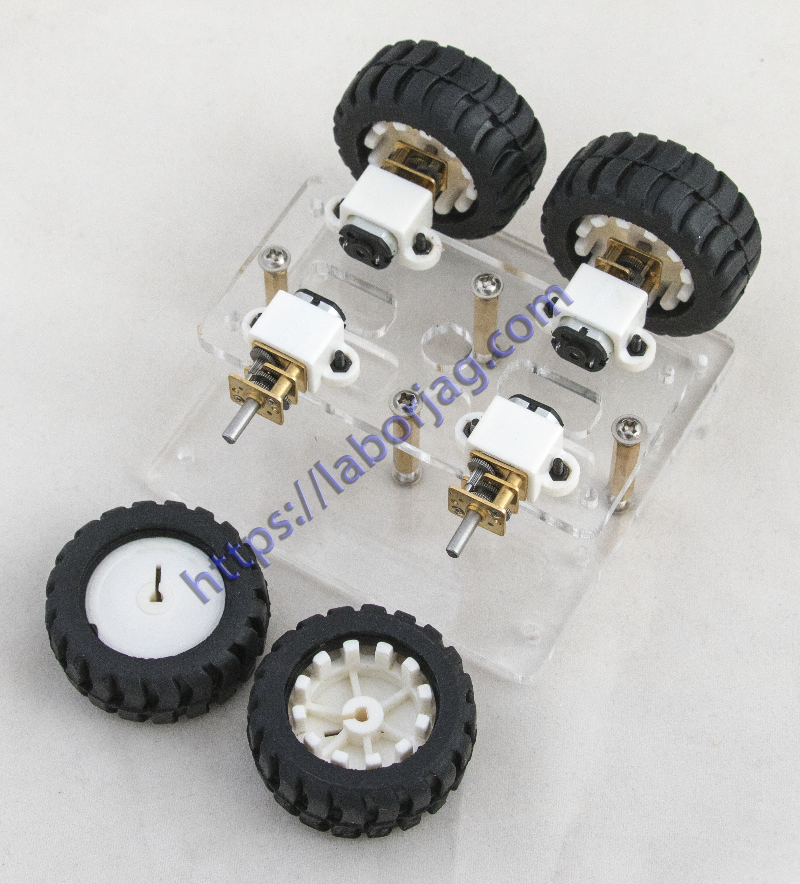

**What is it?** Transparent laser-cut base plate; four brass standoffs at corners; four small motors with brass gearboxes and two wires each; black rubber wheels on D-shafts; two motors mounted at rear, two loose in the centre.

**Core sequence:** *(apply the five steps above)*

**Extra questions:**

- 4WD vs 2WD — trade-offs for this chassis?
- What holds the motor shafts to the wheels?
- How would you steer this platform electrically?
- Identify structural vs actuation vs power components.

---

### Part 27 — Blue chassis with triangular tracks

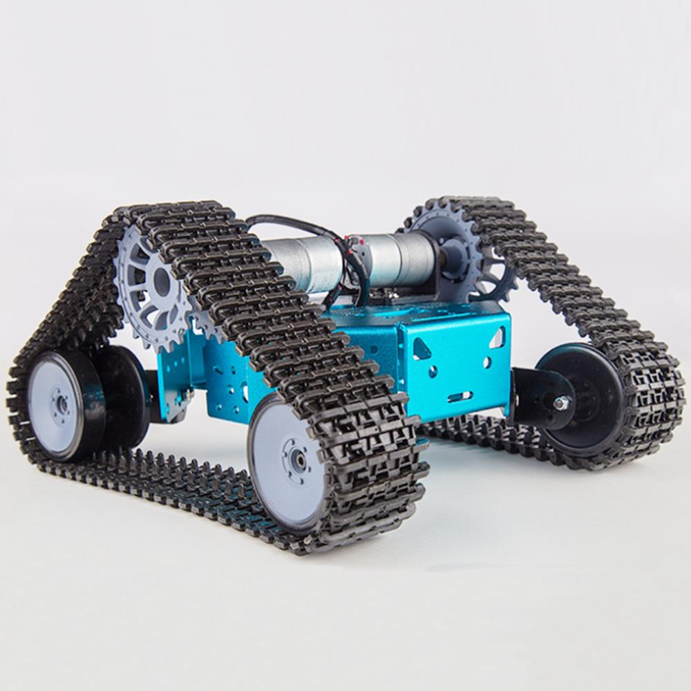

**What is it?** Blue anodised aluminium box chassis with mounting holes; two triangular track loops with black tread; grey spoked drive wheels at the top of each triangle; smaller idler wheels at the corners; two silver motors on top with red/black wires.

**Core sequence:** *(apply the five steps above)*

**Extra questions:**

- How does differential drive steering work with two tracks?
- Trace power from each motor to its track.
- Why tracks instead of wheels for this platform?
- What driver and sensors would you add for autonomous control?

---

### Part 28 — Three-finger claw (black printed fingers)

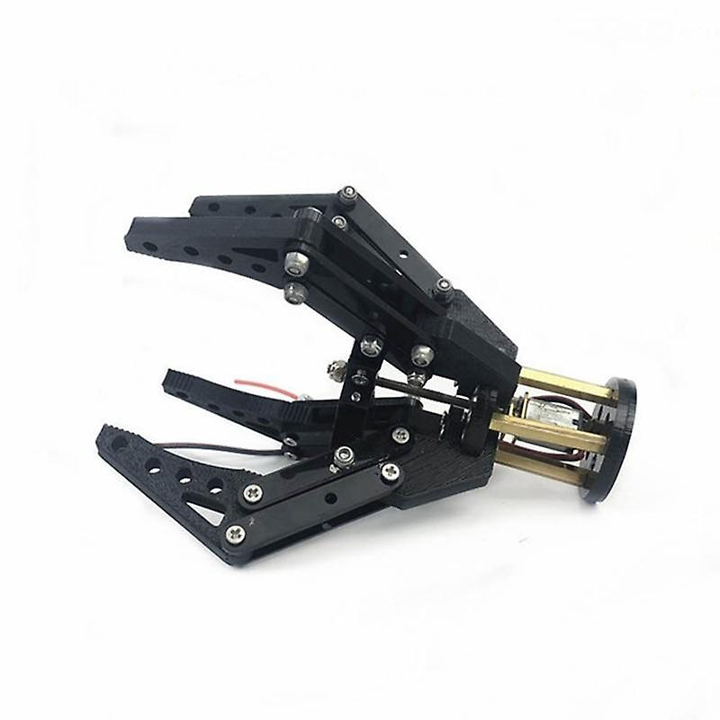

**What is it?** Three black serrated fingers on linkages; central vertical threaded rod; small cylindrical motor at base between circular plates and four brass standoffs; red/black motor wires.

**Core sequence:** *(apply the five steps above)*

**Extra questions:**

- How many DOFs — one motor moves all three fingers how?
- Trace: motor → screw → linkage → fingers.
- Why a threaded rod instead of a direct motor on each finger?
- What driver for bidirectional motor control?

---

### Part 29 — Two-jaw gripper with dimensions labelled

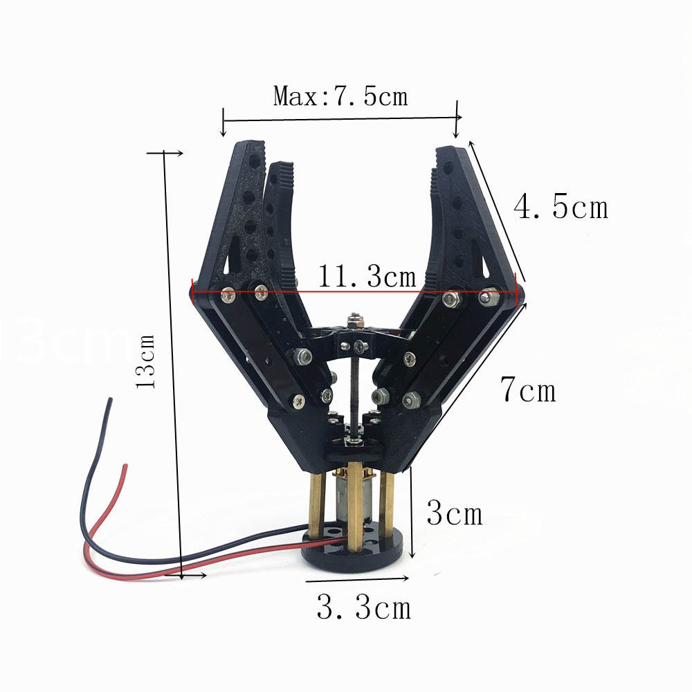

**What is it?** Two mirrored black jaws on a four-bar linkage; central threaded rod; motor between standoffs at base; dimension labels (13 cm height, 7.5 cm max opening, etc.).

**Core sequence:** *(apply the five steps above)*

**Extra questions:**

- Parallel gripper vs the three-finger design in Part 28?
- Identify all revolute joints in the linkage.
- One DOF — confirm by counting independent inputs.
- Gear ratio implications of the lead screw pitch.

---

### Part 30 — CAD model of two-jaw geared gripper

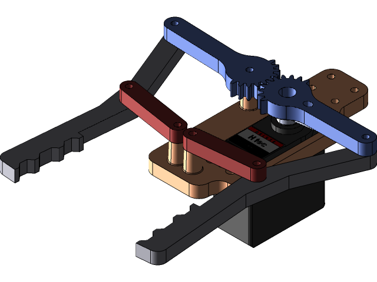

**What is it?** 3D render: tan base plate; blue gear-sector arms meshing at centre; maroon links; grey serrated jaws; black rectangular motor labelled at the base.

**Core sequence:** *(apply the five steps above)*

**Extra questions:**

- Why mesh gear sectors at the base?
- Identify the four-bar linkage on each side.
- Servo vs DC motor — which is shown and why is it appropriate?
- DOFs of the mechanism?

---

### Part 31 — Gantry liquid-handling robot over petri dishes

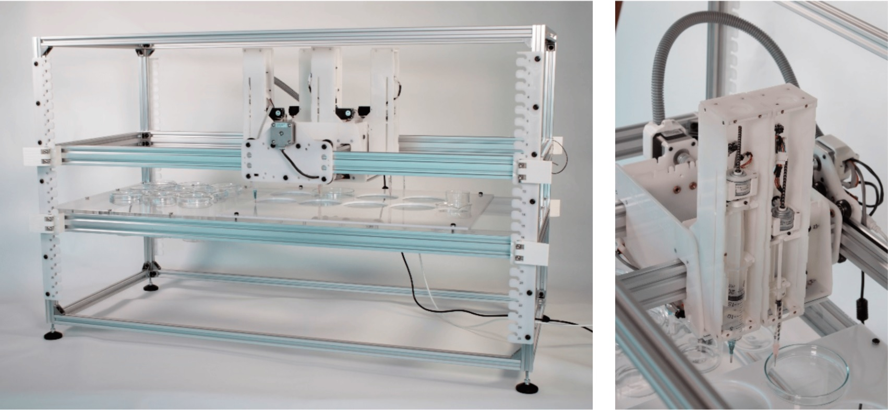

**What is it?** Aluminium extrusion frame on levelling feet; horizontal carriage on rails; three vertical modules with needles over petri dishes in cutouts on a clear work surface; white custom plastic structural parts; ribbon cables; motors on carriages and at top of vertical modules.

**Core sequence:** *(apply the five steps above)*

**Extra questions:**

- How many independent vertical axes?
- Trace power for one syringe plunger from motor to liquid dispense.
- What sensors for homing and volume control?
- Cartesian gantry vs delta — why gantry for this application?

---

### Part 32 — Modular vertical pump units (three views)

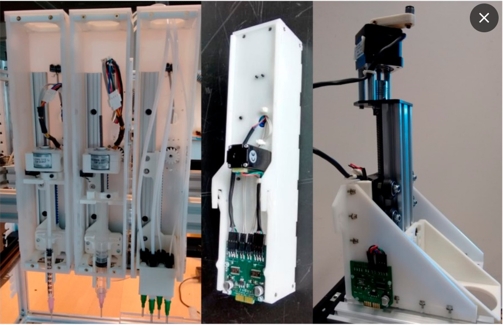

**What is it?** Three-panel image: (left) three side-by-side vertical modules with syringes and a multi-tip manifold; (middle) internal view of motor, lead screw, green PCB, wiring; (right) side profile of lead screw, linear rail, motor on top, triangular gussets.

**Core sequence:** *(apply the five steps above)*

**Extra questions:**

- Per module: identify motor, linear guide, end effector, driver board.
- What are the black switches on the carriage for?
- How does modularity scale to more channels?
- Separate PCB per module — why?

---

### Part 33 — Machine photograph (inspect image directly)

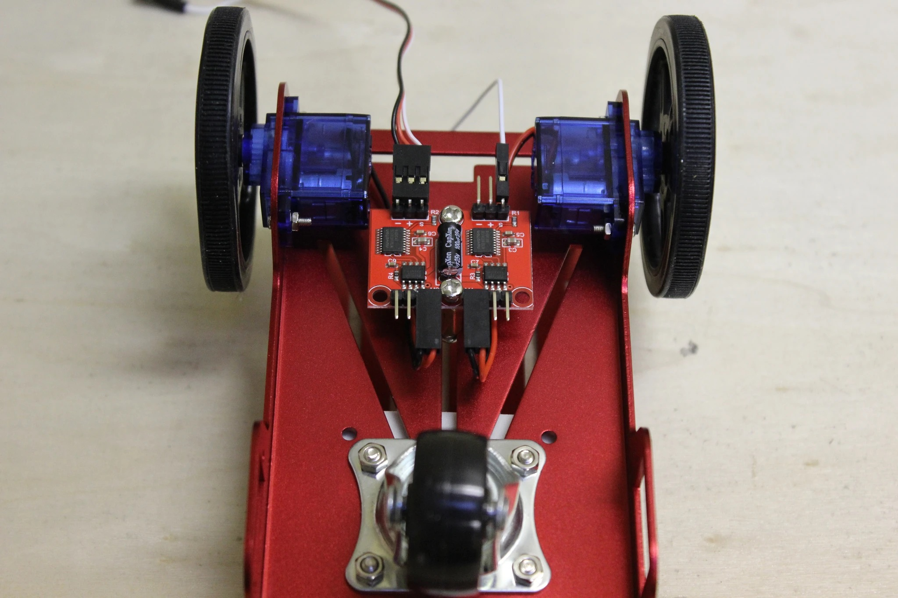

**What is it?** *(Open the image and describe the frame, moving parts, motors, and end effector yourself before reading on.)*

**Core sequence:** *(apply the five steps above)*

**Extra questions:**

- Classify the machine: positioning plotter, material-depositing fabricator, material-removing mill, or mobile robot?
- Draw a block diagram: power source → driver → actuator → mechanism → end effector.
- What would you add for closed-loop position control?
