# Q1 — Manufacturing practice (all_parts)

Look at each image **before** reading the questions. Identify the process and material yourself, then answer the **three core questions** (justify with cost, time, tolerance, material properties, and surface finish). Work through the **extra questions** after.

---

### Part 01 — Two-part electronics enclosure

**What is it?** Black glossy box and matching lid. The box has a row of circular front cutouts, a rectangular side cutout, internal corner posts with holes, and floor posts for mounting. The lid has a ribbed internal pattern and corner posts that align with the box.

**Core questions:**

1. **Default:** What process and material would you use, and why?
    I would start with 3D printing if it was for a small local production or for smaller use cases, as this offers the quickest "idea to physical object" time at a reasonable cost. FDM would be the cheapest/fastest option, but going for SLA (the resin curing stuff) will provide a nicer finish.
2. **Metal:** What if it must be metal?
    Then i would probably opt for casting, i.e. pouring melted metal into a mould. Depending on the needs, there might also exist an option for producing this by laser cutting and bending metal sheets, but it is probably more difficult for the inner parts of the box.
3. **Volume:** What if you need 1000 units?
    Then i would use injection moulding, which is fast and cheap for large quantities, and also has better material properties than 3D printing.

**Extra questions:**

- What structural features add stiffness without thickening the walls?
    - Few thicker patterns (X on lid f.ex.) add stability without making the entire part thicker.
- Where would the parting line be on the finished assembly?
    - We would have a mould for each piece where the parting line for the lid would be on the large flat face
    - For the main part, parting line would be the outer perimeter on the top rim.
- What design rules prevent sink marks on the outer surface?
    - Stable wall thickness.
    - Draft angles (to allow easy ejection).
- What are the mounting posts (bosses) for?
    - They are for securely fastening the two pieces together after filling whatever needs to go inside, and still allowing easy access to the inside of the box.
    - Some bosses are also for mounting particular items securely inside the box.

---

### Part 02 — Curved black bracket

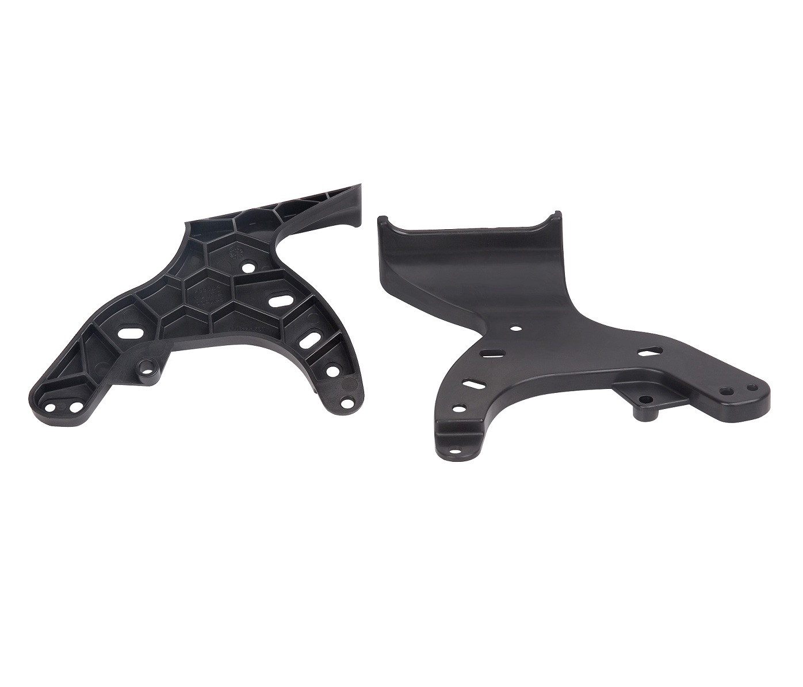

**What is it?** Black curved bracket shown from two angles. The underside has a dense hexagonal rib pattern; the top has mounting holes and elongated slots. Small circular marks appear in recessed areas.

**Core questions:**

1. **Default:** What process and material would you use, and why?
    - 3D print as a default prototyping approach, as it offers quick iterations. I do note that this piece would require quite a bit of support structures in the process. Per default i would go for FDM anyways, as it is faster and cheaper in terms of lead time and therefore provides quicker iterations over the design, especially if only needing a single or few items. If the item is to be put under pressure from multiple angles i would consider going for SLS or SLA as they do not have the same amount of challenges with anisotropy.
2. **Metal:** What if it must be metal?
    - In this case i would probably go for CNC milling.
3. **Volume:** What if you need 1000 units?
    - Injection moulding, just as the item seems to actually be made (see marks from ejection tool and time stamping) due to the low cost-per-unit at scale. This method also produces isotropic items, as opposed to the FDM approach. The lead-time and -cost of producing the mould pays off when we need to produce many copies of the item.

**Extra questions:**

- What is the purpose of the ribbing on the underside?
    - added stability of the part without making a thick and firm part (saving material without weakening the structure)
- Why use slots instead of only round holes for some mount points?
    - I do not know. I imagine that it is useful if you are mounting it on another part which either has some minor variances by production method or by intention (f.ex. different sizes). Or, if it is mounted on the something that may change shape a bit (like materials widening / retracting based on outside temperatures in summer vs winter)
- What visual clues on the part suggest how it was made?
    - There are round marks from the ejection.
    - There is a time-wheel which is also common in injection moulding.
- Why might tapered (not perfectly vertical) walls be required on the ribs?
    - This is to avoid creating a pressured chamber when ejecting the item from the mould. draft angles allow space around the item while ejecting such that the item is not warped or otherwise destroyed while being ejected from the mould.

---

### Part 03 — Four small grey enclosure shells

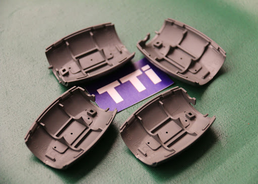

**What is it?** Four identical small grey curved shells (~business-card scale) with internal ribs, raised circular posts with holes, edge alignment pins/slots, and faint circular marks on flat interior surfaces. - battery holders for AA batteries.

**Core questions:**

1. **Default:** What process and material would you use, and why?
    - For minor productions i would go for 3D printing due to the low lead time. Per default i would pick FDM due to availability and price, yet iu recognize that FDM would require support and may suffer from unlucky anisotropy. It may be a better option to use SLS or SLA if available.
3. **Volume:** What if you need 1000 units?
    - Then I would go for injection moulding, which also seems to be the production method of these particular items.

**Extra questions:**

- What is the function of the alignment pins and slots?
- How do raised mounting posts differ from plain through-holes?
- Why is consistent wall thickness important for this geometry?
    - It is important in relation to injection moulding to avoid warping of the structures if cooled unevenly.
- At what production quantity does your chosen process become the most economical?
    - when we start around 1000 items or more, the lead time of creating the mould pays off by the lower per-unit cost.

---

### Part 04 — Two-plate steel tool

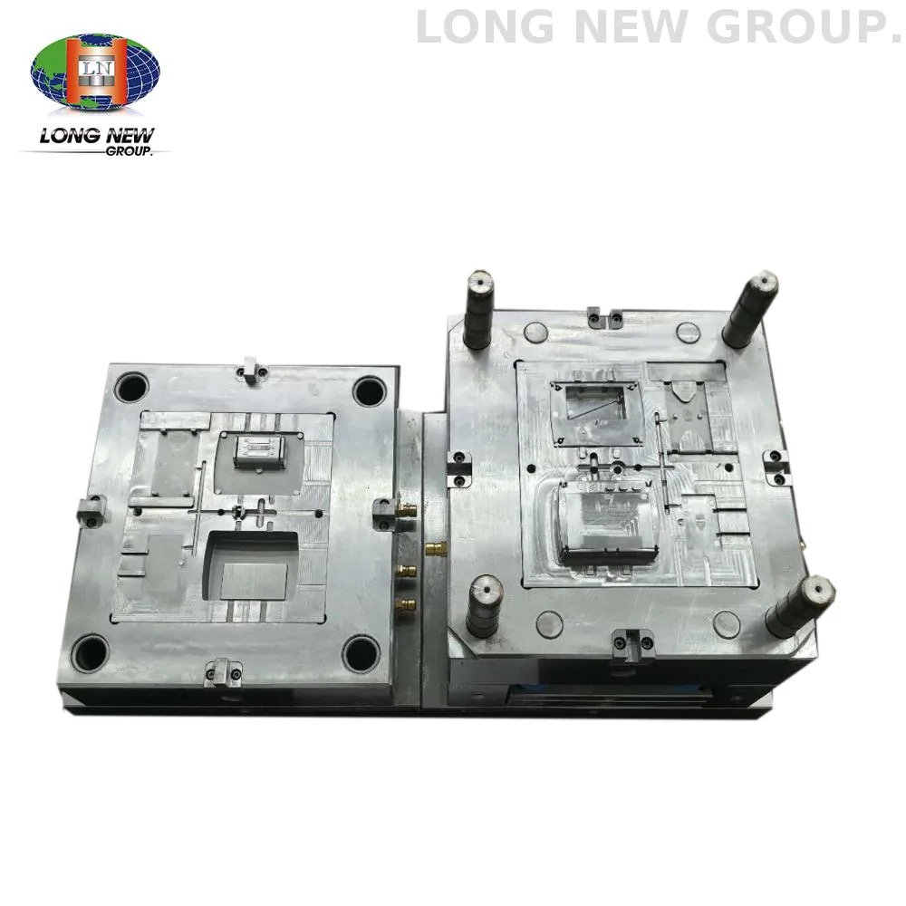

**What is it?** Two heavy steel blocks laid open side by side. Each has machined rectangular cavities, four corner alignment pins or matching holes, and brass hose fittings on the edges. Fine machining marks visible on cavity surfaces.
THIS IS THE INJECTION MOULD!!!

**Core questions:**

1. **Default:** What is this tool used for, what process does it enable, and what material are the *finished parts* made from?
    - This is an injection mould made of metal, which can be used to produce the pieces (looks like 4 pieces) by injecting molten plastic and cooling it down.
    - Corner pins ensure the mould is properly aligned, and channels (sprues) between the different parts allow us to fill the entire mould with material at once.
2. **Metal:** The tool is already metal — what material is it, and why?
    - Metal mould, probably milled to obtain a single high quality mould for mass production.
3. **Volume:** What if you need 1000 units?
    - Injection moulding is a large-scale manufacturing method, I do not see how we would need many more of the mould.

**Extra questions:**

- What is the purpose of the four corner alignment pins?
    - Make sure the two parts of the mould are aligned properly.
- What do the brass fittings connect to, and why?
    - Maybe these are for cooling system around the mould?
- What design feature must the finished part include so it releases from this tool?
    - Draft angles so the part slides out easily.
    - Ejection pins to push the part out of the mould.
- Where is the parting line on a finished part from this tool?
    - The perimeter of each mould cavity where these two mould parts join together.
- Is this a single-cavity or multi-cavity tool?
    - Multi-cavity, there are 4 different parts.

---

### Part 05 — Interlocking plastic bricks

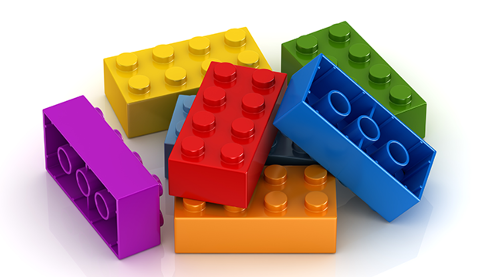

**What is it?** Colourful rectangular plastic bricks with studs on top and hollow tubes underneath, designed to stack and grip together.

**Core questions:**

1. **Default:** What process and material would you use, and why?
    We may do some prototyping initially using 3D printing, but this is a clear case for using injection moulding. These are namely building blocks, and do not have much function individually but only if producing a larger quantity. When making large quantities, it is cheaper at unit-level to use injection moulding and also gives a nicer finish and isotropic final product compared to f.ex. FDM.
3. **Volume:** What if you need 1000 units (or millions)?
    - I would still use injection moulding for the same reason as mentioned.

**Extra questions:**

- How does the stud-and-tube geometry create a joint without fasteners?
- What tolerance and surface finish are needed for a reliable friction fit?
- What material properties matter for repeated assembly/disassembly?
- Why is your chosen process appropriate at very high volume?

---

### Part 06 — Plastic model kit parts and tools

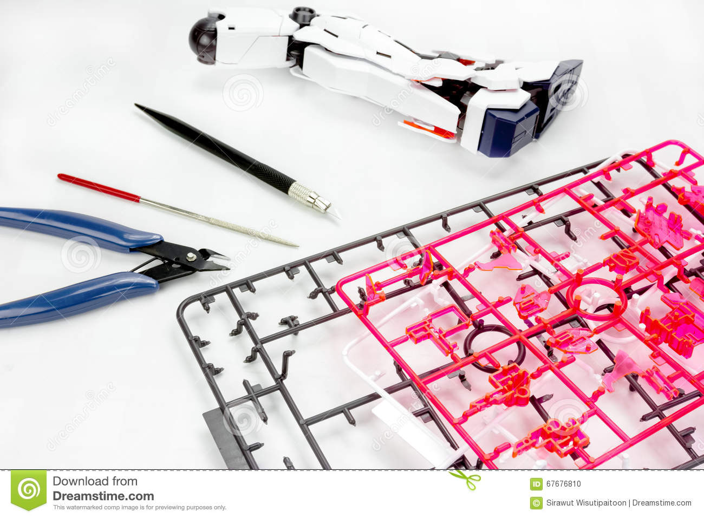

**What is it?** Partially assembled white/black/blue plastic robot leg, coloured plastic frames still holding many small attached parts, plus side cutters, a needle file, and a hobby knife.

**Core questions:**

1. **Default:** What process and material are the raw parts made from, and why?
2. **Metal:** What if the parts must be metal?
3. **Volume:** What if you need 1000 units?

**Extra questions:**

- What are the plastic frames that parts are still attached to, and what are the small connection points called?
- What post-processing is needed before assembly?
- How can parts snap together without glue?
- Why are different colours produced as separate frames?

---

### Part 07 — Brushed-metal strip with tabs and curve

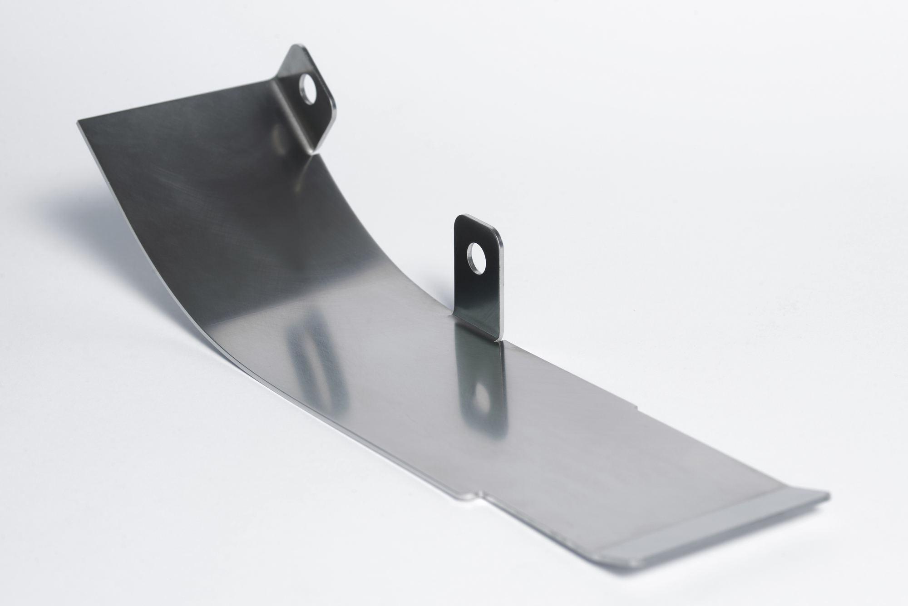

**What is it?** Brushed-metal flat strip with two upright tabs (each with a bolt hole), a large smooth curve at one end, and a small upward lip at the other.

**Core questions:**

1. **Default:** What process and material would you use, and why?
2. **Metal:** It appears to be metal already — which metal, and why?
3. **Volume:** What if you need 1000 units?

**Extra questions:**

- Describe the likely steps from raw stock to finished part.
- If this started as a flat sheet, what calculations are needed before folding?
- Why are the tab corners rounded?
- How does a large-radius curve differ from a sharp fold in terms of tooling?

---

### Part 08 — Single-piece inclined metal bracket

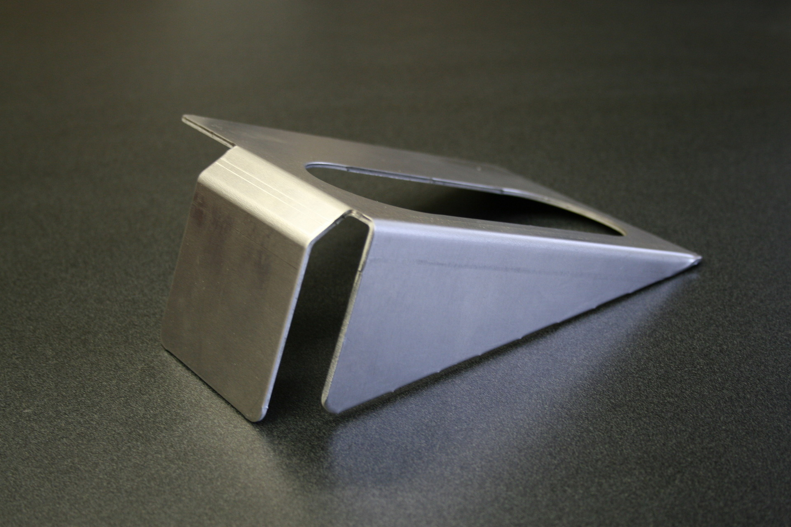

**What is it?** One continuous brushed-metal piece folded into an inclined wedge: central rectangular cutout, two side supports bent down, and a front flap bent down. No welds or separate fasteners.

**Core questions:**

1. **Default:** What process and material would you use, and why?
2. **Metal:** Which metal and thickness would you choose for stiffness?
3. **Volume:** What if you need 1000 units?

**Extra questions:**

- Why are the internal cutout corners rounded?
- In what order must the folds be made to avoid tool interference?
- Can this 3D shape be unfolded to a single flat pattern? Why?
- What cutting methods are suitable for the flat pattern stage?

---

### Part 09 — Long metal U-channel enclosure

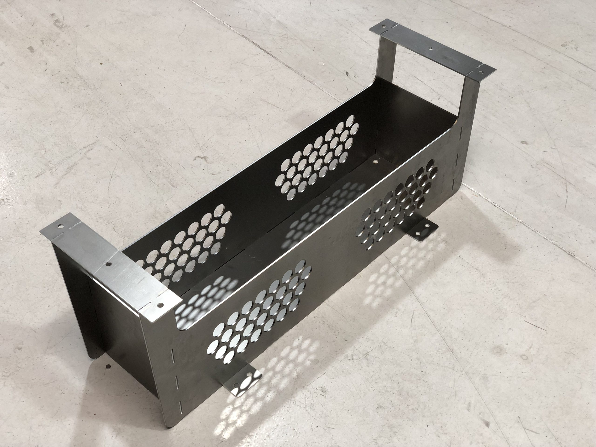

**What is it?** Long open-topped U-channel in dark metal with perforated circular ventilation patterns on the sides, top mounting flanges with holes, bottom L-brackets, and interlocking tabs at the vertical corners.

**Core questions:**

1. **Default:** What process and material would you use, and why?
2. **Metal:** Steel vs aluminium — which and why?
3. **Volume:** What if you need 1000 units?

**Extra questions:**

- What is the purpose of tab-and-slot corner features?
- When in the process are the ventilation holes made?
- What is nesting, and how would you lay out many of these on a sheet?
- What finishing step (e.g. coating) might follow forming?

---

### Part 10 — Black coated metal frame

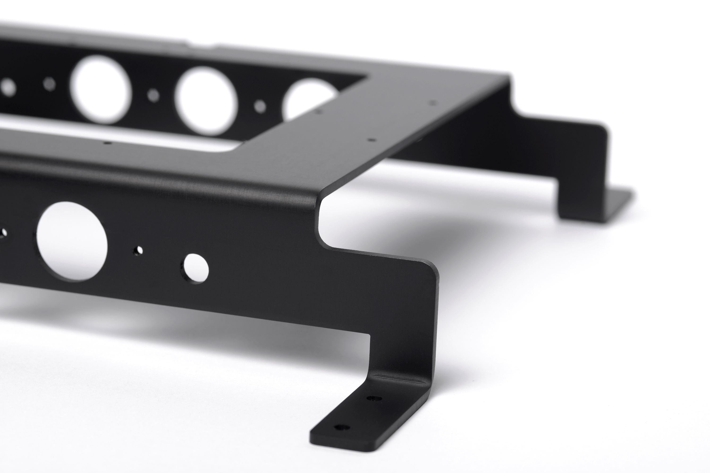

**What is it?** Matte black metal frame: horizontal top with large rectangular opening, vertical sides with repeating large and small circular holes, and bent feet with small mounting holes.

**Core questions:**

1. **Default:** What process and material would you use, and why?
2. **Metal:** Aluminium vs steel — which and why for weight, stiffness, and finish?
3. **Volume:** What if you need 1000 units?

**Extra questions:**

- List the manufacturing steps from flat stock to finished part.
- What is the likely purpose of the large side holes vs the small foot holes?
- When in the process chain is the black coating applied?
- If formed from flat sheet, what affects the accuracy of the final dimensions after folding?

---

### Part 11 — L-shaped metal brackets (pair)

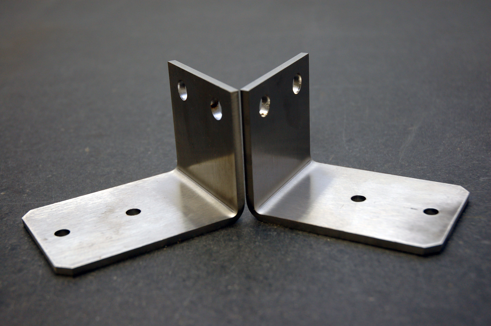

**What is it?** Two identical brushed-metal L-brackets, each arm with two bolt holes; horizontal arm corners are chamfered; 90° bend between arms.

**Core questions:**

1. **Default:** What process and material would you use, and why?
2. **Metal:** Stainless steel vs aluminium — which and why?
3. **Volume:** What if you need 1000 units?

**Extra questions:**

- What does the flat pattern look like before bending?
- Why are the outer corners chamfered?
- When would a different process be better than cut-and-bend?
- What tolerance do hole positions need for bolt alignment?

---

### Part 12 — Stack of identical flat metal plates

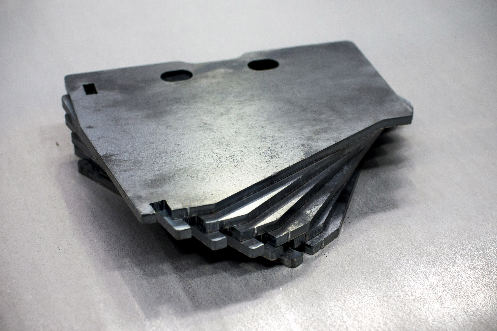

**What is it?** Stack of identical dark flat metal plates (~3–5 mm thick) with oval holes, a square hole, one chamfered corner, and interlocking tabs/notches along the edges.

**Core questions:**

1. **Default:** What process and material would you use, and why?
2. **Metal:** Which cutting method suits this material and thickness?
3. **Volume:** What if you need 1000 units?

**Extra questions:**

- What is kerf, and how do you compensate in CAD?
- What file format goes to the cutting machine?
- How do edge tabs and notches aid assembly?
- What is nesting?

---

### Part 13 — Tapered panel and rectangular frame

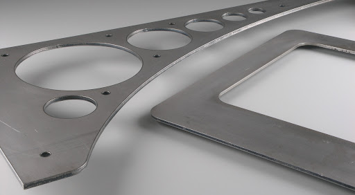

**What is it?** Two flat metal parts: a tapered panel with graduated circular holes of decreasing size, and a rectangular frame with a large central cutout and rounded internal corners.

**Core questions:**

1. **Default:** What process and material would you use, and why?
2. **Metal:** Which cutting method for this thickness and edge quality?
3. **Volume:** What if you need 1000 units?

**Extra questions:**

- Why are the internal corners of the frame rounded rather than sharp 90°?
- What is the purpose of the graduated hole sizes on the tapered part?
- How does kerf affect hole and slot dimensions?
- These are 2D parts — how would you add a third dimension if needed?

---

### Part 14 — Perforated metal plate (keyboard layout)

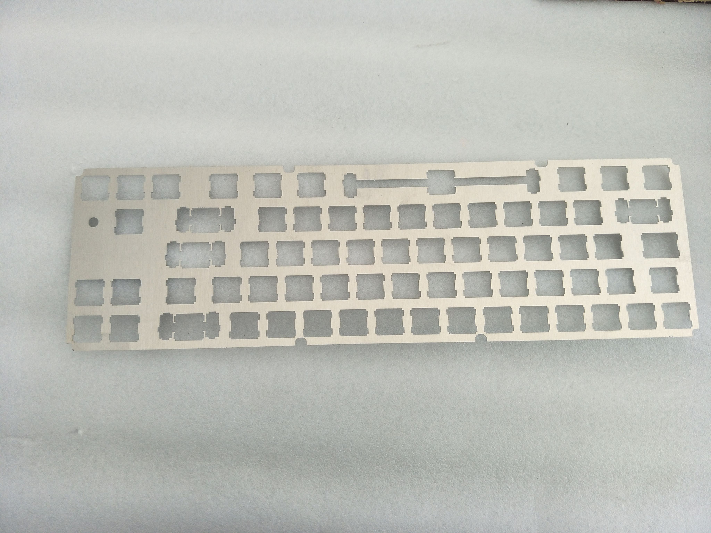

**What is it?** Brushed metal plate with a grid of identical square cutouts, a few wider cutouts with side notches, edge mounting notches, and one small circular hole.

**Core questions:**

1. **Default:** What process and material would you use, and why?
2. **Metal:** Steel or aluminium vs acrylic or printed plastic — trade-offs?
3. **Volume:** What if you need 1000 units?

**Extra questions:**

- Why must kerf be accounted for so components press-fit correctly?
- What tolerance is needed on the square cutouts?
- Why might you choose this material over plastic for stiffness?
- How does the plate align with components underneath?

---

### Part 15 — Nested wireframe polyhedra

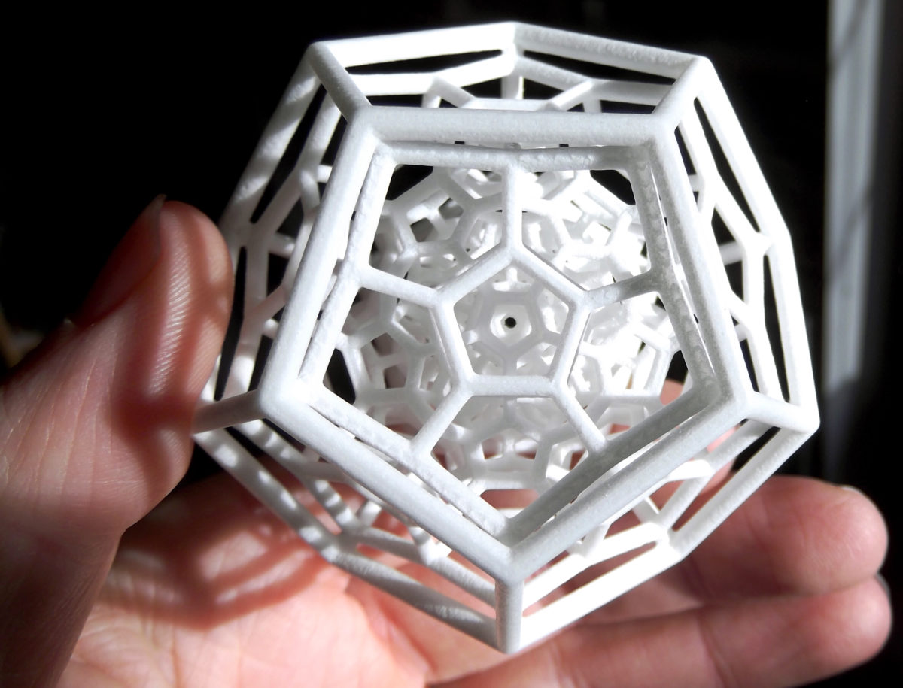

**What is it?** White object: outer dodecahedron wireframe enclosing several smaller identical nested dodecahedrons — one continuous piece, fully enclosed internals.

**Core questions:**

1. **Default:** What process and material would you use, and why?
2. **Metal:** What if it must be metal?
3. **Volume:** What if you need 1000 units?

**Extra questions:**

- Why is this difficult or impossible to make as one piece by subtractive machining?
- What support strategy does your chosen process use for enclosed internal geometry?
- What material properties matter for thin struts?
- What visual clues on the surface suggest how this was made?

---

### Part 16 — Organic perforated sculptures (pair)

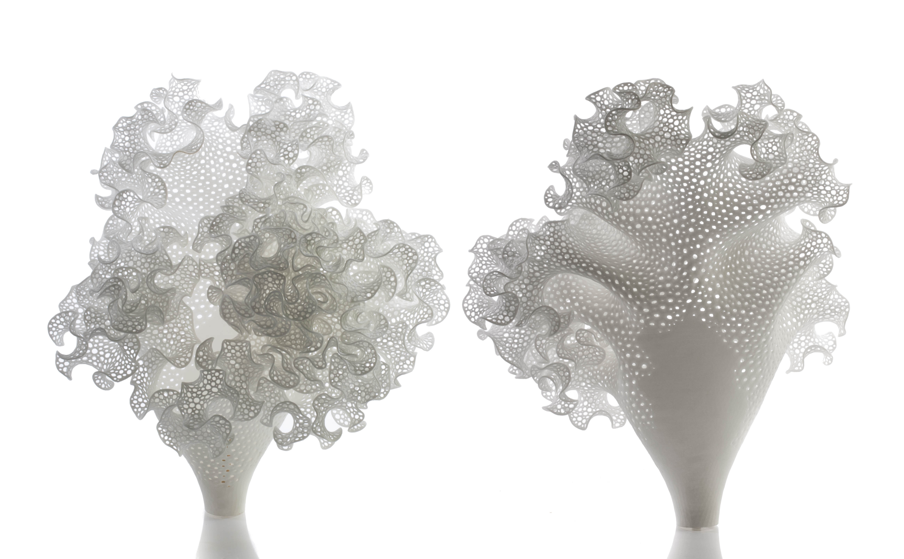

**What is it?** Two white sculptural forms tapering from a narrow base into ruffled, fan-like surfaces perforated with a dense irregular hole pattern. Very thin walls and deep undercuts.

**Core questions:**

1. **Default:** What process and material would you use, and why?
2. **Metal:** What if it must be metal?
3. **Volume:** What if you need 1000 units?

**Extra questions:**

- What visual clues suggest how this was made?
- Why might some manufacturing processes struggle with this geometry?
- How do thin curved surfaces gain stiffness?
- What post-processing might follow printing?

---

### Part 17 — Small detailed dragon figurine

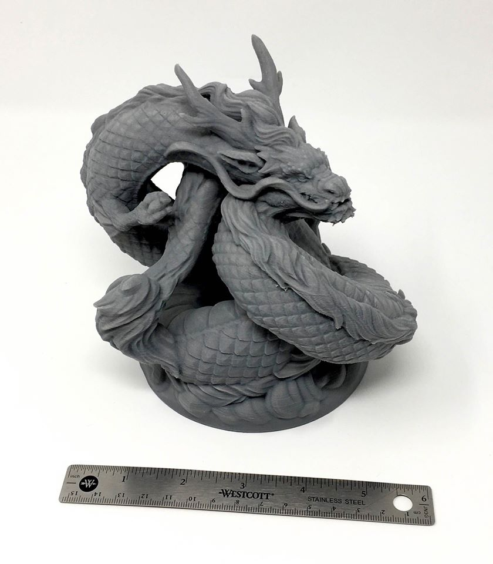

**What is it?** Matte grey dragon figurine (~3–5 in tall) with fine scales, whiskers, horns, open mouth with teeth, coiled on a circular base. A ruler is shown for scale.

**Core questions:**

1. **Default:** What process and material would you use, and why?
2. **Metal:** What if it must be metal?
3. **Volume:** What if you need 1000 units?

**Extra questions:**

- What visual clues suggest the process (surface texture, detail level)?
- What support strategy is needed for whiskers and overhangs?
- What post-processing steps follow printing?
- Compare surface finish and strength of your process vs alternatives.

---

### Part 18 — Large articulated dragon

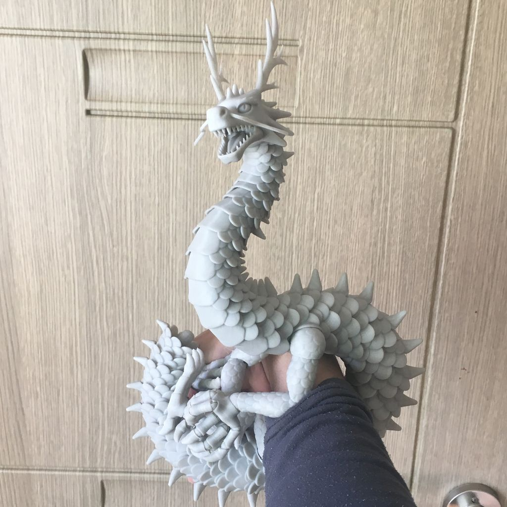

**What is it?** Light-grey dragon coiled around a hand: many interlocking body segments that appear to move, fine scales, whiskers, and claws. Smooth matte surface.

**Core questions:**

1. **Default:** What process and material would you use, and why?
2. **Metal:** What if it must be metal?
3. **Volume:** What if you need 1000 units?

**Extra questions:**

- How can moving joints be produced already assembled in one build?
- What clearance is needed between moving segments?
- Compare your chosen process vs alternatives for articulated organic models.
- What build orientation and settings affect whether joints fuse?

---

### Part 19 — Lattice column (CAD render vs physical part)

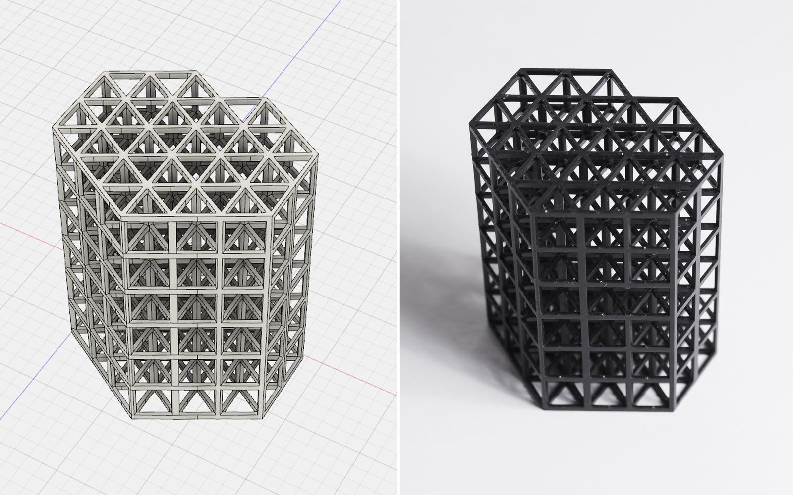

**What is it?** Side-by-side: left — grey CAD model of a tall lattice column with cubic grid and diagonal bracing; right — black physical part of the same geometry.

**Core questions:**

1. **Default:** What process and material would you use, and why?
2. **Metal:** What if it must be metal?
3. **Volume:** What if you need 1000 units?

**Extra questions:**

- Why is this geometry well suited to certain manufacturing processes and poorly suited to others?
- What is the strength-to-weight advantage of truss lattices?
- How does support strategy differ between the main processes you might choose?
- Describe the CAD → manufacture workflow.

---

### Part 20 — Small U-shaped brackets (with coin for scale)

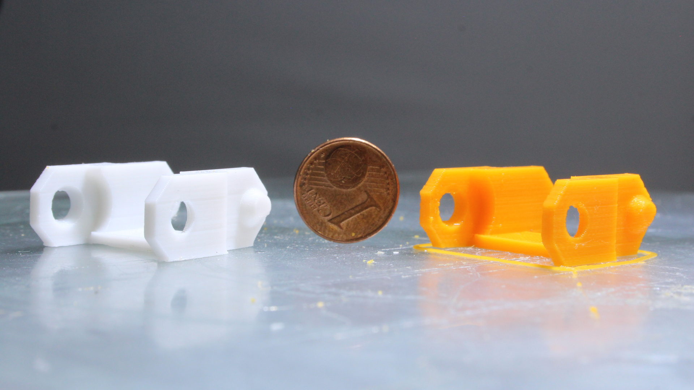

**What is it?** Two small U-shaped parts (white and orange) with a hole in each side wall; orange part has a thin extra layer extending from the base; 1-cent coin between them for scale.

**Core questions:**

1. **Default:** What process and material would you use, and why?
2. **Metal:** What if it must be metal?
3. **Volume:** What if you need 1000 units?

**Extra questions:**

- What visual clues suggest the process used?
- What is the thin extra layer around the orange part's base for?
- What causes faint wavy patterns on vertical surfaces, and how do you reduce them?
- Did the horizontal holes need support during the build?

---

### Part 21 — Servo mounting bracket (CAD assembly)

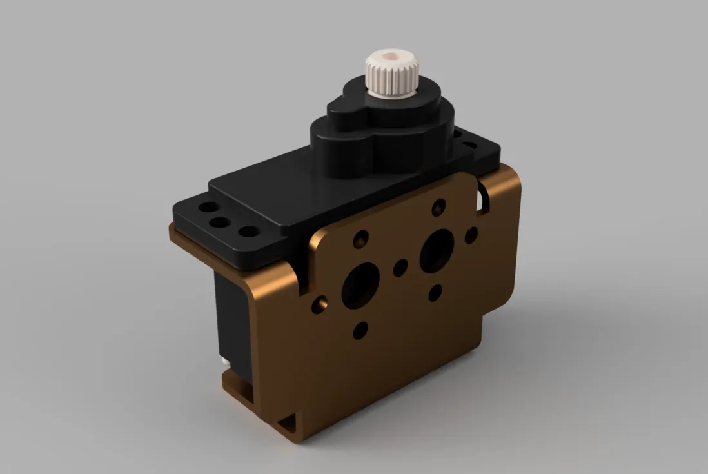

**What is it?** CAD render: U-channel bracket wrapping a standard-size servo motor, with a front face hole pattern (two large cutouts, six smaller holes) and a slot at the bottom.

**Core questions:**

1. **Default:** What process and material would you use for a one-off prototype, and why?
2. **Metal:** What if it must be metal?
3. **Volume:** What if you need 1000 units?

**Extra questions:**

- Why design a custom bracket around a standard off-the-shelf servo?
- What clearance is needed for the servo body and output shaft?
- Which features need full 3-axis machining vs simpler 2.5D operations?
- How does build orientation affect strength for a printed version?

---

### Part 22 — Green boat-shaped test piece (with defect)

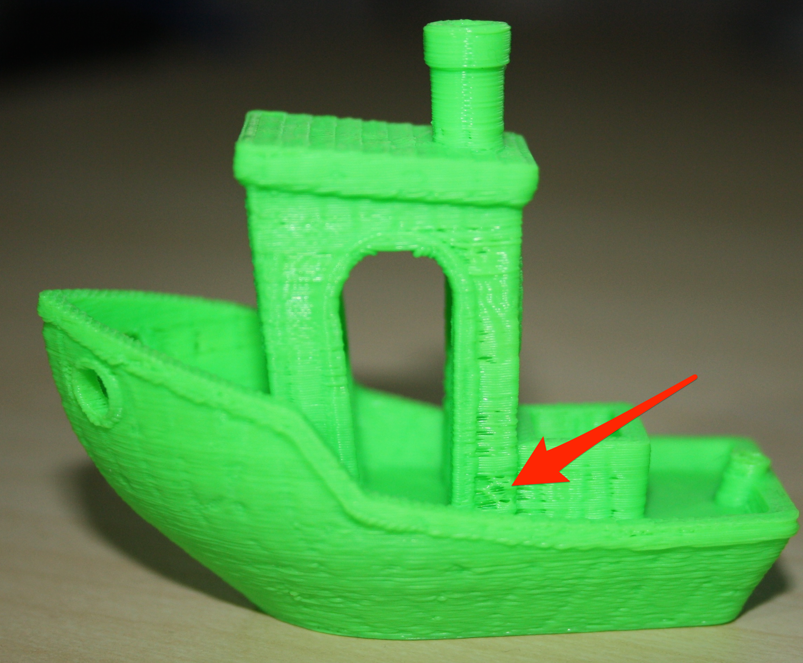

**What is it?** Small green boat-shaped object with a cabin, chimney, and hull. Visible horizontal texture on surfaces, wavy patterns on walls, and a gap in the cabin pillar (marked with a red arrow).

**Core questions:**

1. **Default:** What process was used to make this, and why do people print objects like it?
2. **Metal:** What process would you use for 1000 production parts of similar geometry?
3. **Volume:** What if you need 1000 functional enclosures (not test pieces)?

**Extra questions:**

- Name the defect at the red arrow and list likely causes.
- What causes the wavy patterns on vertical walls, and how do you fix them?
- Is there a standard benchmark shape used to tune this process? What does it test?
- What visual clues reveal the manufacturing process?

---

### Part 23 — Four figurines showing worsening quality

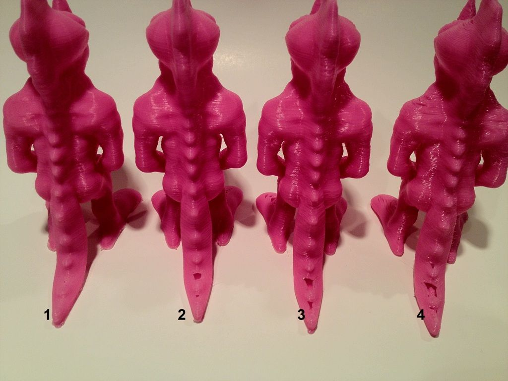

**What is it?** Four identical pink figurines (#1–#4 left to right), viewed from behind. Print quality degrades from solid (#1) to increasing holes and missing material in the tail and back (#4).

**Core questions:**

1. **Default:** What process and material were used, and what settings produce a good result like #1?
2. **Metal:** How would you manufacture this shape in metal?
3. **Volume:** For 1000 good copies, when do you switch processes?

**Extra questions:**

- Identify the defect and why it worsens from #1 to #4.
- How do you calibrate material flow settings?
- What role do temperature and filament diameter play?
- What visual clues reveal the process?

---

### Part 24 — Rectangular metal block with multiple bores

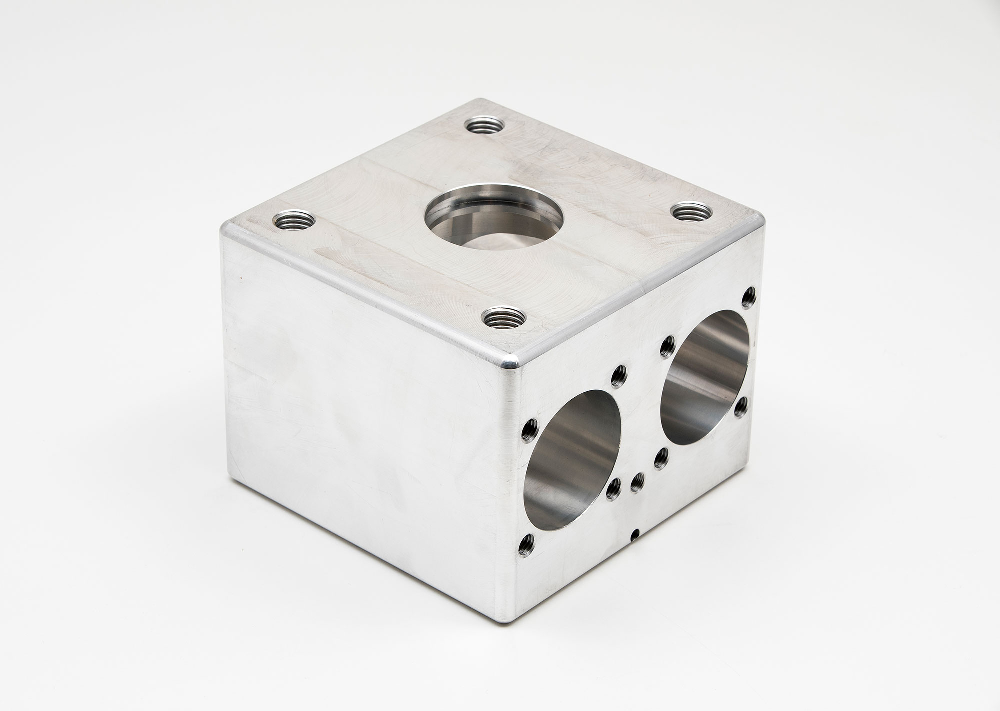

**What is it?** Rectangular metal block with swirl marks on the top face, a large counterbored centre hole, four smaller threaded holes at the corners, and two large bores on one side each surrounded by four smaller threaded holes.

**Core questions:**

1. **Default:** What process and material would you use, and why?
2. **Metal:** 6061 vs 7075 aluminium (or steel) — which and why?
3. **Volume:** What if you need 1000 units?

**Extra questions:**

- Name the operations used to create each feature type.
- How many part orientations (setups) are likely needed?
- What is the purpose of a counterbore?
- What visual clues on the surfaces suggest how this was made?

---

### Part 25 — Three assorted metal components

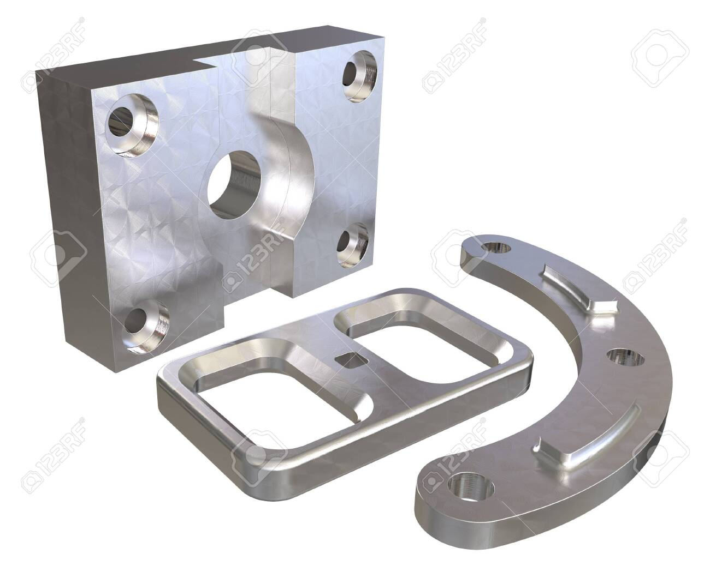

**What is it?** Three metal parts: (1) thick block with circular patterned top face, central bore, curved pocket, and four corner counterbored holes; (2) flat frame with two large rectangular cutouts with rounded inner corners; (3) semi-circular arc plate with three holes and two raised curved ribs.

**Core questions:**

1. **Default:** What process and material would you use, and why?
2. **Metal:** Why aluminium for these parts?
3. **Volume:** What if you need 1000 units?

**Extra questions:**

- Why can't you cut a perfectly sharp internal square corner with a rotating tool?
- What determines the radius of the inner corners on the frame?
- What created the circular pattern on the block's face?
- Which features need 2.5D vs 3D toolpaths?

---

### Part 26 — Six identical metal bars

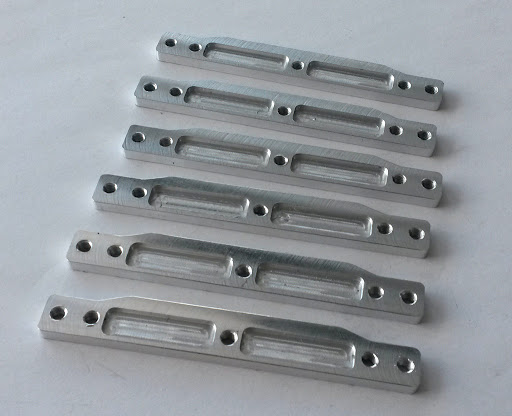

**What is it?** Six identical long thin metal bars, each with two shallow rectangular pockets (rounded inner corners) and five through-holes in a mounting pattern. Visible circular tool marks in the pockets.

**Core questions:**

1. **Default:** What process and material would you use, and why?
2. **Metal:** Aluminium vs steel — which and why?
3. **Volume:** What if you need 1000 units?

**Extra questions:**

- What tool created the pockets?
- What is the purpose of the pockets?
- How do visible tool marks relate to feed rate and stepover?
- When might a different process (e.g. extrusion + drilling) be cheaper?

---

### Part 27 — Shaft, sleeve, and small threaded fitting

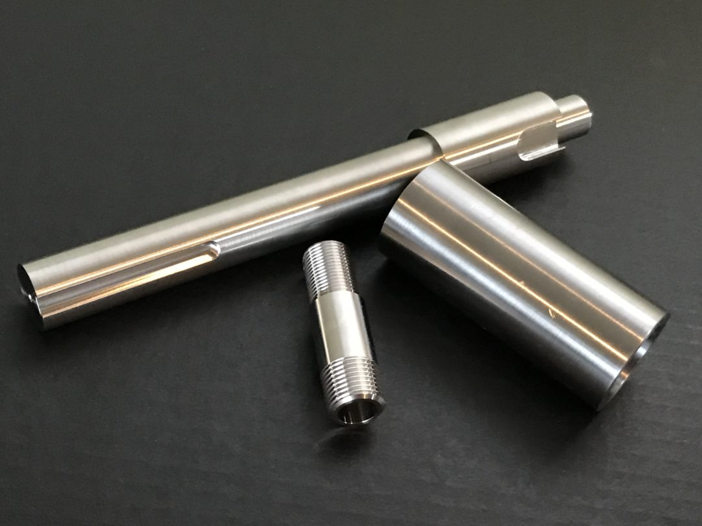

**What is it?** Three metal parts: a long stepped shaft with a slot along one section and a flat milled on a reduced-diameter end; a short thick-walled hollow cylinder with a chamfered inner edge; a small hollow piece with external threads on both ends.

**Core questions:**

1. **Default:** What process and material would you use, and why?
2. **Metal:** Which alloy for a precision shaft?
3. **Volume:** What if you need 1000 units?

**Extra questions:**

- Which features were made by rotation vs by a secondary cutting operation?
- What is the slot on the shaft for?
- Press fit vs clearance fit — how do shaft OD and sleeve ID tolerances differ?
- What visual clues suggest the primary process used?

---

### Part 28 — Collection of small cylindrical metal parts

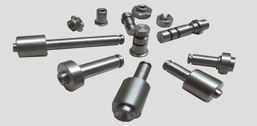

**What is it?** ~13 small silver metal parts, mostly cylinders with steps, grooves, shoulders, and chamfered ends. Some are hollow sleeves; one has a hexagonal base.

**Core questions:**

1. **Default:** What process and material would you use, and why?
2. **Metal:** Why stainless steel for small precision pins?
3. **Volume:** What if you need 1000 units?

**Extra questions:**

- What does rotational symmetry tell you about how these were made?
- What is the circumferential groove near some shaft tips for?
- What is a chamfer for on machined edges?
- When might grinding be added after the primary process?
