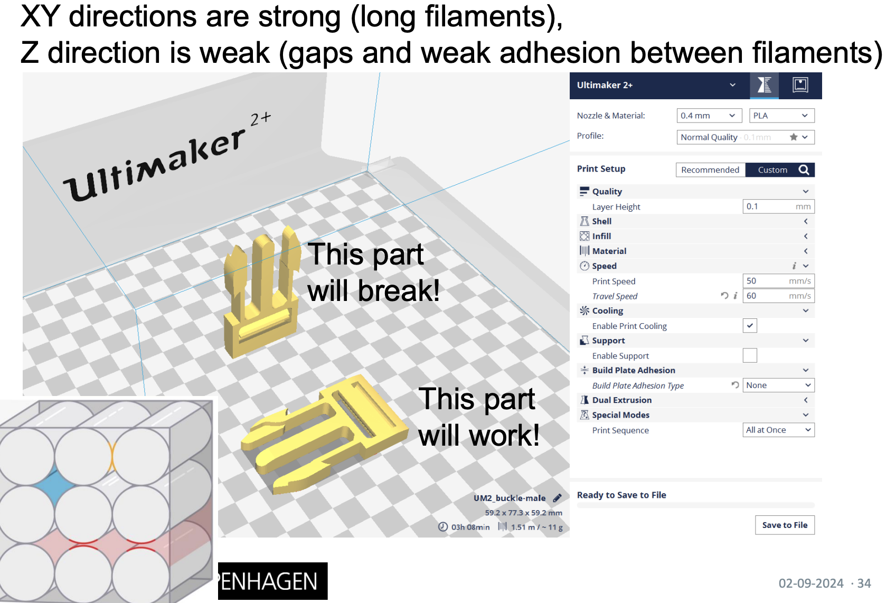
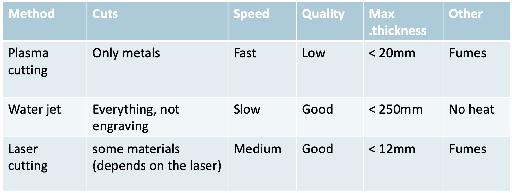
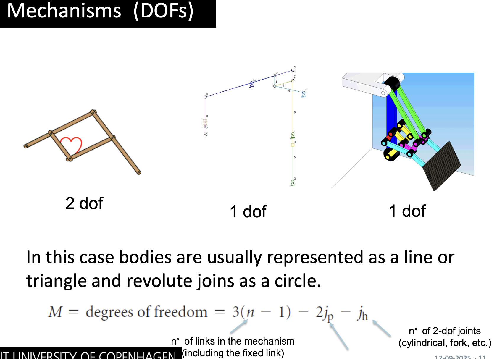
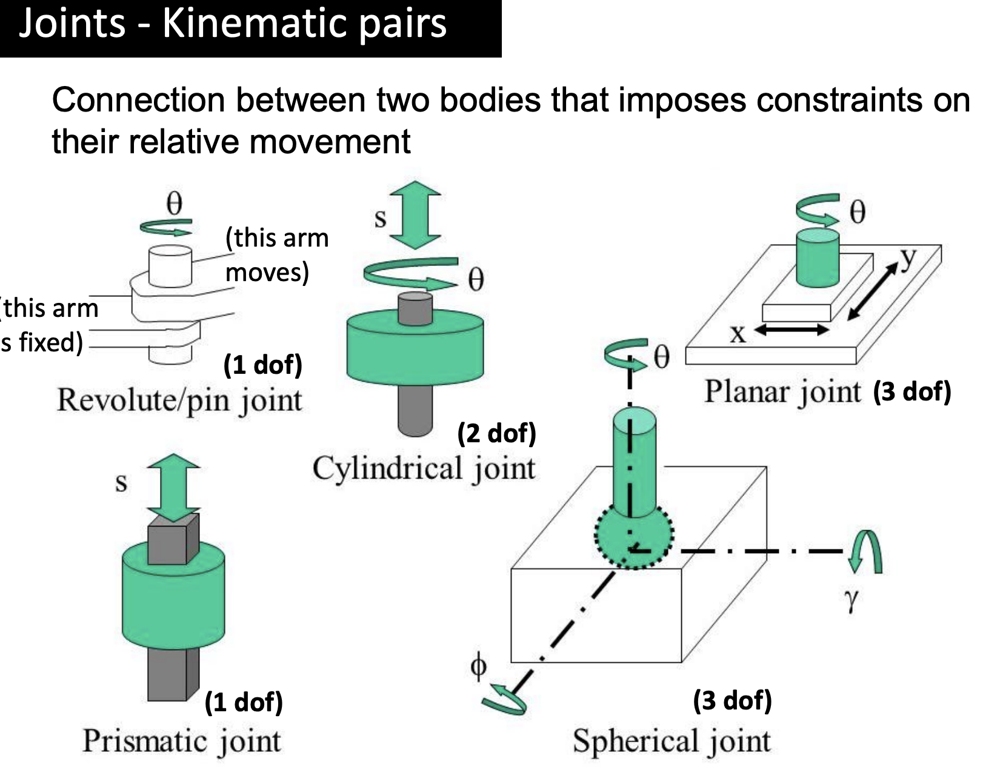
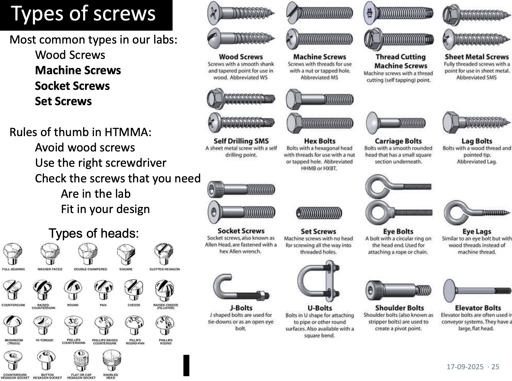
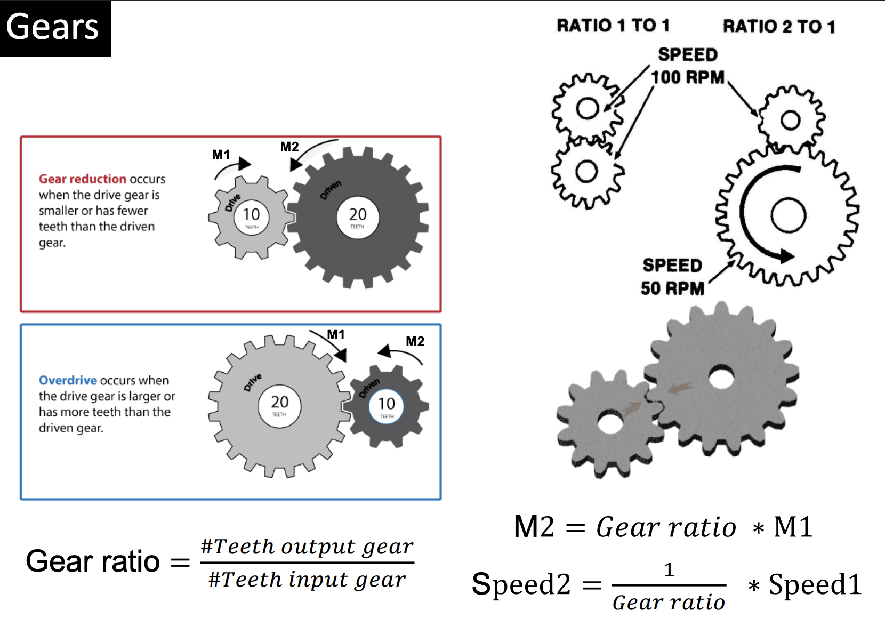
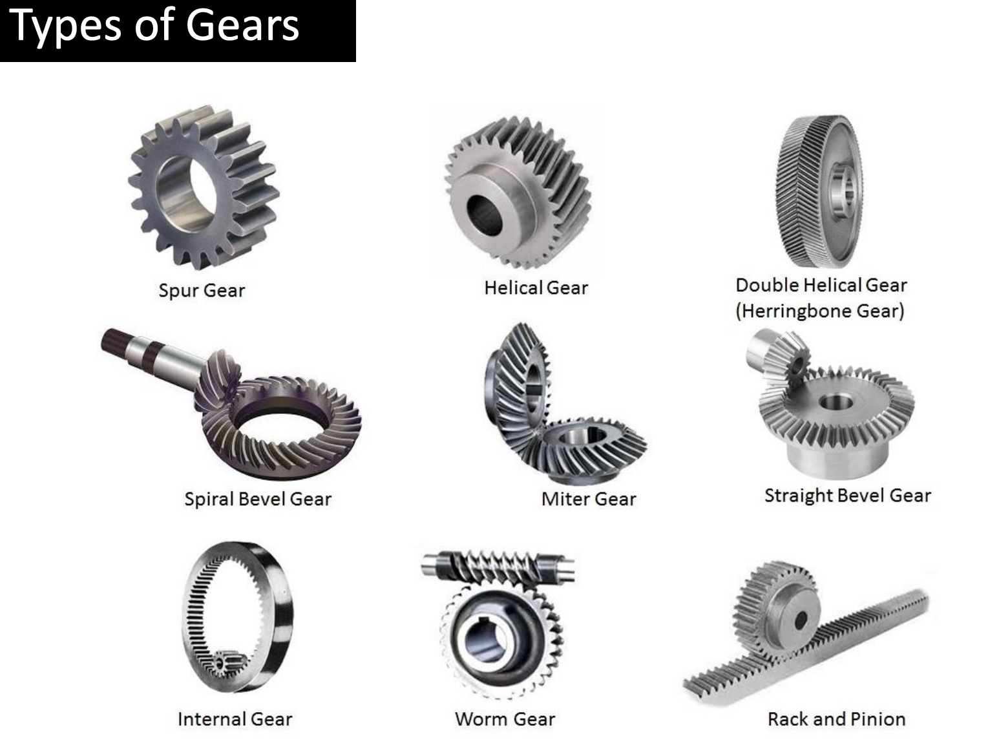

# Curriculum

All the slides and lectures are part of the syllabus. This includes the following topics (in bold the most common topics in the exam):

### 3D modelling:

- Parts and assemblies
- **Extrusion and revolution**
- **Symmetry and linear and circular patterns**
- Assemblies
- Drawings

### 3D printing:

- **Advantages and disadvantages**
- **Different 3D printing techniques: FDM, SLS, SLA**
- FDM basic settings: Layer height, infill, speed, support material, etc.

### Flat sheet cutting:

- **Advantages and disadvantages**
- **Different flat sheet cutting techniques: Laser cutting, water jet, plasma cutting**
- Basic settings for laser cutting: Speed, power and frequency
- Techniques for flat sheets: finger joints, bending, etc.

### Machine elements:

- Structural elements
- **DOF concept**
- **Linkages**
- **Plain and rolling bearings**
- **Linear guides**
- **Power transmission: Gears, pinion and rack, pinion and endless gear, lead screw and belts**

### Electronics:

- **Voltage, current and resistance**
- **How to use a breadboard and a multimeter**
- **Ohm´s law and voltage dividers**
- **Diodes and LEDs, potentiometers, IR sensors, US sensors and switches: How they work, the circuits needed and how to wire them**
- **DC motors, stepper motors and servo motors: How they work, the circuits needed and how to wire them. Advantages and disadvantages of each of them.**
- **Transistors and H-bridge circuits**
- Voltage regulators and DC/DC converters

### Microcontrollers:

- Arduino and microcontrollers
- **Reading sensors with a microcontroller: Circuits and programming**
- **Using actuators with a microcontroller: Circuits and programming**
- Digital communications: SPI and I2C

### PCBs:

- **Advantages and disadvantages (compared to a breadboard)**
- Components of a PCB: pads, tracks, vias, etc
- Soldering

### Milling and Turning:

- **Advantages and disadvantages**

### Moulding and casting:

- **Advantages and disadvantages**
- **Moulding design and its properties**

# Study Plan

## Exam format

- ~15 min **group presentation** (all members present) + ~15 min **individual Q&A** per student
- Three question themes: **Q1 Manufacturing**, **Q2 How a machine works**, **Q3 Electronics**
- Q3 includes **practical wiring** on a breadboard — practice this; many students fail basic circuits
- Bring your **prototype** and a **smartphone** as a backup display

Study **bold curriculum topics** first, then cover the rest for breadth.

---

## Study progression

Work through these in order. Each step builds on the last; don't skip to electronics before you can explain your own prototype's mechanics.

### 1. Learn the theory (slides + bold topics)

- [x] 3D modelling: extrusion, revolution, symmetry, patterns
- [x] Manufacturing methods: 3D printing (FDM/SLS/SLA), flat-sheet cutting (laser/water jet/plasma) — pros, cons, and when to use each
- [ ] Milling/turning, moulding — pros, cons, and when to use each
- [x] Machine elements: DOF, linkages, bearings, linear guides, power transmission (gears, belts, lead screw, rack & pinion)
- [ ] Electronics fundamentals: voltage/current/resistance, Ohm's law, voltage dividers, breadboard, multimeter
- [ ] Components: switches, LEDs, potentiometers, IR/US sensors, diodes, DC/stepper/servo motors, transistors, H-bridge
- [ ] Microcontrollers: reading sensors, driving actuators, basic SPI/I2C
- [ ] PCBs: pros/cons vs breadboard, pads/tracks/vias, soldering basics

### 2. Practice Q1 — Manufacturing

For parts from your project, lecture slides, or exam examples, answer all three variants:

- [ ] Default: what process and material, and why?
- [ ] "What if it must be metal?"
- [ ] "What if you need 1000 units?"

Always justify with cost, time, tolerance, material properties, and surface finish.

### 3. Practice Q2 — How a machine works

Apply this sequence to your prototype and a few machines from the slides:

- [ ] Identify components: linear guides, bearings, motors, belts/gears/screws, structural elements
- [ ] Trace power: motor → reduction (if any) → end effector
- [ ] Count DOFs
- [ ] Name sensors and actuators — which type, and **why**?
- [ ] Identify driver (H-bridge, stepper driver) and microcontroller

### 4. Practice Q3 — Electronics

- [ ] Explain how to read a switch and a potentiometer (circuit + code)
- [ ] Explain how to control a DC motor (direction and speed) and how a servo works internally
- [ ] Wire from memory on breadboard or simulator: button, LED with resistor, potentiometer, DC motor via H-bridge, servo
- [ ] Draw schematics with correct symbols for every component used in the course
- [ ] Redo relevant MAs until wiring is automatic

### 5. Tie it together on your prototype

- [ ] For each part: manufacturing choice (Q1)
- [ ] Full mechanism walkthrough (Q2)
- [ ] Complete electronics schematic and wiring (Q3)
- [ ] Rehearse the group presentation; each member can answer "why did you choose X?"

### 6. Final check before the exam

- [ ] Prototype working (or ready to explain failures clearly)
- [ ] Can wire a button circuit on a breadboard without help
- [ ] Can justify every design and manufacturing decision on your project
- [ ] Smartphone charged; presentation parts assigned

# Notes on Theory

## 3D modelling: extrusion, revolution, symmetry, patterns

| Term | Description |
|------|-------------|
| **Extrusion** | Create a 3D solid by pushing or pulling a 2D sketch profile along a straight path (distance and direction). Used for prismatic parts like brackets, boxes, and beams. |
| **Revolution (revolve)** | Create a 3D solid by rotating a 2D profile around an axis. Used for axisymmetric parts like shafts, wheels, and bottles. |
| **Chamfer / Round** | Select one or more edges and round them to a certain circular radius / chamfer with an angle and distance |
| **Symmetry (mirror)** | Duplicate geometry across a mirror plane so you only model half the part. Keeps the model parametric and consistent — change one side and the other updates. |
| **Linear pattern** | Copy a feature or part at equal spacing along a straight line (e.g. a row of holes or repeated ribs). Also **Rectangular pattern** in 2 dimensions with the same idea. |
| **Circular pattern** | Copy a feature or part at equal angular spacing around an axis (e.g. bolt holes on a flange or teeth on a gear blank). |
| **Part** | A part is a single fusion file representing one object. |
| **Assembly** | An assembly is a collection of parts fit together to resemble a bigger gathered object. |
| **(Technical) Drawing** | A technical drawing is a 2D representation of a 3D part and/or assembly. It can be used as the basis for laser cutting or in order to mass produce a given 3 dimensional part by supplying all relevant dimensions. |
| **CAD** | Computer Aided Design - refers to using software to design parts, such as we do in Fusion360 when making marts and assemblies |
| **CAM** | Computer Aided Manufacturing - refers to using software to manufacture parts, such as we do in Prusa Slicer to translate our 3D designs into a programme for the Prusa 3D printer to follow in order to manufacture our part. It also encompasses things such as technical drawings. |
| **Fully constrained sketch** | Every point and line in the sketch has its position and size fully defined (dimensions, angles, coincident/tangent/parallel constraints). Unconstrained geometry is blue; fully constrained turns white (in dark mode). Prevents accidental shape changes when editing. |
| **Parameterised model** | Key dimensions are defined as named parameters (variables) rather than hard-coded numbers. Change one parameter (e.g. wall thickness) and the whole model updates automatically — essential for iteration and design variants. |

### Product Design
Design a product based in categories, describing the product from each of the following perspectives:

- *Interface*: Type and location of sensors and any user interface (UI)
- *Mechanism*: What kinds of mechanisms make the product function / behave in the desired way?
- *Outputs*: Which motors are used (strongly coupled to mechanism) and other elements (screens, lights, etc.)
- *Power*: How is the product powered? (Wall Plug, Batteries, Solar Cells etc.)
- *Size*: What is the physical size of the product? (height, breadth, depth, weight?) Can also be defined in terms of a specific product-relevant metric such as # of products.
- **Requirements**: What are the functional requirements for the behavior of the product?

A traditional workflow in a CAD programme contains:
- Select a 2D plane in 3D space to make a sketch on
- Draw a sketch on the plane
- Extrude / Revolve / Cut the sketched shape into a 3D part
- Repeat

### Extra Takeaways

- The earlier in the process we can make a working model, the better - the further we get in the production chain, the more expensive it is to iterate and change the product.
- Make sure your sketches are **fully constrained**. Unconstrained sketches drift when you edit later features, and fully constraining makes edits easier to follow. 
- If creating a hole for a screw / shaft, add some clearance to the diameter (of ~nozzle width) to ensure the part will fit through the manufactured part! (f.ex. 3.3 mm is good for M3 screws)

### Technical Drawings
A technical drawing is a 2D representation of a 3D part. It is used for multiple purposes, hereunder illustration, description, documentation and the basis for manufacturing parts in a workshop.
We can represent a part in multiple ways:

- *Projection*: refers to a perspective on the 3D object in 2D space. It may represent a specific angle or a top view.
- *Multi-view Projection*: Aims at providing a full description of an object by showing the flat surfaces from multiple perspectives (top, bottom, front, back, right, left) - often aimed at describing the object fully with the least amount of sketches.
- *Exploded-view Drawing*: Displays multiple parts, that are assembled together, exploded apart such that one can examine each individual part of the assembly.

Rules for adding dimensions on the drawing:
- Add **all** dimensions
- **Display** dimensions in the most descriptive view of the feature.
- Dimension lines shall **never cross other lines**

## Manufacturing methods: 3D printing (FDM/SLS/SLA), flat-sheet cutting (laser/water jet/plasma), milling/turning, moulding — pros, cons, and when to use each

Here is a high level overview of the pros and cons of the main types of manufacturing. Detailed pros / cons of subtypes are described in the following sections.

| Method | Description | Pros | Cons |
|--------|-------------|------|------|
| **3D printing** | Builds parts layer-by-layer from a digital model (additive — material is added, not cut away). FDM, SLS, and SLA are the main subtypes. | Only little waste, can create complex parts (infeasible assemblies / hollow parts), good for prototyping because of short lead time | Layer lines and weaker strength between layers - less resistant than raw material, slow and costly at high volume |
| **Flat-sheet cutting** | Cuts 2D profiles from flat stock (acrylic, plywood, metal plate, etc.) along a programmed path. Main methods: **laser** (melts/vaporises), **water jet** (high-pressure abrasive water), and **plasma** (ionised arc through metal). | Fast for flat parts; low setup cost and minimal fixturing; fine detail; good for enclosures, panels and finger-joint boxes; can combine with bending for 3D shapes | 2D profiles only — true 3D needs bending, stacking, or assembly; thickness and material limits depend on method. |
| **Milling** | A rotating cutter removes material from a solid block (subtractive CNC). | High precision and tight tolerances; wide material choice including metals; excellent surface finish and strength | Material waste; slow and expensive for complex 3D shapes; skilled setup required; poor choice for large production runs of simple parts |
| **Turning** | The workpiece rotates on a lathe while a fixed cutting tool shapes it — for axisymmetric parts. | Very efficient for round parts (shafts, pins, bushings); high precision on cylindrical features; good surface finish | Only axisymmetric (round) parts; material waste; setup time; usually overkill for quick plastic prototypes |
| **Moulding & casting** | Liquid material is poured or injected into a mould cavity and solidifies (e.g. injection moulding, silicone casting). | Lowest unit cost at high volume (1000+ parts); consistent, repeatable parts; complex shapes in one step | High upfront mould/tooling cost; long lead time to make the mould; design changes are expensive; mainly suited to specific materials (plastics, metals, silicone) |

### 3D printing types w. pros & cons
Traditional manufacturing was *subtractive*, meaning you start with a larger block of material and cut away the parts that are not needed in order to obtain the desired shape. 
3D printing is, on the other hand, an *additive* manufacturing method, meaning we add material until reaching the desired shape.

| Method | Description | Pros | Cons |
|--------|-------------|------|------|
| **LOM** *(Laminated Object Manufacturing)* / **SDL** *(Selective Deposition Lamination)* | sheets are succesively glued together on top of each other and cut with a knife / laser | Cheap materials, good for mock-ups | layered surfaces, weakness between layers, waste from cutting layers |
| **SLS** *(Selectve Laser Sintering)* | A thin layer of powder is distributed on the printing surface and a laser is used to *sinter* the sections that should be melted together into the manufactured part. A new layer is then distributed on top and process is repeated. | loose powder acts as support structure | Grainy surfaces, post processing can be difficult / expensive |
| **SLA** *(Stereolithography)* | A laser is used to cure resin in a layer-by-layer fashion on a surface that moves upwards. | More sturdy and elastic results, different material options, high quality and resolution | Expensive, need support material |
| **SLS** *(Fused Deposition Modelled)* | Melting and placing material (PLA, ABS, TPE) in layers on a build surface, building the part line-by-line | Cheap and accessible, good for prototyping | Anisotropy (stronger on one axis than on other ones due to layers), Needs support, layered surfaces |

#### Anisotropy Explained

#### Slicers and Settings
Slicers creates a stack of 2D representations of the 3D model, which results in the 3D model!
This sections provides an overview of the settings that are relevant to remember:

- *Layer Height* (Default: nozzle diameter / 2) defines the distance in the z-direction between each slice in the stack. Large values will give low resolution, but default is often good enough for most prototyping work!
- *Infill* (Default: 5% or 10%) defines how much filament should be filled on the inside of parts. Adds stability, but is a waste of material if it is not needed.
- *Speed* (Default: 15-30 mm/s) defines how quickly the printer head will move. Higher speeds risk dragging the material so it is not properly extruded where it is supposed to be.

#### Common Printing Problems

- *Adhesion* (The base layer is not sticking and has gaps or is tumbled over) - the bed is not leveled, the bed is oily or otherwise dirty - use brim / raft (area around base is printed to support the main print)
- *Warping* (The base layer is misshaped) - bed is not heated, fan is cooling of too quickly - use brim / raft (area around base is printed to support the main print)

### Flat Sheet types w. pros & cons
Flat-sheet cutting is a *subtractive* process: you start with a flat sheet and cut away material along a 2D path. Unlike 3D printing, you cannot build overhangs — but you can bend, stack, or join cut pieces (finger joints) to make 3D structures.

| Method | Description | Pros | Cons |
|--------|-------------|------|------|
| **Laser cutting** | A focused laser beam melts or vaporises material along a programmed 2D path. | Fast on thin sheets; good for acrylic, plywood, enclosures, and finger-joint boxes; minimal fixturing | Thickness and material limits; kerf width loses material; fumes from some plastics (need ventilation); reflective/thick metals need a more powerful laser |
| **Water jet cutting** | High-pressure water, often mixed with abrasive, erodes material without heat. | No heat-affected zone — no warping; cuts thick and hard materials (metal, stone, glass); high precision; no toxic fumes | Slower than laser on thin sheets; messy; wider kerf; higher machine running cost |
| **Plasma cutting** | An ionised gas arc melts through conductive sheet metal, blown away by compressed air. | Fast and relatively cheap for thick steel and other conductive metals; good for heavy plate | Rougher edge finish than laser; heat-affected zone; conductive metals only; |

#### Laser settings
The main settings to remember for laser cutting:

- *Speed* — how fast the head moves. Higher speed = faster cut but may not cut through; too slow can over-burn the material.
- *Power* — laser intensity. Higher power needed for thicker or denser materials.
- *Frequency* — pulses per second (on some machines). Affects cut quality on certain materials, especially metals.

#### Flat sheet techniques

- *Finger joints* — interlocking rectangular teeth cut into sheet edges so two pieces slot together without fasteners. Common in laser-cut plywood boxes.
- *Kerf* — the width of material removed by the cut. Account for kerf in your CAD so assembled parts fit (typically ~0.1–0.2 mm for laser).
- *Bending* — shaping a flat 2D sheet into a 3D shape
    - Metals: Bending deformation (a manual machine applying forces)
    - Plastic: Heat bending (on some types)
    - Paper / Cardboard: Folding, possibly with cut hinges

#### Flat Sheet Materials

- *Plywood* - expensive, thicker (should ask lab staff before using it)
- *MDF* - Medium Density Fiberboard (this is what we used!) - brittle & expands with water
- *Cardboard* - weak and quickly becomes useless with water / screws etc.
- *Acrylic* - easy to laser cut but brittle!
- *POM* - difficult to laser cut, expensive, low friction

## Machine elements: DOF, linkages, bearings, linear guides, power transmission (gears, belts, lead screw, rack & pinion)

Objects move in space based on **forces** applied. **Restrictions** may change how the forces are being actuated in the environment.

A mechanism is formally defined as: *a combination of rigid or resistant bodies, formed and connected [with kinematic pairs] so that they move with definite relative motions with respect to one another* - i.e. it exists with or without motors and simply define bodies that move relative to others bodies.

A machine extends on this with motors, by defining it to also include *transmit force from the source of power to the resistance to be overcome*

### Degrees of Freedom
One of the most important concepts to understand; usually **DOF = # Motors**, since each possible movement direction in a mechanical part should usually be controlled by driving force.
Formally: *Number of independent parameters that define the configuration of a machine (position and orientation of all the components)* - some machines have many (plane) while others have few (train on train tracks).

### Joints & Linkages
Define a pair of two bodies, that constrain the movement of the other. See specific examples and their DOFs in below image:

#### Bearings
Formally: *A machine element that constrains relative motion to only the desired motion, and reduces friction between moving parts* - i.e. ensures with a fixed object that another body follows a desired motion pattern in space relative to the fixed object.

Two main types: **Plain Bearings** and **Ball Bearings** (Rolling bearings). Ball bearings produce less friction but require lubrication and are more expensive than plain bearings.

#### Guides
An element that constrains relative motion to 1 DOF. Particularly, linear guides are used in many applications, such as 3D printers, to limit motion to a single linear direction.
Types of linear guides:

- **Rail + Carriage**: either plain or with rolling bearings, a rail defines the linear direction and the carriage moves along the rail which it surrounds.
- **V-slot**: a part is fastened into the v-slot from which it can only move in the linear direction along the slot.

### Structural Elements
Are the parts of our mechanism that do not move and should remain still. Remember that joints are weak and triangular patterns make them slightly stronger.
Joints that should remain fixed usually use screws either mounted into a plate or with a bolt tightened on the other side.

Screw holes for these are either created using **inserts** which are premade metal parts that can be inserted into the hole or **tapping** where the threading is created directly on the hole.

**Thread Rods** may also be utilized as a cheap lead screw for a rail + carriage implementation or to otherwise be used as a structural element.

### Power Transmission
A *force* is a measure of how much relative acceleration is applied to an object by another object. *Gravity* and *Friction* are two common forces that we always encounter everywhere. Formula: `F = m * a` (Force = Mass * Acceleration) - as a vector in 3D space!

**Torque** describes the turning effect of a force. Torque is also refered to as *Moment* and is defined by: `M = F * d` (Moment / Torque = Force * distance) where distance is the distance to the center point.

Here we list the main types of power transmission and their features:

| Method | Motion | Description | Notes |
|--------|--------|-------------|-------|
| **Gears** | Rotational ↔ rotational | Two meshing toothed wheels transfer rotation between shafts. Gear ratio = driven teeth / driving teeth — sets speed and torque trade-off. | Compact and efficient; precise ratio; can change direction. Noisy at high load; requires precise alignment; distance between shafts is fixed by gear size |
| **Pinion and rack** | Rotational ↔ linear | A small rotating gear (pinion) meshes with a straight toothed bar (rack). Pinion rotation drives the rack linearly — or linear rack motion spins the pinion. | Used in CNC axes, steering systems, and moving a bed along a rail; rack must be straight and supported |
| **Pinion and endless gear** | Rotational → rotational | The rack is bent into a circle (ring / endless gear); a pinion drives around its inner or outer teeth. Pinion spin rotates a platform or turntable continuously. | Used for spinning trays, indexing tables, and turntables. Smooth continuous rotation; limited load capacity; self-locking and not very efficient; |
| **Lead screw** | Rotational → linear | A threaded screw turns inside a nut (or nut travels along a fixed screw). Each rotation moves the nut a fixed linear distance (pitch of the thread). | High mechanical advantage; precise positioning; self-locking (won't back-drive under load).; Used in 3D printer Z-axes, vices, and linear actuators; Slower than belts; friction and wear on threads |
| **Belts** | Rotational ↔ rotational, linear ↔ linear, or rotational ↔ linear | A flexible belt runs over pulleys to transfer motion. **Rot ↔ rot:** belt between two pulleys (like a bike). **Rot ↔ linear:** one pulley drives a belt that pulls a carriage in a straight line (common on 3D printer gantries). **Linear ↔ linear:** belt loop moves a point along a fixed path. | Quiet; can span long distances; cheap; absorbs shock; less precise than gears or lead screws |

## Electronics fundamentals: voltage/current/resistance, Ohm's law, voltage dividers, breadboard, multimeter

todo

## Components: switches, LEDs, potentiometers, IR/US sensors, diodes, DC/stepper/servo motors, transistors, H-bridge

todo

## Microcontrollers: reading sensors, driving actuators, basic SPI/I2C

todo

## PCBs: pros/cons vs breadboard, pads/tracks/vias, soldering basics

todo

# Example Questions
## Q1

todo

## Q2

todo

## Q3

todo

# The Drink Dispenser