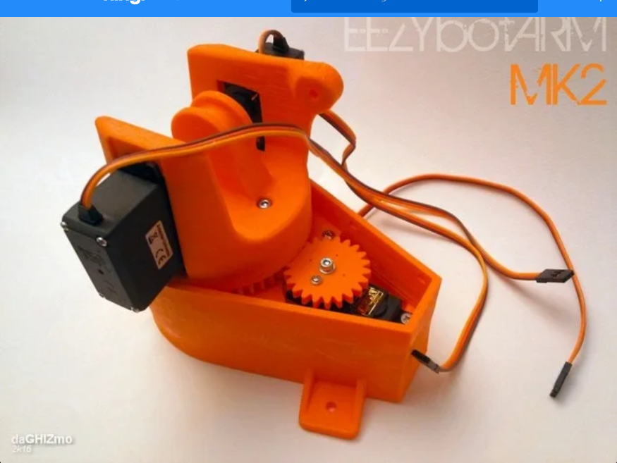
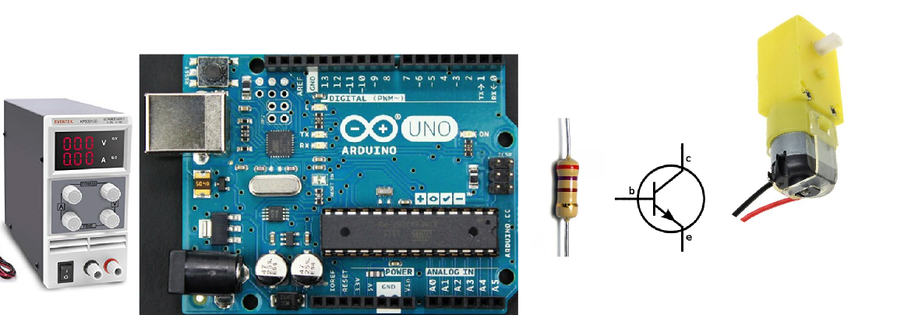
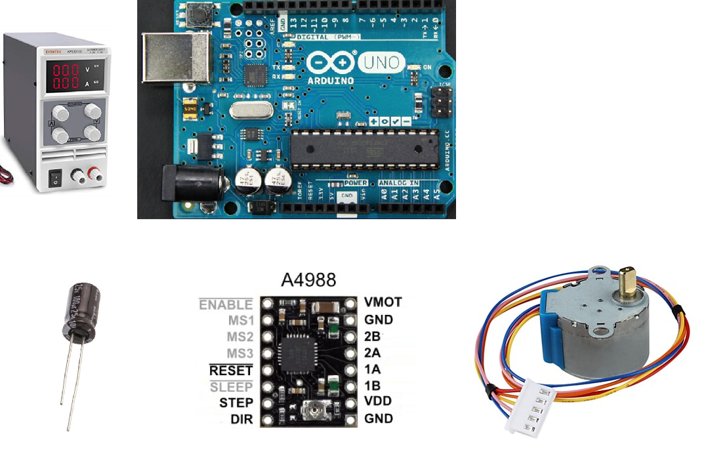
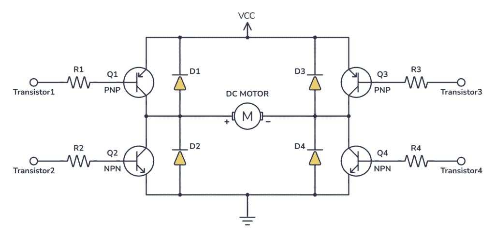
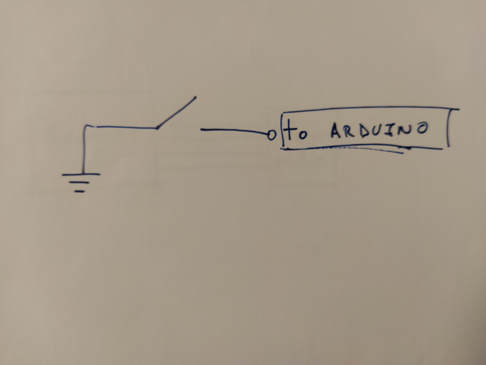
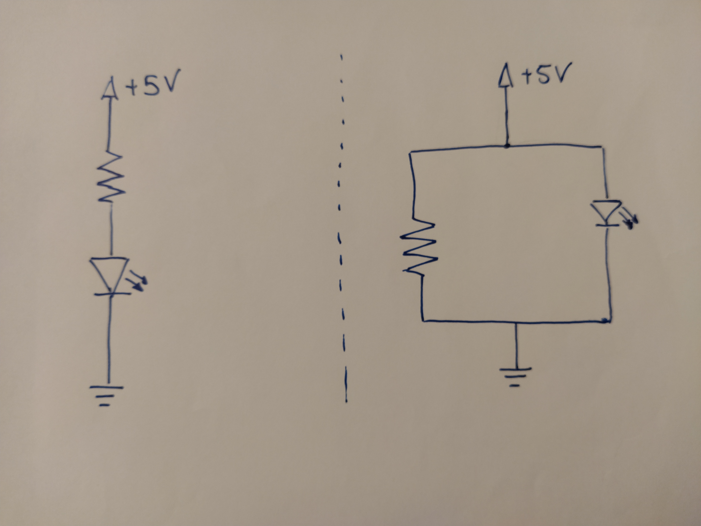

# Exam Question Notes

**Format:** 15 min group presentation → per student ~15 min Q&A on **Q1 Manufacturing**, **Q2 How a machine works**, **Q3 Electronics**. Bring prototype + phone. Q3 may include **live breadboard wiring**.

---

## Q1 — How would you manufacture these parts?

*Slides also ask: "And if you need to make it of metal?" / "And if you need 1000 parts?"*

### Approach (memorize)
1. **Identify** geometry clues → process (ribs/bosses/ejector marks = injection mould; layers = FDM; finger joints = laser cut; axisymmetric = turning)
2. **Default:** prototype process + material (usually FDM/PLA or laser-cut MDF/acrylic)
3. **Justify** with: **cost, time, tolerance, material properties, surface finish**
4. **Metal variant:** CNC mill, die cast, sheet metal (cut + bend), turning — match geometry
5. **1000 units:** injection moulding (plastic) or die cast/CNC at scale — mould cost amortised

### Practice images (`all_parts/`)

**Part 02**

*Your answer:*
1. It is some kind of plastic structure with multiple slots for mounting things, and with a mesh pattern inside the hollow side of the part for strength.
2. For initial prototyping, I would choose to 3D print this using FDM.
3. I would pick this approach initially as it is cheap, easily accessible and has a low lead time from idea -> design -> physical part. It suffers from anisotropy and needing support, but in a prototyping phase we can live with these limitations.
4. For this part, milling and drilling would probably be the main way forward, as the part is 3-dimensional in a way hard to model using flat sheets og revolution parts.
5. This part looks injection moulded (see date-stamp and ejection marks), which is also the approach i would pick for mass-manufacturing, where the cost of creating a good mould for the part will be minor in the unit-cost for mass manufacturing.

**Part 04**

*Your answer:*
1. This is an injection mold. We can visibly see the sprues and how the parts have symmetric outlines on either part. The mould is made of metal and has corner rods for ensuring the two parts of the mould are properly aligned.
2. Per default, I would produce it using milling.
3. I would pick this option as it give a smooth finish on all edges, with the quality of the mould being highly related to the quality of the injection moulded products. Since we also only need a few or a single one, the "slowness" of creating the mould would not be a prominent issue.
4. It is already.
5. I do not think mass producing this mould is as relevant, but of course creating this mould in the first place only makes sense if we need a lot of identical parts manufactured.

**Part 05**

*Your answer:*
1. These are lego bricks. They are used to stack on top of each other and build 3D structures.
2. If I had to initially develop the shape i would likely go for 3D printing using FDM.
3. I would initially pick this due to accesibillity and price as well as the quick iterations over the design that are possible. I do note that a single or few lego bricks do not make a lot of sense, so switching to injection moulding rather quickly may pay off (most lego sets are at least a couple hundred bricks).
4. I do not think that is relevant for this bit.
5. Injection Moulding would be the way to go in this case, and maybe even for smaller scale productions (as you would always need a bunch of lego bricks to play around!)

**Part 07**

*Your answer:*
1. This is a bending metal piece with two mounting holes perpendicular to the main surface.
2. I would go for flat sheet cutting this piece (laser or plasma), followed by bending. 
3. This approach is fast and relatively cheap to obtain the desired metal piece, as one can easily see how it would look laid flat out. As for using laser or plasma cutting, it really depends on whether the laser cutter available can cut the metal sheet (thickness and material wise) and whether the rougher edges from plasma cutting are acceptable for the downstream use.
4. It is already.
5. For mass production I would likely still opt for laser cutting and bending, as laser cutting is rather fast and i suppose machines exist for automatically bending sheets of metal rather fast as well.

**Part 15**

*Your answer:*
1. This is clearly a 3D printed complex part, as the nested 3D parts cannot be constructed otherwise.
2. I would use SLS for this object.
3. I would choose SLS as it is a complex part and would also need support and creating only few items that do not have to withstand any substantial pressure. SLS is picked over FDM due to support, as SLS support is the powder itself and is not "extra" things that need to be removed additionally at later points.
4. Not possible ? 
5. Unsure if there would be a case where mass production would be relevant, and do not think it is really possible with a better solution ?

**Part 24**

*Your answer:*
1. A metal block with various round cuts, some of which are threaded.
2. I would use milling to manufacture this part.
3. Milling is a good choice as it gives a high quality finish. It works well with metal, especially when they are largely blocks, and therefore do not produce too much waste material from being a subtractive method.
4. It is already.
5. continue with milling & drilling.

**Part 28**

*Your answer:*
1. The are revolution parts with few hexagon parts.
2. I would use turning to manufacture these parts.
3. Turning is a good option as the parts are largely revolution parts, meaning they are identical revolutions around an axis. Revolution parts are produced more efficiently using turning than milling. Hex parts may be produced using milling rather than turning.
4. It is already.
5. Automatic lathe exists for mass manufacturing. 

---

## Q2 — How does it work?

*Slides: identify components → trace motor to end effector → DOFs → sensors/actuators (type + WHY) → drivers → microcontroller*

### Approach (memorize)
1. **Components:** linear guides, bearings (plain vs ball), motors, belts/gears/lead screw/rack, structure
2. **Power path:** motor → reduction (if any) → end effector
3. **Count DOFs** (usually ≈ # controlled motors)
4. **Actuators + sensors:** name type and **why** (servo = angle; stepper = steps; DC = speed/torque)
5. **Electronics layer:** driver (H-bridge, A4988, servo PWM) + microcontroller

### Practice images (`all_mechanisms/`)

**Part 01**

*Your answer:*

**Part 06**

*Your answer:*

**Part 15**

*Your answer:*

**Part 24**

*Your answer:*

**Part 28**

*Your answer:*

---

## Q3 — Electronics

*Slides: read switch/pot, control DC motor, explain servo internals, wire components on breadboard. "Half of students fail the button circuit."*

### Approach (memorize)
1. **Draw schematic first** (symbols, polarity, series vs parallel)
2. **Power:** separate motor supply vs Arduino 5 V; use **transistor** for motors (Arduino can't drive high current)
3. **Every LED needs series resistor**; pot = voltage divider → `analogRead`
4. **Motors:** NPN low-side switch (1 kΩ base); H-bridge + **flyback diodes** for bidirectional DC; servo = PWM signal pin
5. **Multimeter:** voltage in **parallel**, current **in series**

### Practice images (`all_electronics/`)

**Part 04**

*Your answer:*

**Part 05**

*Your answer:*

**Part 06**

*Your answer:*

**Part 18**

*Your answer:*

**Part 21**

*Your answer:*

---

## Last-minute checklist
- [ ] Wire button + LED from memory on breadboard
- [ ] Explain your prototype: Q1 process, Q2 power path + DOFs, Q3 schematic
- [ ] Know: `V=RI`, voltage divider, injection mould design (draft, ribs, uniform walls)
